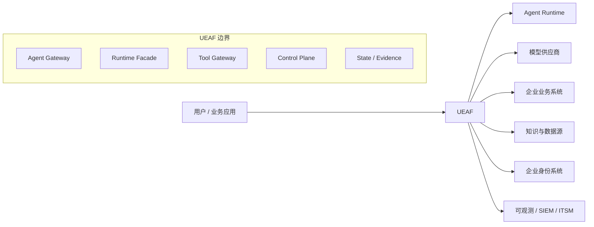
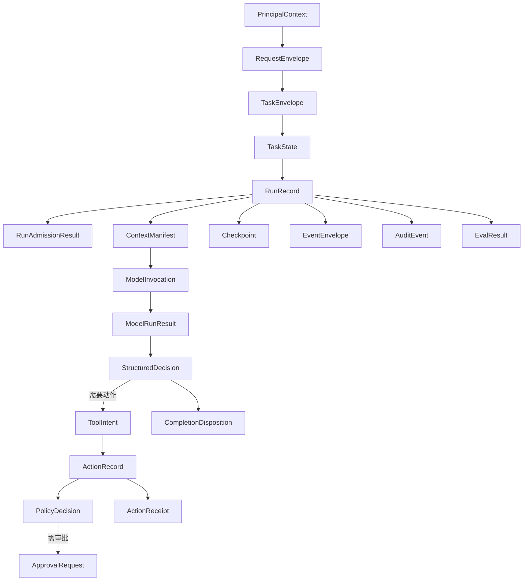

# UEAF 总体设计

## 1. 文档目的

本文定义 UEAF 的系统边界、能力域、模块职责、唯一所有权、运行主链和质量要求。字段级对象、状态与端口以[核心规范](../01-核心规范/01-统一术语与对象模型.md)为准。

## 2. 架构驱动因素

| 优先级 | 驱动因素 | 设计响应 |
|---:|---|---|
| 1 | 身份、租户和权限正确 | PrincipalContext 由可信入口建立；授权由 PDP 决定 |
| 2 | 副作用不可重复、可追责 | ActionRecord、action_key、审批、收据和对账 |
| 3 | 任务可暂停、恢复和取消 | 事件、Checkpoint、租约、fencing 和版本重验 |
| 4 | 结果有证据 | ContextManifest、EvidencePack、Trace、Audit 和 Eval |
| 5 | 运行时可替换 | Runtime Adapter SPI 和能力协商 |
| 6 | 多租户可隔离 | Isolation Profile、层级配额、命名空间和独立 Cell |
| 7 | 变化可控制 | ReleaseManifest、兼容矩阵、灰度、回滚和向前修复 |
| 8 | 运营可量化 | 用户旅程 SLO、成本账本、容量和错误预算 |

## 3. 系统边界

UEAF 内部拥有企业稳定语义。外部 Runtime、模型和工具只能通过端口接入，不得把其内部对象暴露为企业业务接口。

## 4. 架构域

### 4.1 Developer Plane

负责 SDK、CLI、Agent Bundle、Adapter SPI、本地运行、契约测试、调试和发布入口。Developer Plane 不拥有生产 Task、Run 或 Action 状态。

### 4.2 Control Plane

负责租户配置、Agent/Prompt/Model/Capability/Policy Registry、预算、评测、发布、路由和 kill switch。Control Plane 管理期望状态，不成为运行结果事实源。

### 4.3 Runtime Plane

负责接收边缘 accepted 候选、创建 queued Task/Run、参与正式 Run 准入，并在 admitted 后推进上下文、模型循环、工作流、HumanTask、工具动作协调、暂停恢复和终态计算。

### 4.4 Data Plane

负责 Task、Run、事件、Checkpoint、Action、Conversation、Memory、Knowledge、Artifact、预算和幂等状态的物理持久化与隔离；Data Plane 不因此获得这些对象的语义所有权。

### 4.5 Evidence and Governance Plane

负责 Trace、Metric、Log、Audit、Eval、成本、数据血缘、删除证明和发布证据。它观察其他平面，但不得反向篡改权威运行状态或业务事实。

## 5. 功能模块

| 编号 | 模块 | 唯一主责 | 关键输出 |
|---:|---|---|---|
| 01 | 接入与准入 | 边缘预校验、认证上下文、输入校验及已有 Run 的风险准入 | RequestEnvelope、TaskEnvelope、RunAdmissionResult |
| 02 | Agent 运行时与状态 | Task/Run 语义、Agent Loop 控制、Checkpoint、终态 | TaskState、RunRecord、CompletionDisposition |
| 03 | 模型、Prompt 与结构化输出 | Prompt/Schema 契约、模型路由调用、候选结果校验 | PromptContract、ModelInvocation、StructuredDecision |
| 04 | 上下文、RAG 与记忆 | Context Builder、知识摄取、权限检索、证据、会话和长期记忆治理 | ContextManifest、EvidencePack、MemoryRecord、ContextSource |
| 05 | 工具、MCP 与动作执行 | Tool Gateway、动作协调、策略/审批执行点、幂等、执行和对账 | ActionRecord、ToolResult、ActionReceipt |
| 06 | 工作流与多 Agent | Workflow/Node 状态、路由、并发、聚合和 Handoff | WorkflowRun、NodeRun、HandoffEnvelope |
| 07 | 身份、权限与安全治理 | 委托、PDP、凭据代理、数据策略、威胁响应与安全发布门 | PrincipalContext、PolicyDecision、SecurityGateDecision、安全事件 |
| 08 | 评测与发布治理 | 评测证据、质量门、独立门禁聚合和最终发布裁决 | EvalResult、QualityGateDecision、ReleaseDecision、ReleaseManifest |
| 09 | 生产运行与可观测性 | 队列/租约承载、扩缩、遥测、SLO、部署执行、灾备和运行就绪门 | OperationalReadinessDecision、SLO、部署与恢复记录 |
| 10 | 开发者平台与框架适配 | SDK/CLI、Adapter、调试、脚手架、一致性测试 | Agent Bundle、Adapter Capability、测试报告 |

模块不得因为独立部署而获得新的语义所有权。物理服务拆分只改变故障域、容量和部署边界。

## 6. 统一对象关系

主要基数关系：

- 一个 Request 触发零或一个新 Task，也可以关联现有 Task；
- 一个 Task 可以跨多个 Conversation、Session 和 Run；
- 一个 Run 属于一个 Task，并包含多个 Attempt、ModelInvocation 和 Action；
- 一个 WorkflowRun 属于一个根 Run；NodeRun 只拥有编排子状态；
- 一个 ActionRecord 由一个 action_key 唯一标识，可包含多个 ExecutionAttempt，但只能形成一条受控结果序列；实现内部 MAY 将其组织为 DDD 聚合，但线级对象名保持 `ActionRecord`；
- 一个 ReleaseManifest 可以被多个 Run 引用，已签发版本不可原地修改。

## 7. 唯一所有权模型

UEAF 区分四种责任：

- **Semantic Owner**：定义状态含义和合法迁移；全局唯一。
- **State Writer**：被授权提交状态变化的组件；可受租约限制。
- **Physical Store**：保存状态的技术设施；可替换。
- **Projection**：缓存、索引、报表或读取模型；不得反向写权威状态。

| 状态或事实 | Semantic Owner | 允许的 State Writer | Physical Store 示例 |
|---|---|---|---|
| RequestEnvelope / edge validation | Ingress Domain | Agent Gateway | Request Store |
| RunAdmissionResult | Admission Domain | Admission Controller | State/Evidence Store |
| TaskState | Task Domain | Task State Service | State/Event Store |
| RunRecord | Runtime Domain | Run Coordinator（有效租约） | State/Event Store |
| WorkflowRun/NodeRun | Orchestrator | Workflow Coordinator | State/Event Store |
| ContextManifest | Context Domain | Context Builder | Artifact/Metadata Store |
| ActionRecord | Action Domain | Action Coordinator / Reconciler | Action Store |
| PolicyDecision | Policy Domain | Policy Decision Point | Decision/Evidence Store |
| ApprovalRequest | Approval Domain | Approval Service | Approval Store |
| BusinessFactRef | 企业业务系统 | 业务事务服务 | 业务数据库 |
| EvidencePack | Evidence Domain | Evidence Service | Evidence Store |
| MemoryRecord | Memory Service | Memory Governance Pipeline | Memory Store |
| ReleaseManifest | Release Control | Release Controller | Release Registry |
| AuditEvent | Audit Service | 受信事件发布器 | Append-only Audit Store |

## 8. 端到端主流程

### 8.1 准入与运行创建

1. Gateway 完成协议、凭据、大小、基础 Schema、速率和最低安全预校验；失败提交 request rejected，不创建 Run。
2. Identity Adapter 建立 PrincipalContext；正文中的身份字段不得覆盖它。
3. 边缘预校验通过后形成不可变 TaskEnvelope；Runtime 创建或关联 TaskState，并创建 `RunRecord(phase=queued)`。
4. Run 取得 admission lease 后进入 admitting；Admission Controller 针对该 run_id 校验 ReleaseManifest、预算、配额、区域、策略和风险，生成 RunAdmissionResult。
5. admitted 进入 running；deferred 进入 waiting；rejected 原子提交 terminal/rejected。

### 8.2 上下文与模型循环

1. Runtime 通过模块 04 请求 Knowledge、Memory、Conversation 和 Task State 的受限视图。
2. 模块 04 的 Context Builder 先硬过滤身份、作用域、有效期和用途，再排序、压缩、隔离。
3. 模块 03 在调用前生成 PromptContract 与 ModelInvocation。
4. Model Adapter 调用供应商并归一流式事件、用量、终态和错误。
5. 模块 03 在调用后执行 Schema、证据和语义规则校验，输出 StructuredDecision。
6. Runtime 决定继续模型循环、进入工具动作、请求 HumanTask 或计算终态。

### 8.3 工具动作

1. StructuredDecision 只能产生 ToolIntent。
2. Tool Gateway 规范化参数并计算 action_key。
3. PDP 重新绑定当前主体、Agent、资源、用途和风险，形成 PolicyDecision。
4. 需要审批时持久化 ApprovalRequest，Run 进入 waiting；恢复时重验版本和权限。
5. Action Coordinator 预占执行权，使用短期凭据调用 Adapter。
6. 业务系统返回下游收据或权威状态观察；模块 05 校验并规范化为 canonical ActionReceipt。超时或响应丢失进入 unknown/reconciling。
7. Reconciler 查询权威业务状态，只有证明未执行时才允许新的 ExecutionAttempt。

### 8.4 终态和交付

1. Runtime 分别计算 RunPhase 和 CompletionDisposition。
2. 状态、证据引用、成本、Audit 和 Trace 关联被持久化。
3. Gateway 根据同步、流式或异步 Delivery Contract 返回结果。
4. 后续 Eval 不得修改原始 Run 和 Audit，只能产生新的证据与门禁结论。

## 9. Runtime Adapter 设计

Runtime Adapter 用于接入 LangGraph、MAF、OpenAI Agents SDK、ADK 或自研 Runtime。

Adapter MUST：

- 声明支持的 streaming、checkpoint、interrupt、handoff、parallel、replay 和 cancel 能力；
- 将 Runtime 内部事件映射为 UEAF EventEnvelope；
- 接受 UEAF 生成的 ContextManifest、预算和可见能力集合；
- 将所有企业工具调用转交 Tool Gateway；
- 支持 UEAF trace_id、task_id、run_id 和 release_id 传播；
- 对不支持的能力返回明确 capability error；
- 保持 Runtime Checkpoint 与 UEAF Task/Action 真相分离。

Adapter MUST NOT：

- 把 Thread 或 Session 自动提升为 Task、Memory 或业务事实；
- 让框架内置 Tool 绕过 UEAF Policy Enforcement；
- 使用框架内置审批替代 Approval Service 的权威票据；
- 把 Runtime Trace 当作合规 Audit；
- 静默丢弃安全、租户、来源、预算或版本字段。

## 10. 多租户设计

所有资源 MUST 包含不可由模型覆盖的 tenant reference。租户隔离同时覆盖：

- 身份与委托；
- 数据库行、Schema 或实例；
- 队列、租约和并发池；
- 缓存键和幂等作用域；
- 向量索引、检索过滤和重排输入；
- Artifact、Workspace 和日志；
- 模型、工具、区域和数据出站策略；
- 成本配额和公平调度；
- 备份、恢复、导出和删除。

Enterprise Profile 至少支持 Pooled Isolation；Regulated Profile 支持 Dedicated Cell。详细拓扑见[部署拓扑与多租户](../03-参考架构/02-部署拓扑与多租户.md)。

## 11. 一致性与可靠性

### 11.1 强一致或原子边界

- Task/Run 状态版本更新；
- action_key 预占与执行权；
- Approval 消费；
- 租约与 fencing token；
- ReleaseManifest 签发；
- 配额 reserve/settle；
- Outbox 与本地状态提交。

### 11.2 有界最终一致

- Trace、Metric 和搜索索引；
- 成本报表和容量聚合；
- Knowledge 索引发布；
- Memory 删除向派生视图传播；
- Control Plane 期望状态向区域 Cell 分发。

### 11.3 投递语义

队列默认采用 at-least-once；所有消费者使用 inbox 去重。副作用只能承诺 effectively-once：UEAF 控制重复执行，最终事实仍以业务系统的幂等和查询能力为准。

## 12. 安全设计

关键控制包括：

- User、Calling Service、Agent、Workload 和 Approver 身份分离；
- 用户委托与 Agent 能力取交集，不取并集；
- 不可信用户、文档、工具结果和远程 Agent 消息按来源隔离；
- 凭据通过 Credential Broker 按受众、动作和期限签发；
- 高风险动作需要参数指纹绑定的 ApprovalRequest；
- 模型和 Runtime 不接触长期密钥；
- Tool/MCP/Adapter/Prompt/Agent Bundle 有来源、版本、签名和撤销状态；
- 安全策略失效时高风险路径失败关闭。

## 13. 发布与版本

ReleaseManifest MUST 固定：

- AgentDefinition；
- PromptContract 与 Schema；
- Model Route 和允许的 Provider Profile；
- Runtime Adapter 与能力版本；
- Tool、MCP Server 和远程 Agent 能力版本；
- Knowledge snapshot 与 Memory policy；
- Policy bundle；
- Evaluator、门禁和基线；
- 平台兼容范围、迁移方案和回滚目标。

长运行任务默认绑定原 ReleaseManifest。恢复时若原版本不可用，必须进行显式状态迁移、重新授权和回归校验，不能跟随默认配置自动升级。

## 14. 可观测、审计和评测

| 信号 | 目的 | 不得替代 |
|---|---|---|
| Trace | 运行因果链和性能诊断 | Audit、Task State |
| Metric | SLO、容量和趋势 | 高基数用户明细 |
| Log | 组件诊断 | 业务状态和长期证据 |
| Audit | 谁依据什么执行了什么 | 通用调试日志 |
| Eval | 版本质量与风险判断 | 实时授权和生产健康 |

五类信号通过 trace_id、task_id、run_id、action_key 和 release_id 关联，但采用不同访问、脱敏、采样和保留策略。

## 15. 质量属性目标

| 属性 | 设计目标 |
|---|---|
| 安全 | 未授权动作在所有 Runtime Adapter 下均被阻断 |
| 正确性 | 任务、运行、动作和业务事实不存在双写所有者 |
| 可恢复 | Worker 崩溃后可从已提交事件水位恢复，不重复副作用 |
| 可替换 | 更换模型或 Runtime 不改变 UEAF 公共契约 |
| 可审计 | 高风险动作具有完整身份、策略、审批和收据链 |
| 可运营 | 每条关键用户旅程具有 SLI、SLO、告警和 Runbook |
| 可演进 | N/N+1 版本共存，长任务和旧消息有兼容策略 |
| 可治理 | 数据来源、用途、保留、更正和删除可证明 |

## 16. 验收条件

- 核心对象通过 Schema 校验和向后兼容测试；
- 所有模块通过唯一所有权扫描，无重复 Semantic Owner；
- 至少一个 Runtime Adapter 通过能力协商和一致性测试；
- 重复投递、租约过期、取消竞态和工具超时完成故障注入；
- 跨租户数据库、缓存、队列、索引、Artifact 和日志隔离通过测试；
- 发布流水线能依据质量、安全和运行门禁自动阻断；
- 备份恢复后不会复活已完成删除的数据；
- 每个高风险动作能够从 Audit 还原完整控制链。
