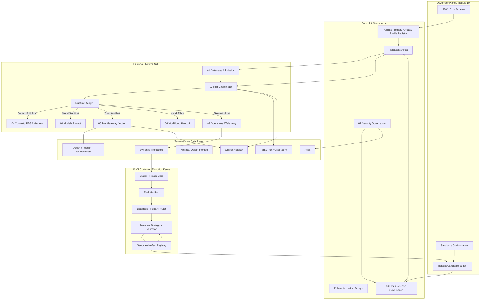

# UEAF 总体架构

Architecture Generation: `V1`  
Implementation: `Current`

## 1. 架构摘要

UEAF V1 采用：

```text
Developer Plane
+ Control Plane
+ Regional Runtime Cell
+ Tenant-aware Data Plane
+ Evidence/Governance Plane
+ logical V1 Controlled Evolution Kernel
```

`Evolution Kernel` 是逻辑能力边界，不要求独立微服务；首个实现继续遵守 ADR-004 模块化单体优先。

## 2. V1 逻辑架构



## 3. 平面职责

### Developer Plane

- Schema/SDK/CLI；
- Adapter Kit / Conformance；
- Artifact/Sandbox；
- `ReleaseCandidate` Build；
- 不签发生产 Release，不写生产 Run/Action。

### Control/Governance

- Registry、Policy、Budget、Eval、Release、Kill Switch；
- 管理期望状态和发布门禁；
- 不成为运行结果事实源。

### Runtime Cell

- Request/Admission；
- Task/Run/Checkpoint；
- Runtime Adapter；
- Context/Model/Tool/Workflow；
- Operations/Telemetry；
- 运行时权威状态按模块 Semantic Owner 分离。

### Data Plane

- 提供物理持久化；
- 不取得 Semantic Owner；
- State/Event、Action、Audit 至少保持逻辑隔离。

### Evolution Kernel

- 读取 Evidence Projection/refs；
- Trigger Gate；
- `EvolutionTrigger` / `EvolutionRun`；
- Diagnosis/Repair Router；
- Subject/Objective/Strategy Profile；
- machine-valid `MutationProposal`；
- `GenomeManifest` candidate；
- 不执行事故止血、不签发 Release、不修改 Governance Kernel。

## 4. Runtime Adapter

公共最小 SPI 只使用核心规范：

```text
DescribeRuntime
StartRun
AdvanceRun
SuspendRun
ResumeRun
CancelRun
InspectRun
```

一个 Run 只能绑定一个 Runtime Adapter 版本。Adapter 通过受限 `RuntimeExecutionContext` 使用：

```text
ContextBuildPort
ModelStepPort
ToolIntentPort
HandoffPort
TelemetryPort
```

Adapter 原生 event 先归一为 `RuntimeEvent`/observation；只有权威 State Writer 提交的跨模块事实才成为核心 `EventEnvelope`。

## 5. 核心运行时序

```text
External Request
  -> 01 Edge Pre-validation
  -> PrincipalContext + RequestEnvelope + TaskEnvelope
  -> 02 TaskState + RunRecord(queued)
  -> admitting
  -> 01 RunAdmissionResult
  -> admitted -> running
  -> RuntimeAdapter
       -> ContextBuildPort
       -> ModelStepPort
       -> ToolIntentPort if needed
       -> HandoffPort if needed
  -> Action / Workflow / Model outcomes
  -> 02 computes terminal Run
  -> Audit / Eval / Production Evidence
```

## 6. Tool / Action 时序

```text
ToolIntent
  -> 05 canonicalize + stable action_fingerprint/action_key
  -> ActionRecord(proposed)
  -> validating -> authorizing
  -> 07 PDP: PolicyDecision
       deny -> terminal/denied
       require_approval -> durable Approval -> re-evaluate
       allow -> reserve existing action_key
  -> short-lived credential + execution lease/fencing
  -> Tool Adapter
  -> ActionReceipt succeeded | failed | unknown
  -> reconcile unknown
```

外部副作用结果不确定时不得盲重试。

## 7. Evidence 架构

```text
02..08 facts
  -> core TelemetryPort / local non-blocking buffer
  -> 09 sampling / aggregation / retention
  -> RunSummary / rolling windows / ErrorFingerprint / Eval/Security refs
  -> 11 Trigger Candidate / Trigger Gate
  -> bounded L2 Evidence Expansion when needed
```

Evidence 分层：L0 Always-on Minimal、L1 Conditional Sample、L2 On-demand Expansion。

正常采集/聚合/Trigger Candidate 路径目标 `0 LLM Token`。

## 8. V1 Evolution 时序

```text
Observed signal / opportunity
  -> urgent? Operational Response first
  -> Trigger Gate
  -> EvolutionTrigger
  -> EvolutionRun
  -> bounded Evidence Expansion
  -> Diagnosis / Repair Router
  -> Effective Mutation Surface
  -> Strategy proposes 0..N Proposal Drafts
  -> Mutation Validator
  -> MutationProposal
  -> GenomeManifest candidate
  -> Module 10 ReleaseCandidate
  -> Module 08 Eval + 07/09 gates
  -> Objective comparison
  -> Reject | Canary | Promote according to Release Governance
  -> Production feedback
```

首版 `Single-Candidate First`。

## 9. Event / Error / Contract 边界

- 所有跨模块持久对象继承 `ContractMeta`；
- 跨模块 public event 使用核心完整 `EventEnvelope`；
- event name = `ueaf.<domain>.<past_tense_fact>`；
- 未进入核心事件目录的 Evolution event 只作为模块 11 internal event/metadata；
- API error 使用 `ProblemDetail`；
- Port 使用 `PortResult<T>/PortError`；
- 不再建立 `ErrorEnvelope`。

## 10. Release / Version

`ReleaseManifest` 是生产运行唯一不可变版本清单，表达兼容版本集合：

```text
agent_versions
prompt_versions
schema_versions
model_route_versions
capability_versions
adapter_versions
knowledge_index_versions
memory_policy_versions
policy_versions
```

Run 启动后固定 `release_id`；恢复不静默升级。

## 11. Trust Boundary

- 所有外部内容和模型输出是不可信候选；
- tenant/principal/policy/action identity 只能由确定性可信组件构造；
- Tool/MCP/Remote Agent 不因 discovery 获得权限；
- Judge 无生产 Tool 写权限；
- Evolution Evidence 视为不可信输入；
- Candidate 不能修改自身 Eval/Release/Budget/Governance root。

## 12. Multi-tenant

隔离覆盖：

```text
identity / delegation
database / RLS or cell
queue / lease
cache / idempotency
search/vector
artifact/object store
telemetry/audit
model/tool egress
budget/quota
backup/restore/deletion
```

## 13. Reference Physical Topology

首个实现技术默认见实施规范 05：

```text
Python/FastAPI
PostgreSQL
NATS JetStream
OpenTelemetry
S3-compatible / local MinIO
LangGraph Runtime Adapter
OpenAI Agents SDK read-only Adapter #2
```

这些是 Reference Profile，不是 UEAF 契约依赖。

## 14. Failure Isolation

| 故障 | 核心响应 |
|---|---|
| 身份/tenant 无法确认 | edge reject / fail closed |
| Admission dependency 暂不可用 | deferred/waiting or rejected by policy |
| Runtime Adapter crash | lease expiry + restore from durable state |
| Model unavailable | bounded retry/fallback; explicit failed/incomplete when exhausted |
| Tool timeout | unknown -> reconciliation |
| Telemetry backpressure | preserve Audit/Security/P0-P1/RunSummary; degrade verbose trace |
| Eval/Security evidence missing | no active release approval |
| Evolution budget exhausted | normal terminal disposition; no more strong-model calls |
| Candidate safety failure | stop promotion; no weighted override |

## 15. V2/V3 Boundary

V2: Species/GenePool/Population/Ecosystem Fitness/Diversity。

V3: Meta Evolution/Dynamic Niche/Topology/Pareto/Evolution Debt/ModelEvolutionPort。

不得为 V2/V3 在 V1 预建 service/DB/state/topic。
