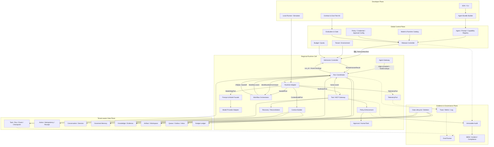
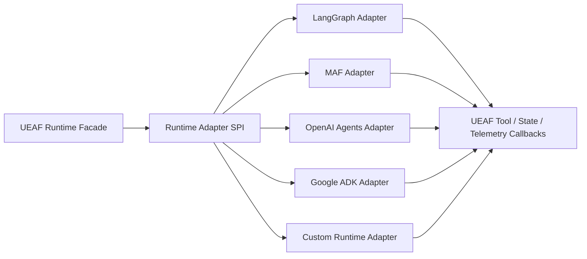
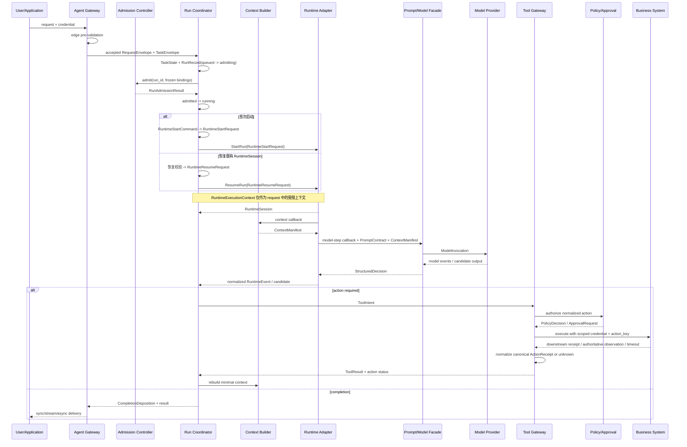
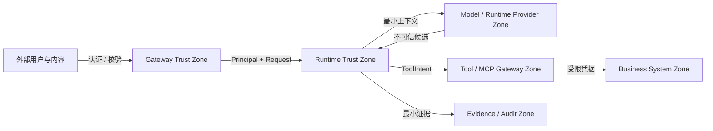

# UEAF 总体架构

## 1. 架构摘要

UEAF 采用“全局控制面 + 区域运行 Cell + 租户感知数据面 + 独立证据面 + 开发者面”的结构。Agent Runtime 被封装在 Runtime Adapter 后方；所有进入模型的上下文、所有离开模型的动作和所有跨域调用均经过 UEAF 的确定性控制边界。

## 2. 逻辑架构



## 3. 组件职责

### 3.1 Agent Gateway

- 终止 HTTP、SSE、WebSocket、gRPC 或消息协议；
- 绑定可信 PrincipalContext；
- 执行大小、速率、区域和数据分类初筛；
- 创建 request_id 和 trace_id；
- 提供同步、流式、异步、查询和取消接口；
- 不执行模型循环，不拥有 Task/Run 状态。

### 3.2 Admission Controller

- 验证 AgentDefinition 和 ReleaseManifest；
- 校验租户、环境、区域、模型/工具 allowlist；
- 预留时间、Token、费用、并发和动作预算；
- 消费 Gateway 的边缘预校验证据，但不替代该阶段；
- 只针对 Runtime 已创建且进入 admitting 的 run_id 形成 RunAdmissionResult；
- 高风险控制依赖不可用时失败关闭。

### 3.3 Run Coordinator

- Task/Run 的唯一运行协调者；
- 获取和续约运行租约，传播 fencing token；
- 推进 RunPhase、WaitReason 和 CompletionDisposition；
- 调度 Runtime Adapter，并通过受控端口调用 Context Builder、Model Facade、Tool Gateway 和 HumanTask；
- 原子提交状态与 Outbox；
- 处理取消、超时、恢复和版本重验。

### 3.4 Context Builder

- 属于模块 04 Context Domain，由 Runtime/Runtime Adapter 按轮调用；
- 收集 Task、Conversation、Memory、Evidence、Tool 能力和业务事实引用；
- 硬过滤主体、租户、用途、权限、有效期和地域；
- 选择、结构化、压缩并隔离不可信内容；
- 输出不可变 ContextManifest；
- 不拥有知识、记忆或业务事实原文。

### 3.5 Prompt and Model Facade

- 加载 PromptContract 和 Schema；
- 将 ContextManifest 转为 ModelInvocation；
- 选择兼容的模型路由和 Provider Adapter；
- 归一流式事件、用量和错误；
- 执行结构、证据和语义校验；
- 输出 StructuredDecision，不执行工具或业务动作。

### 3.6 Runtime Adapter

- 承载底层 Agent Loop、图工作流或 SDK Runner；
- 映射 start、resume、cancel、stream、checkpoint、interrupt 和 handoff；
- 暴露 capability descriptor；
- 把企业工具调用回送 Tool Gateway；
- 不拥有 UEAF Task、Action、Approval、Audit 或 Release 语义。

### 3.7 Workflow Orchestrator

- 管理 WorkflowDefinition、WorkflowRun、NodeRun 和 Attempt；
- 支持顺序、条件、并行、循环、Manager-as-tools 和 Handoff；
- 预留并结算子任务预算；
- 传播取消并隔离晚到结果；
- 不修改根 Task 的权威业务事实。

### 3.8 Tool / MCP Gateway

- 计算当前可见能力集合；
- 将 Runtime Tool Call 转为 ToolIntent；
- 规范化参数和 action_key；
- 调用 PDP、Approval、Credential Broker 和 Adapter；
- 管理 ActionRecord、ExecutionAttempt、ActionReceipt 和对账；
- MCP 只负责发现和协议转换，不提升信任。

### 3.9 Policy Enforcement and Approval

- PDP 对主体、Agent、资源、动作、用途和环境形成 PolicyDecision；
- PEP 执行拒绝、参数收窄、脱敏、审批和凭据约束；
- ApprovalRequest 绑定动作指纹、目标、版本、审批人范围、TTL 和次数；
- HumanTask 同时支持用户补充、人工复核、接管和异常对账。

### 3.10 Recovery and Reconciliation

- 验证 Checkpoint、事件水位、ReleaseManifest 和权限；
- 阻断过期租约 Worker；
- 对 unknown Action 查询业务权威状态；
- 执行状态迁移、补偿或人工升级；
- 记录恢复证据，不伪造原始运行历史。

## 4. 控制路径与数据路径

### 4.1 慢控制路径

```text
Agent Bundle
  → Registry Validation
  → Contract / Security / Eval
  → QualityGateDecision
  → SecurityGateDecision
  → OperationalReadinessDecision
  → ReleaseDecision
  → Signed ReleaseManifest
  → Regional Runtime Cells
```

### 4.2 快运行路径

```text
Request
  → Edge pre-validation
  → TaskState / RunRecord(queued → admitting)
  → RunAdmissionResult
  → running（仅 admitted）
  → Context / Model / Runtime
  → Tool Gateway（如需）
  → Result / Event / Evidence
```

Control Plane SHOULD 不进入每次低风险模型调用的同步热路径。区域 Cell 使用有期限的签名配置快照；策略撤销和 kill switch 通过高优先级通道传播。超过有效期后，高风险路径 MUST 失败关闭。

## 5. Runtime Adapter 架构



一个 Run MUST 绑定一个 Runtime Adapter 和确定版本。跨 Runtime 协作通过 HandoffEnvelope 或远程 Agent 协议发生，不允许两个 Runtime 同时写同一 Run 状态。

## 6. 运行关键时序



## 7. 信任边界



边界规则：

- 从模型和外部内容返回的所有数据均视为不可信候选；
- 身份、tenant、策略版本和 action_key 只能由确定性组件创建或验证；
- Runtime Provider 只能看到完成当前步骤所需的最小数据；
- MCP Server、远程 Agent 和 Tool Adapter 必须登记来源、版本、数据流和撤销状态；
- Evidence/Audit Zone 使用独立访问、保留、完整性和导出策略。

## 8. 物理部署拓扑

最小生产拓扑包括：

- 全局或区域化 Control Plane；
- 至少一个 Regional Runtime Cell；
- 独立 API 和 Worker 池；
- 持久队列、State/Event Store、Action Store；
- 租户感知 Knowledge、Memory、Artifact 和 Cache；
- 独立 Telemetry Pipeline 和 Audit Store；
- Credential Broker、PDP 和 Approval Service；
- Runtime Adapter 运行池及 Tool/MCP egress 边界。

同一二进制可在初期承载多个逻辑模块，但 State/Event、Action/Audit 三类数据必须保持逻辑隔离。拆分服务的触发条件包括独立扩缩、信任域、合规、故障域和团队所有权。

## 9. 故障隔离

| 故障 | RunPhase | CompletionDisposition / 运营信号 | 限损策略 |
|---|---|---|---|
| 身份或租户无法确认 | edge 阶段无 Run；Run admission 时 terminal | rejected | 边缘安全拒绝或正式准入拒绝 |
| Control Plane 短时不可用 | running 或 waiting | 非终态为空；可标记运营受限 | 仅使用未过期签名快照 |
| Runtime Adapter 崩溃 | retrying 或 waiting | 非终态为空 | 租约过期后从事件水位恢复 |
| 模型不可用 | retrying；耗尽后 terminal | incomplete 或 failed | 仅使用已评测回退路由 |
| RAG 必需证据不可用 | terminal | incomplete | 禁止无依据生成 |
| Memory 不可用 | running | 非终态为空；degraded 仅作运营信号 | 关闭个性化并记录影响 |
| Tool 响应超时 | waiting | 非终态为空；耗尽后可 incomplete | unknown → reconciliation |
| PDP 不可用 | waiting；不可恢复时 terminal | rejected 或 failed | 高风险失败关闭 |
| Approval 不可用 | waiting；到期后 terminal | incomplete 或 rejected | 保持等待或按完成契约到期 |
| Audit 不可落盘 | waiting；低风险可 running | 非终态为空；degraded 仅作运营信号 | 敏感动作暂停，低风险有界缓冲 |
| Telemetry 出口不可用 | running | 非终态为空；degraded 仅作运营信号 | 有界缓冲并告警 |

## 10. 可扩展性

扩展维度包括 tenant、region、agent、runtime、model、workflow、tool risk 和 data classification。默认分区键为 tenant_id + task_id/run_id；Action 使用 tenant_id + action_key；Conversation 和 Memory 使用 tenant_id + subject_id。

Worker 扩缩必须尊重：

- 每租户公平队列和并发上限；
- 同一 Run/Workflow 的写入租约；
- 同一 Action 的 fencing 和预占；
- 模型、工具和业务依赖的独立舱壁；
- 父预算对子任务预算的硬上限。

## 11. 可观测架构

标准 Span 至少覆盖：admission、context build、model invocation、runtime turn、workflow node、policy decision、approval wait、tool execution、reconciliation 和 state commit。

禁止将完整 Prompt、工具载荷、凭据、用户标识或敏感证据默认写入 Trace。需要受限调试时，载荷写入独立 Payload Vault，Trace 只保存短期引用和分类标签。

## 12. 架构验收

- Control Plane 与 Runtime Plane 的期望/实际状态接口清晰；
- Runtime Adapter 的能力协商与拒绝行为可测试；
- Agent Runtime 无法绕过 Tool Gateway 访问高风险企业工具；
- State Writer 必须持有有效 lease/fencing token；
- 每种状态和事实只有一个 Semantic Owner；
- Pooled 与 Dedicated 租户拓扑均有明确隔离边界；
- Trace、Audit 和 Eval 使用不同存储和访问策略；
- N/N+1 ReleaseManifest 可共存，旧 Run 可安全恢复；
- 所有降级模式都有可见信号和退出条件。
