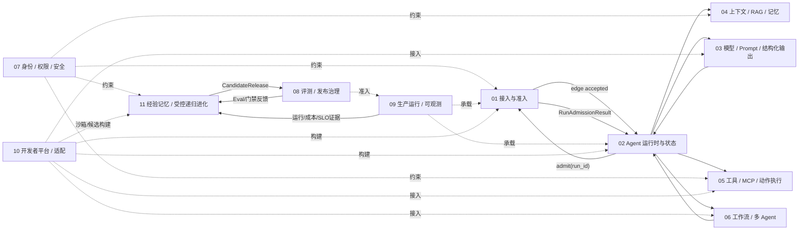

# UEAF 功能模块全景

## 1. 模块关系



## 2. 模块目录

| 模块 | 核心组件 | 主要输入 | 主要输出 | 不负责 |
|---|---|---|---|---|
| [01 接入与准入](../02-功能模块/01-接入与准入.md) | Gateway、Identity Adapter、Contract Gate、Admission Controller | 协议请求、凭据、租户配置、待准入 run_id | PrincipalContext、RequestEnvelope、TaskEnvelope、RunAdmissionResult | Task/Run 状态写入、模型调用 |
| [02 Agent 运行时与状态](../02-功能模块/02-Agent运行时与状态.md) | Run Coordinator、State Machine、Agent Loop Controller、Checkpoint Manager | 边缘 accepted 候选、RunAdmissionResult、事件、HumanTask 结果 | TaskState、RunRecord、CompletionDisposition | 身份签发、业务事务 |
| [03 模型 Prompt 与结构化输出](../02-功能模块/03-模型Prompt与结构化输出.md) | Prompt Registry、Schema Validator、Model Router、Provider Adapter | ContextManifest、PromptContract、ModelRoute | ModelInvocation、ModelRunResult、StructuredDecision | 工具授权、Task 状态 |
| [04 上下文 RAG 与记忆](../02-功能模块/04-上下文RAG与记忆.md) | Context Builder、Knowledge Pipeline、Retrieval Gateway、Conversation、Memory Service | 查询、主体、任务、知识和会话事件 | ContextManifest、EvidencePack、MemoryRecord、ContextSource | 根 Run 推进、业务事实修改、EvolutionExperience |
| [05 工具 MCP 与动作执行](../02-功能模块/05-工具MCP与动作执行.md) | Capability Registry、Tool Gateway、Action Coordinator、Reconciler | ToolIntent、PrincipalContext、PolicyDecision | ActionRecord、ToolResult、ActionReceipt | PDP 规则所有权、根 Run 状态 |
| [06 工作流与多 Agent](../02-功能模块/06-工作流与多Agent.md) | Workflow Registry、Orchestrator、Router、Handoff Adapter | 任务投影、预算、AgentDefinition | WorkflowRun、NodeRun、HandoffEnvelope | 根 Task/Run、全局授权 |
| [07 身份权限与安全](../02-功能模块/07-身份权限与安全治理.md) | Principal Resolver、PDP、PEP、Credential Broker、安全运营 | 身份、资源、动作、用途、风险、安全证据 | PrincipalContext、PolicyDecision、SecurityGateDecision、安全事件 | Tool 执行、Memory 实体存储、Evolution Candidate 激活 |
| [08 评测与发布治理](../02-功能模块/08-评测与发布治理.md) | Dataset、Eval Runner、Quality Gate、Release Governance | 候选版本、Trace、结果、SecurityGateDecision、OperationalReadinessDecision | EvalResult、QualityGateDecision、ReleaseDecision、ReleaseManifest | 生产流量执行、实时授权、Mutation 生成 |
| [09 生产运行与可观测](../02-功能模块/09-生产运行与可观测性.md) | Queue、Worker、Lease、Deployment Controller、Telemetry、DR | ReleaseManifest、Run、Event、运营信号 | OperationalReadinessDecision、SLO、部署和恢复记录 | 重新定义领域状态语义、签发 ReleaseManifest、宣告 Evolution 成功 |
| [10 开发者平台与适配](../02-功能模块/10-开发者平台与框架适配.md) | SDK、CLI、Bundle、Runtime/Provider Adapter、Studio、Test Kit | Agent 源、配置、测试集、外部框架 | 可签名 Bundle、Adapter、测试报告 | 生产状态和业务授权 |
| [11 经验记忆与受控递归进化](../02-功能模块/11-经验记忆与受控递归进化.md) | Trigger Engine、Experience/Lesson Store、Genome Registry、Evolution Strategy、Mutation Proposer、Budget Controller、Lineage | 结构化生产/评测/成本证据、AgentGenome、EvolutionBudget | EvolutionTrigger、EvolutionExperience、EvolutionLesson、MutationProposal、CandidateRelease、FitnessRecord、LineageGraph | 当前 Release 原地修改、Eval/Release 签发、Governance Kernel 自改 |

## 3. 关键同步契约

| 调用方 | 接口 | 服务方 | 响应 |
|---|---|---|---|
| Gateway | prevalidate(request, principal) | Edge Admission | RequestEnvelope + TaskEnvelope + edge_validation_ref，或安全拒绝 |
| Runtime | admit(run_id, bindings) | Admission Controller | RunAdmissionResult |
| Runtime Adapter | ContextBuildPort(request) | Context Builder | ContextManifest |
| Runtime Adapter | ModelStepPort(context, prompt) | Prompt/Model Facade | StructuredDecision |
| Prompt/Model Facade | invoke(ModelInvocation) | Model Provider Adapter | ModelRunResult/EventStream |
| Runtime Adapter | ToolIntentPort(intent) | Tool Gateway | ToolResult/Interruption |
| Tool Gateway | decide(subject, action, resource) | PDP | PolicyDecision |
| Tool Gateway | request_approval(action) | Approval Service | ApprovalRequest(status=pending/approved/rejected/expired/cancelled) |
| Runtime Adapter | HandoffPort(handoff) | Orchestrator | Handoff result/EventStream |
| Runtime Adapter | TelemetryPort(event) | Telemetry Pipeline | Accepted/Rejected + telemetry_ref |
| Release Controller | evaluate(candidate) | Gate Engines | ReleaseDecision |
| Evolution Trigger Engine | evaluate(signal_window) | Evidence/Metric/Eval projections | EvolutionTrigger 或 no_trigger |
| Evolution Strategy | propose(trigger, lessons, genome, budget) | Strategy Adapter | MutationProposal[] |
| Candidate Builder | build(mutation, genome) | Module 10 Sandbox/Bundle Builder | CandidateRelease |
| Evolution Plane | evaluate(candidate, suite) | Module 08 Eval Runner | Fitness 所需 EvalResult refs |
| Evolution Plane | submit(candidate, evidence) | Release Governance | ReleaseCandidateRef；后续仍由独立门禁裁决 |

## 4. 关键异步事件

| 事件 | 生产者 | 主要消费者 |
|---|---|---|
| `ueaf.request.accepted` / `ueaf.request.rejected` | Edge Admission | Runtime、Audit |
| `ueaf.run.admitted` | Run Admission | Runtime、Audit、SRE |
| `ueaf.run.phase_changed` / `ueaf.run.wait_registered` | Runtime | Gateway、SRE、Eval |
| `ueaf.context.manifest_created` | Context Builder | Runtime、Model、Eval |
| `ueaf.model.invocation_completed` | Model Gateway | Runtime、Eval、Cost |
| `ueaf.approval.requested` / `ueaf.approval.resolved` | Approval Service | Tool Gateway、Runtime、Audit |
| `ueaf.action.reconciliation_scheduled` | Tool Gateway | Reconciler、Audit、SRE |
| `ueaf.action.receipt_recorded` / `ueaf.action.terminal_committed` | Action Domain | Runtime、Audit、Eval |
| `ueaf.evidence.pack_created` | Evidence Service | Context Builder、Eval |
| `ueaf.memory.record_created` / `ueaf.memory.record_deleted` | Memory Service | Context Builder、Deletion Coordinator |
| `ueaf.eval.result_recorded` | Eval Runner | Gate Services、Release Governance、Evolution Plane |
| `ueaf.release.manifest_approved` / `ueaf.release.activated` | Release Controller | Runtime Cells、Audit、Lineage Service |
| `ueaf.evolution.triggered` | Evolution Trigger Owner | EvolutionRun、Audit、Cost |
| `ueaf.evolution.experience_validated` / `ueaf.evolution.lesson_consolidated` | Evolution Experience Domain | Strategy Engine、Lineage |
| `ueaf.evolution.mutation_proposed` / `ueaf.evolution.candidate_generated` | Evolution Plane | Sandbox、Eval、Audit |
| `ueaf.evolution.candidate_evaluated` / `ueaf.evolution.candidate_selected` | Evolution Plane | Release Governance、Lineage |
| `ueaf.evolution.run_terminal_committed` | EvolutionRun Owner | Audit、Cost、Operations |

## 5. 模块边界规则

### 5.1 调用前与调用后

模块 03 是双向契约边界：

```text
Runtime Adapter → ModelStepPort（模块 03）
  → PromptContract + ContextManifest
  → ModelInvocation → Model Provider Adapter
  → ModelRunResult → 模块 03 Validation
  → StructuredDecision → Runtime Adapter / Run Coordinator
```

不得将模块关系简化成只存在 `Model → Prompt` 的单向链。

### 5.2 Context Builder 唯一性

- 模块 04 生产可访问的 Conversation、EvidencePack 和 MemoryRecord；
- 模块 04 的 Context Builder 是 ContextManifest 唯一写者；模块 02 按本轮目标、预算和状态发起请求并只保存引用；
- 模块 03 只负责将 ContextManifest 序列化为特定模型请求。

### 5.3 ActionRecord 唯一性

- 模块 05 唯一拥有 ActionRecord 和 action_key；实现内部 MAY 将该状态边界组织为 ActionAggregate；
- 模块 07 拥有 PolicyDecision，不拥有动作实体；
- MCP Server 或业务系统返回的远端收据是 ActionRecord 的下游证据；
- 模块 09 只提供 Action Store 的物理承载和恢复能力。

### 5.4 Task、Run 与 WorkflowRun

- 模块 02 拥有根 Task 和 Run；
- 模块 06 拥有 WorkflowRun、NodeRun 和 Attempt；
- NodeRun 的结果通过受控投影更新根 Run，不直接修改 Task 业务事实；
- 子任务预算总和不得超过父预算的预留值。

### 5.5 决策对象命名

| 对象 | 唯一语义 |
|---|---|
| ResultDisposition | 单次模型候选的接受、复核或拒绝 |
| PolicyDecision | 运行时访问或动作授权 |
| QualityGateDecision | 候选版本质量门禁 |
| SecurityGateDecision | 候选版本安全门禁 |
| OperationalReadinessDecision | 候选版本生产准备度门禁 |
| ReleaseDecision | 综合门禁后的最终发布裁决 |

禁止使用无前缀 `GateDecision` 表达多个语义。

### 5.6 Evolution Domain 唯一性

- 模块 11 拥有 `EvolutionTrigger`、`EvolutionExperience`、`EvolutionLesson`、`AgentGenome`、`MutationProposal`、`EvolutionRun`、`FitnessRecord` 和 `LineageGraph` 的演化语义；
- 模块 04 的 `MemoryRecord` 继续面向业务 Agent 的受治理长期记忆；两者不得合并为同一“无限记忆池”；
- 模块 08 唯一拥有 Eval 与 Release 语义，模块 11 只能引用和消费 Eval 事实；
- 模块 09 的 Trace/Metric/Cost 是触发证据，不得直接宣告 `EvolutionTrigger` 或 `improved`；
- 当前 `ReleaseManifest` 不属于 mutable Genome；任何自改必须创建新 Candidate；
- Subject、Builder、Judge 和 Release Authority 必须逻辑隔离；
- 没有有效 Trigger 时，模块 11 不应进入持续 LLM 运行状态。

### 5.7 Evolution Cost 与记忆边界

- `EvolutionBudget` 必须约束模型调用、Token、金额、候选、代数和时间；
- Fitness 必须同时保留质量、安全、Token、费用、延迟、复杂度和回归差异；
- Evaluator 优先级为 Deterministic → Statistical → Small Model → Strong Model → Human；
- Active Evolution Working Set 必须有界；Raw Evidence 和 Archived Lineage 不默认进入模型上下文；
- 经验证的 Lesson SHOULD 尽量编译为 Policy、Router、Tool、Workflow 或 Skill，以降低长期 Token 依赖。

## 6. 公共横切能力

所有模块共同遵守：

- tenant_id、principal reference、task_id、run_id、trace_id 和 release_id 传播；
- deadline、budget、classification、purpose 和 provenance 传播；
- Schema 版本与生产者版本声明；
- ErrorEnvelope 和明确 retryability/outcome certainty；
- OTel 兼容 Trace 语义和敏感载荷最小化；
- Audit 的独立完整性、访问与保留；
- 数据删除、撤销和法律保留；
- Adapter 供应链、签名和紧急隔离；
- Evolution Candidate、Genome、Experience 和 Lineage 的版本化、来源与预算可追溯。

## 7. 推荐实现顺序

1. 模块 01、02、03：完成单 Agent 确定性运行外壳。
2. 模块 05、07：完成受控只读工具和一个可审批写动作。
3. 模块 09：完成持久队列、租约、事件、Checkpoint、Trace 和 Audit。
4. 模块 04：接入权限感知 RAG；长期记忆按业务证据单独启用。
5. 模块 08：形成自动评测和 ReleaseManifest 门禁。
6. 模块 10：完成 SDK/CLI、首个 Runtime Adapter 和一致性测试。
7. 模块 06：仅在单 Agent 基线证明瓶颈后引入工作流或多 Agent。
8. 模块 11：在 08/09 的证据、预算和发布治理稳定后，先实现 Experience/Lineage/Trigger，再启用低风险 sparse mutation；Population/Genetic Search 和 Meta-Evolution 最后按证据引入。
