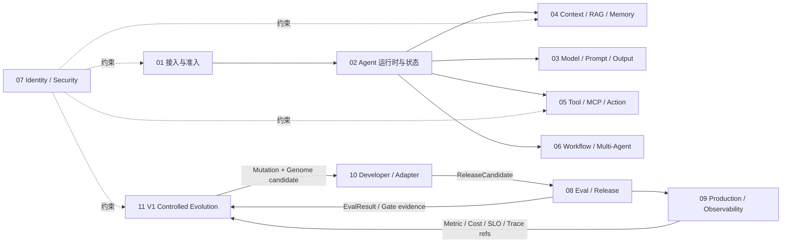

# UEAF 功能模块全景

当前实施代际：`V1`  
未来设计：`V2 / V3`，见 [架构代际与实施范围](06-UEAF架构代际与实施范围.md)

## 1. 模块关系



## 2. V1 模块目录

| 模块 | 核心组件 | 主要输出 | 不负责 |
|---|---|---|---|
| [01 接入与准入](../02-功能模块/01-接入与准入.md) | Gateway、Identity Adapter、Admission Controller | PrincipalContext、RequestEnvelope、TaskEnvelope、RunAdmissionResult | Task/Run 状态、模型调用 |
| [02 Agent 运行时与状态](../02-功能模块/02-Agent运行时与状态.md) | Run Coordinator、State Machine、Checkpoint | TaskState、RunRecord、CompletionDisposition | 身份签发、业务事务 |
| [03 模型 Prompt 与结构化输出](../02-功能模块/03-模型Prompt与结构化输出.md) | Prompt Registry、Model Router、Provider Adapter | ModelInvocation、ModelRunResult、StructuredDecision | Tool 授权、Run 状态 |
| [04 上下文 RAG 与记忆](../02-功能模块/04-上下文RAG与记忆.md) | Context Builder、Retrieval、Memory Service | ContextManifest、EvidencePack、MemoryRecord | EvolutionRun、业务事实写入 |
| [05 工具 MCP 与动作执行](../02-功能模块/05-工具MCP与动作执行.md) | Tool Gateway、Action Coordinator、Reconciler | ActionRecord、ToolResult、ActionReceipt | PDP 规则、根 Run 状态 |
| [06 工作流与多 Agent](../02-功能模块/06-工作流与多Agent.md) | Workflow Registry、Orchestrator、Handoff | WorkflowRun、NodeRun、HandoffEnvelope | 根 Task/Run、全局授权 |
| [07 身份权限与安全](../02-功能模块/07-身份权限与安全治理.md) | Principal Resolver、PDP、PEP、Credential Broker | PrincipalContext、PolicyDecision、SecurityGateDecision | Tool 执行、Evolution Candidate 发布 |
| [08 评测与发布治理](../02-功能模块/08-评测与发布治理.md) | Eval Runner、Quality Gate、Release Governance | EvalResult、QualityGateDecision、ReleaseDecision、ReleaseManifest | Mutation 生成、生产流量 |
| [09 生产运行与可观测](../02-功能模块/09-生产运行与可观测性.md) | Queue、Worker、Lease、Telemetry、DR | OperationalReadinessDecision、SLO、部署/恢复记录 | 重新定义领域语义、宣告演化成功 |
| [10 开发者平台与适配](../02-功能模块/10-开发者平台与框架适配.md) | SDK、CLI、Bundle、Sandbox、Adapter Kit | `ReleaseCandidate`、Bundle、Adapter、测试报告 | 生产状态、发布授权 |
| [11 V1 经验记忆与受控递归进化](../02-功能模块/11-经验记忆与受控递归进化.md) | Trigger、Evolution Coordinator、Genome Registry、Mutation Strategy、Working Set | `EvolutionTrigger`、`EvolutionRun`、`GenomeManifest`、`MutationProposal`、`EvolutionAuthorityPolicy` | 第二套 Candidate/Eval/Budget/Release、V2 生态服务 |

## 3. V1 Evolution 复用边界

模块 11 只新增五个 Canonical Object：

```text
EvolutionTrigger
EvolutionRun
GenomeManifest
MutationProposal
EvolutionAuthorityPolicy
```

以下必须复用现有模块：

| 需要 | 复用 |
|---|---|
| 候选 | 模块 10 `ReleaseCandidate` |
| 评测 | 模块 08 `EvalConfig` / `EvalRun` / `EvalResult` |
| 安全门禁 | 模块 07 |
| 生产就绪门禁 | 模块 09 |
| 预算 | 既有 Budget Domain |
| 发布 | 模块 08 `ReleaseDecision` / `ReleaseManifest` |
| 工件 | Artifact / Registry |

V1 不再把 `EvolutionExperience`、`EvolutionLesson`、`FitnessRecord`、`LineageGraph`、`CandidateRelease`、`EvaluationSuite`、`EvolutionBudget` 定义为新的跨模块权威对象。

它们的思想可通过内部记录、Projection、Registry metadata、Eval dimension 或既有对象引用表达。

## 4. 关键同步契约

| 调用方 | 接口 | 服务方 | 响应 |
|---|---|---|---|
| Gateway | prevalidate(request, principal) | Edge Admission | RequestEnvelope + TaskEnvelope 或拒绝 |
| Runtime | admit(run_id, bindings) | Admission Controller | RunAdmissionResult |
| Runtime Adapter | ContextBuildPort | Context Builder | ContextManifest |
| Runtime Adapter | ModelStepPort | Prompt/Model Facade | StructuredDecision |
| Runtime Adapter | ToolIntentPort | Tool Gateway | ToolResult/Interruption |
| Tool Gateway | decide | PDP | PolicyDecision |
| Release Controller | evaluate(candidate) | Gate Engines | ReleaseDecision |
| Trigger Engine | evaluate(signal_window) | Evidence projections | EvolutionTrigger 或 no_trigger |
| Evolution Coordinator | propose(trigger, genome, budget_ref) | Strategy/Mutation | MutationProposal[] |
| Evolution Module | build(mutation, genome) | Module 10 Sandbox/Builder | ReleaseCandidate |
| Evolution Module | evaluate(candidate) | Module 08 Eval | EvalResult refs |

## 5. 关键事件

现有事件语义继续保持。V1 Evolution 新增最小事件集合：

```text
ueaf.evolution.triggered
ueaf.evolution.run_started
ueaf.evolution.mutation_proposed
ueaf.evolution.genome_created
ueaf.evolution.run_terminal_committed
```

Candidate 构建、Eval、Gate、Release 继续使用模块 10/08/07/09 的既有事件，不复制第二套 `candidate_evaluated` / `candidate_released` 语义。

## 6. 模块边界规则

### 6.1 Context

- 模块 04 是 ContextManifest 的唯一写者；
- Evolution 的 Working Set 不成为业务 `MemoryRecord`；
- 演化内部经验不默认注入业务 Agent 上下文。

### 6.2 Action

- 模块 05 唯一拥有 ActionRecord/action_key；
- 自我进化生成的新 Tool 进入生产后仍必须通过 Tool Gateway。

### 6.3 Eval / Release

- 模块 08 唯一拥有 Eval 与 Release 语义；
- 模块 11 只能消费 EvalResult 和提交 ReleaseCandidate；
- Candidate 不得修改自己的 Eval root 或 Release Authority。

### 6.4 Budget

- 演化预算是既有 Budget Domain 的用途/切片；
- 模块 11 可以消费和结算预算，但不能成为第二套 Budget 真相源；
- Candidate/Strategy 不得提升自身预算。

### 6.5 Genome

V1 统一使用 `GenomeManifest`：

```text
GenomeManifest<agent>
GenomeManifest<skill>
GenomeManifest<tool>
GenomeManifest<workflow>
GenomeManifest<strategy>
```

通过 `profile_ref` 定义不同类型，不建设多套基础 Genome 状态机。

### 6.6 Lineage / Fitness / Experience

- Lineage：refs/events -> Projection；
- Fitness：Eval/Cost/SLO -> comparison view；
- Experience/Lesson：内部结构化记录；
- Gene Pool / Species：V1 仅为 metadata/未来兼容，不是当前 Domain。

## 7. Minimum Semantic Surface

新增跨模块对象前必须证明：

1. 独立生命周期；
2. 独立 Semantic Owner；
3. 独立状态迁移/并发控制；
4. 跨模块稳定契约需求；
5. 现有对象 + ref / Projection / Registry metadata / Eval dimension 无法表达。

否则不得新增 Canonical Object。

## 8. V2/V3 归属

### V2 Planned

- Species / Population / Elite；
- Gene Pool；
- Capability Transfer；
- Local + Ecosystem Fitness；
- Diversity / Monoculture Risk；
- Ecosystem Funnel Evaluation。

对应设计文档：

- `../01-核心规范/06-生态共同进化与演化授权规范.md`
- `../03-参考架构/06-生态共同进化与基因池.md`

### V3 Research

- Meta Evolution；
- Dynamic Niche/Species；
- Ecosystem Topology；
- Pareto Frontier；
- Evolution Debt / Systemic Risk；
- ModelEvolutionPort。

V2/V3 不属于 V1 Current 实施范围。

## 9. 推荐实现顺序

1. 模块 01、02、03：单 Agent 确定性运行外壳；
2. 模块 05、07：受控工具与权限；
3. 模块 09：持久队列、租约、Trace/Audit/SLO；
4. 模块 04：权限感知 RAG/Memory；
5. 模块 08：Eval + ReleaseManifest 门禁；
6. 模块 10：SDK/CLI/Runtime Adapter/Sandbox；
7. 模块 06：按证据引入工作流/多 Agent；
8. 模块 11 V1：先 `GenomeManifest + AuthorityPolicy`，再 Trigger/Run，再一种 sparse mutation Strategy；
9. V1 稳定后才评估 V2；V3 不进入当前实施计划。
