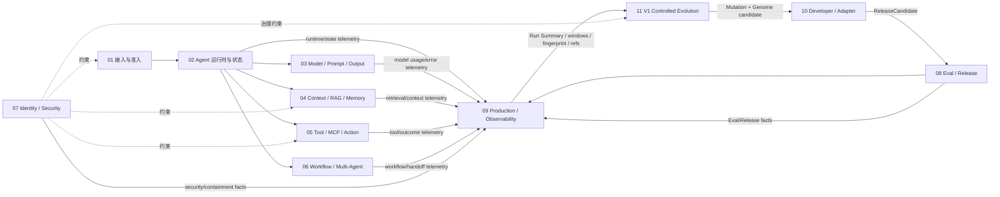

# UEAF 功能模块全景

当前实施代际：`V1`  
未来设计：`V2 / V3`，见 [架构代际与实施范围](06-UEAF架构代际与实施范围.md)

## 1. 模块关系



严重问题的即时止血继续由 05/07/08/09 的既有能力完成；模块 11 只消费其证据引用，不成为第二套 Incident/SRE/Release Control。

V1 Evidence 的责任边界是：

```text
02..08 产生事实
09     采集 / buffer / sampling / aggregation / retention
11     Trigger Candidate / Trigger Gate / Evidence Expansion
```

详细采集字段与成本规则见 [V1 最小 Evidence 采集规范](../01-核心规范/07-V1最小Evidence采集规范.md)。

## 2. V1 模块目录

| 模块 | 核心组件 | 主要输出 | 不负责 |
|---|---|---|---|
| [01 接入与准入](../02-功能模块/01-接入与准入.md) | Gateway、Identity Adapter、Admission Controller | PrincipalContext、RequestEnvelope、TaskEnvelope、RunAdmissionResult | Task/Run 状态、模型调用 |
| [02 Agent 运行时与状态](../02-功能模块/02-Agent运行时与状态.md) | Run Coordinator、State Machine、Checkpoint | TaskState、RunRecord、CompletionDisposition、runtime/state telemetry | 身份签发、业务事务 |
| [03 模型 Prompt 与结构化输出](../02-功能模块/03-模型Prompt与结构化输出.md) | Prompt Registry、Model Router、Provider Adapter | ModelInvocation、ModelRunResult、StructuredDecision、usage/error telemetry | Tool 授权、Run 状态 |
| [04 上下文 RAG 与记忆](../02-功能模块/04-上下文RAG与记忆.md) | Context Builder、Retrieval、Memory Service | ContextManifest、EvidencePack、MemoryRecord、retrieval/context telemetry | EvolutionRun、业务事实写入 |
| [05 工具 MCP 与动作执行](../02-功能模块/05-工具MCP与动作执行.md) | Tool Gateway、Action Coordinator、Reconciler | ActionRecord、ToolResult、ActionReceipt、outcome certainty telemetry | PDP 规则、根 Run 状态 |
| [06 工作流与多 Agent](../02-功能模块/06-工作流与多Agent.md) | Workflow Registry、Orchestrator、Handoff | WorkflowRun、NodeRun、HandoffEnvelope、fan-out/handoff telemetry | 根 Task/Run、全局授权 |
| [07 身份权限与安全](../02-功能模块/07-身份权限与安全治理.md) | Principal Resolver、PDP、PEP、Credential Broker | PrincipalContext、PolicyDecision、SecurityGateDecision、安全响应事实 | Tool 执行、Evolution Candidate 发布 |
| [08 评测与发布治理](../02-功能模块/08-评测与发布治理.md) | Eval Runner、Quality Gate、Release Governance | EvalResult、QualityGateDecision、ReleaseDecision、ReleaseManifest、rollback/release facts | Mutation 生成、生产流量 |
| [09 生产运行与可观测](../02-功能模块/09-生产运行与可观测性.md) | Queue、Worker、Lease、Telemetry、Sampling、Aggregation、Retention、DR | SLO、Run Summary/aggregate/fingerprint Projection、部署/恢复/mitigation 记录 | 重新定义领域语义、宣告演化成功 |
| [10 开发者平台与适配](../02-功能模块/10-开发者平台与框架适配.md) | SDK、CLI、Bundle、Sandbox、Adapter Kit | `ReleaseCandidate`、Bundle、Adapter、测试报告 | 生产状态、发布授权 |
| [11 V1 经验记忆与受控递归进化](../02-功能模块/11-经验记忆与受控递归进化.md) | Projection Reader、Signal Detector、Trigger Gate、Evidence Expander、Evolution Coordinator、Genome Registry、Mutation Strategy | `EvolutionTrigger`、`EvolutionRun`、`GenomeManifest`、`MutationProposal`、`EvolutionAuthorityPolicy` | 第二套 Telemetry/Trace/Eval/Incident/Candidate/Budget/Release、V2 生态服务 |

## 3. V1 Evolution 复用边界

模块 11 只新增五个 Canonical Object：

```text
EvolutionTrigger
EvolutionRun
GenomeManifest
MutationProposal
EvolutionAuthorityPolicy
```

以下必须复用现有模块：

| 需要 | 复用 |
|---|---|
| 即时止血 | 05/07/08/09 的 rollback / fallback / isolate / degrade / kill 等能力 |
| Evidence collection | 模块 09 Telemetry / Sampling / Aggregation / Retention |
| 原始领域 Evidence | 02–08 各自权威对象和 refs |
| 候选 | 模块 10 `ReleaseCandidate` |
| 评测 | 模块 08 `EvalConfig` / `EvalRun` / `EvalResult` |
| 安全门禁 | 模块 07 |
| 生产就绪门禁 | 模块 09 |
| 预算 | 既有 Budget Domain |
| 发布 | 模块 08 `ReleaseDecision` / `ReleaseManifest` |
| 工件 | Artifact / Registry |

V1 不再把 `EvolutionExperience`、`EvolutionLesson`、`FitnessRecord`、`LineageGraph`、`CandidateRelease`、`EvaluationSuite`、`EvolutionBudget`、Incident、OperationalResponse、RunSummary、ErrorFingerprint、AggregateWindow 或 TriggerCandidate 定义为新的跨模块权威对象。

它们的思想可通过内部记录、Projection、Registry metadata、Policy/Config、Eval dimension 或既有对象引用表达。

## 4. V1 Evidence 漏斗

```text
L0 Always-on Minimal Evidence
  -> tiny structured telemetry / Run Summary
L1 Conditionally Sampled Evidence
  -> selected full trace / detailed failure payload
L2 On-demand Evidence Expansion
  -> bounded A/B/C samples after Trigger Candidate
```

默认正常采集、Fingerprint、滚动统计和 Trigger Candidate 检测目标为 `0 LLM Token`。

Trigger Engine 不扫描全量 Trace；完整 Prompt/Response/RAG chunk/Tool payload 默认不复制到模块 11。

## 5. V1 两条反馈链

```text
Observed signal / opportunity
  ├─ P0/P1 urgent -> existing Operational Response
  │                  rollback / fallback / isolate / degrade / kill
  │
  └─ Trigger Gate -> EvolutionTrigger -> EvolutionRun
```

- Operational Response：解决“现在怎么办”；
- Evolution Response：解决“以后是否值得改变自己”。

异常、告警、Incident、Metric 超阈和单次失败都不是 `EvolutionTrigger` 的同义词。

## 6. Trigger Gate

除 P0 快速路径外，模块 11 默认按以下顺序形成 Trigger：

```text
evidence_sufficient
  -> still_relevant
  -> mutable_surface_match
  -> existing_mitigation_insufficient
  -> novelty_sufficient
  -> expected_value_positive
  -> cooldown_satisfied
  -> EvolutionTrigger
```

Trigger Gate SHOULD 优先使用规则、统计、Projection、索引和确定性查询。只有根因或 expected-value 无法可靠分类时才逐级使用模型。

Trigger 支持：

- `reactive`：failure / drift / regression；
- `opportunistic`：new model / tool / provider / business / cost opportunity。

## 7. 关键同步契约

| 调用方 | 接口 | 服务方 | 响应 |
|---|---|---|---|
| Gateway | prevalidate(request, principal) | Edge Admission | RequestEnvelope + TaskEnvelope 或拒绝 |
| Runtime | admit(run_id, bindings) | Admission Controller | RunAdmissionResult |
| Runtime Adapter | ContextBuildPort | Context Builder | ContextManifest |
| Runtime Adapter | ModelStepPort | Prompt/Model Facade | StructuredDecision |
| Runtime Adapter | ToolIntentPort | Tool Gateway | ToolResult/Interruption |
| Tool Gateway | decide | PDP | PolicyDecision |
| Domain Modules | TelemetryPort.emit | Module 09 Telemetry Pipeline | accepted/buffered/dropped-with-reason |
| Release Controller | evaluate(candidate) | Gate Engines | ReleaseDecision |
| Signal Detector | observe(summary/window/fingerprint) | Evidence projections | Trigger Candidate；非 Canonical Trigger |
| Trigger Gate | evaluate(signal, policy, history, mitigation) | Module 11 | EvolutionTrigger 或 no_trigger |
| Evidence Expander | expand(candidate, limits) | Module 09/08/05/04 refs | bounded sample refs / excerpts |
| Evolution Coordinator | propose(trigger, genome, budget_ref) | Strategy/Mutation | MutationProposal[] 或 no_evolution_needed |
| Evolution Module | build(mutation, genome) | Module 10 Sandbox/Builder | ReleaseCandidate |
| Evolution Module | evaluate(candidate) | Module 08 Eval | EvalResult refs |

## 8. 关键事件

现有事件语义继续保持。V1 Evolution 新增最小事件集合：

```text
ueaf.evolution.triggered
ueaf.evolution.run_started
ueaf.evolution.mutation_proposed
ueaf.evolution.genome_created
ueaf.evolution.run_terminal_committed
```

Signal/alert/incident/mitigation、Telemetry、Trace、Eval、Action 继续使用其原始模块事件，不复制第二套 `ueaf.evolution.signal_*`、`evidence_*` 或 `incident_*` 真相源。

Candidate 构建、Eval、Gate、Release 继续使用模块 10/08/07/09 的既有事件。

## 9. 模块边界规则

### 9.1 Context

- 模块 04 是 ContextManifest 的唯一写者；
- Evolution 的 Working Set 不成为业务 `MemoryRecord`；
- 演化内部经验不默认注入业务 Agent 上下文；
- RAG 大 Payload 通过 retrieval/context refs 按需读取。

### 9.2 Action / Immediate Response

- 模块 05 唯一拥有 ActionRecord/action_key；
- 自我进化生成的新 Tool 进入生产后仍必须通过 Tool Gateway；
- Tool timeout/unknown 必须保留 outcome certainty / reconciliation 语义；
- 模块 11 不执行或拥有事故止血动作，只引用其权威事实。

### 9.3 Telemetry / Evidence

- 02–08 在事实产生位置输出结构化观测；
- 09 是采集、采样、聚合、保留和 Evidence Projection 的生产承载；
- 11 只读取 Projection 与按需 refs；
- 高基数 run/trace/user/document/prompt 信息不得进入常规 Metric label；
- Evidence gap 必须可观测。

### 9.4 Eval / Release

- 模块 08 唯一拥有 Eval 与 Release 语义；
- 模块 11 只能消费 EvalResult 和提交 ReleaseCandidate；
- Candidate 不得修改自己的 Eval root 或 Release Authority。

### 9.5 Budget

- 演化预算是既有 Budget Domain 的用途/切片；
- Evidence collection cost 使用 Policy/Config 控制，不新建 Budget 真相源；
- Candidate/Strategy 不得提升自身预算。

### 9.6 Genome

V1 统一使用 `GenomeManifest`：

```text
GenomeManifest<agent>
GenomeManifest<skill>
GenomeManifest<tool>
GenomeManifest<workflow>
GenomeManifest<strategy>
```

通过 `profile_ref` 定义不同类型，不建设多套基础 Genome 状态机。

### 9.7 Trigger Policy

- P0-P3、cooldown、novelty、expected-value、minimum evidence 是版本化 Policy/Config；
- P0/P1 MAY 绕过普通 cooldown/最小样本，但不能绕过 Authority/Eval/Budget/Release/Governance；
- `EvolutionTrigger` 只表示值得启动分析，不表示必须产生 Mutation；
- `EvolutionRun.disposition=no_evolution_needed` 是正常终态。

### 9.8 Lineage / Fitness / Experience

- Lineage：refs/events -> Projection；
- Fitness：Eval/Cost/SLO -> comparison view；
- Experience/Lesson：内部结构化记录；
- RunSummary/ErrorFingerprint/AggregateWindow/TriggerCandidate：Projection/内部分析；
- Gene Pool / Species：V1 仅为 metadata/未来兼容，不是当前 Domain。

## 10. Minimum Semantic Surface

新增跨模块对象前必须证明：

1. 独立生命周期；
2. 独立 Semantic Owner；
3. 独立状态迁移/并发控制；
4. 跨模块稳定契约需求；
5. 现有对象 + ref / Projection / Registry metadata / Eval dimension 无法表达。

否则不得新增 Canonical Object。

## 11. V2/V3 归属

### V2 Planned

- Species / Population / Elite；
- Gene Pool；
- Capability Transfer；
- Local + Ecosystem Fitness；
- Diversity / Monoculture Risk；
- Ecosystem Funnel Evaluation。

对应设计文档：

- `../01-核心规范/06-生态共同进化与演化授权规范.md`
- `../03-参考架构/06-生态共同进化与基因池.md`

### V3 Research

- Meta Evolution；
- Dynamic Niche/Species；
- Ecosystem Topology；
- Pareto Frontier；
- Evolution Debt / Systemic Risk；
- ModelEvolutionPort。

V2/V3 不属于 V1 Current 实施范围。

## 12. 推荐实现顺序

1. 模块 01、02、03：单 Agent 确定性运行外壳；
2. 模块 05、07：受控工具、权限和即时 containment；
3. 模块 09：持久队列、租约、Trace/Audit/SLO、Telemetry buffer/sampling/aggregation；
4. 模块 04：权限感知 RAG/Memory 与 retrieval evidence refs；
5. 模块 08：Eval + ReleaseManifest + rollback 门禁；
6. 模块 10：SDK/CLI/Runtime Adapter/Sandbox；
7. 模块 06：按证据引入工作流/多 Agent；
8. 模块 11 V1：Projection Reader + Signal Detector + Trigger Gate + Evidence Expander，再接 EvolutionRun；
9. 首先证明 Single-Candidate Evolution；
10. V1 稳定后才评估 V2；V3 不进入当前实施计划。
