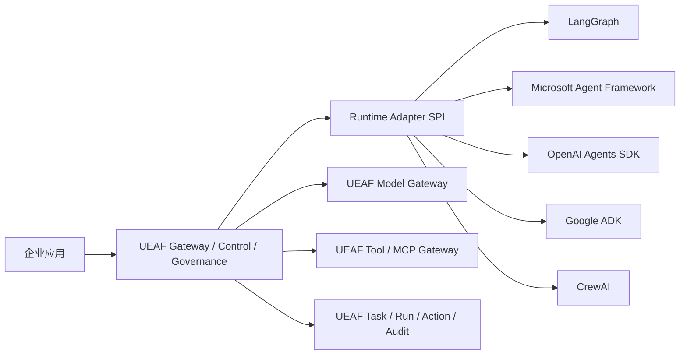

# UEAF 外部 Agent 框架整合策略

## 1. 结论

UEAF SHOULD 直接复用成熟 Agent 框架的运行能力，但 MUST 通过 Adapter 接入，不能复制其对象模型成为 UEAF 核心，也不建议 fork 后与 UEAF 源码合并。

推荐结构是“UEAF 企业控制外壳 + 可替换 Runtime Adapter + 可替换 Provider/Tool Adapter”：



这样可以获得各框架的图执行、Runner、handoff、模型适配和开发工具，同时保留 UEAF 在身份、租户、状态、副作用、审计、评测和发布方面的统一语义。

## 2. 复用边界

### 2.1 可以复用

- Agent Loop、Graph、Workflow 和节点调度；
- 框架内的 interrupt、stream、handoff 和局部 checkpoint 能力；
- 模型客户端、流事件解析和结构化输出辅助；
- 本地调试、开发者工具、测试夹具和框架生态集成；
- 无副作用的规划、路由、聚合和内容处理节点。

### 2.2 UEAF 必须保留

- `PrincipalContext`、委托链、租户与用途绑定；
- `TaskEnvelope`、`TaskState`、`RunRecord` 和根终态；
- `PolicyDecision`、审批、短期凭据和策略重验；
- `ToolIntent`、`ActionRecord`、`action_key`、收据与对账；
- RAG 权限过滤、Memory 治理、数据驻留和删除传播；
- 合规 Audit、Eval、四类发布决定和 `ReleaseManifest`；
- 预算、SLO、租约、fencing、恢复和跨框架版本兼容。

底层框架的 Session、Thread、Run、State、Memory、Tool Call 或 Trace 只能作为运行时内部对象或 Projection，不得成为上述 UEAF 对象的第二真相源。

## 3. 框架接入矩阵

表中能力是接入候选，不是静态保证。每个具体版本都 MUST 通过能力协商和一致性测试确认。

| 框架 | 优先复用候选 | Adapter 重点 | 禁止直接接管 |
|---|---|---|---|
| LangGraph | 图执行、状态节点、interrupt、局部 checkpoint、并行分支 | 将 graph/node/event 映射为 RuntimeEvent；原生 state 只作 Projection；拦截 tool node | TaskState、RunRecord、ActionRecord、审批与业务事实 |
| Microsoft Agent Framework | Agent/Workflow Runner、middleware、handoff、消息与工作流能力 | 规范化 Agent/Workflow 事件；约束 context、tool、暂停恢复和取消传播 | PrincipalContext、ContextManifest、根 Run 和企业授权 |
| OpenAI Agents SDK | Runner、agent、handoff、function tool、结构化结果和模型能力 | function call 转 ToolIntent；provider state 保存为受治理 opaque ref；trace 映射但不充当 Audit | Thread/response/run ID 提升为 UEAF Task/Run；Hosted Tool 绕过 Gateway |
| Google ADK | Agent/Runner、Session、Artifact、Tool、事件和 transfer | Session 作为会话 Projection；Artifact 进入 UEAF 分类与生命周期；Tool 经 Gateway | Session 同时充当 Conversation、Memory、Run 或业务状态 |
| CrewAI | Crew/Task 协作模式、角色分工和受限流程 | Crew execution 映射为 WorkflowRun/NodeRun；所有工具和交接回送 UEAF | Crew/Task 覆盖根 Task/Run，或让角色配置生成权限 |

一个 Run MUST 绑定一个 Adapter 及其确定版本。若需要跨 Runtime 协作，使用 `HandoffEnvelope` 或远程 Agent 端口创建受控边界，不允许两个框架同时写同一 `RunRecord`。

## 4. 用外部框架补 UEAF 弱项

| UEAF 当前建设弱项 | 优先策略 | UEAF 仍需实现 |
|---|---|---|
| 缺少成熟的图/长流程执行引擎 | 先接 LangGraph 或 MAF Adapter | 根状态、租约、fencing、动作对账、版本恢复规则 |
| 缺少轻量 Agent Runner 与 handoff | 接 OpenAI Agents SDK、ADK 或 MAF | HandoffEnvelope、预算继承、权限重验和审计 |
| 模型供应商接入成本高 | 复用 SDK 客户端或 Provider Adapter | ModelInvocation、路由快照、数据区域、用量和输出门禁 |
| 本地调试与开发体验不足 | 复用框架 Studio/CLI，再接 UEAF Test Kit | 脱敏 Trace、契约回放、租户隔离测试和发布门禁 |
| 多 Agent 模式缺少现成抽象 | 复用框架的 manager/handoff/crew 模式 | 默认单 Agent、WorkflowRun/NodeRun、父子预算和晚到结果隔离 |
| Checkpoint 格式各异 | 保留框架 checkpoint 为 opaque provider state | UEAF Checkpoint 元数据、完整性、版本绑定和可恢复性验证 |

外部框架不能补齐 UEAF 的企业治理弱项。身份、细粒度授权、审批、凭据代理、合规审计、发布证据、多租户隔离和副作用对账必须由 UEAF 或企业现有基础设施提供。

## 5. Adapter 调用模型

Runtime Adapter 不持有模型长期凭据，也不绕过模块 03：

```text
Run Coordinator
  -> Runtime Adapter.start/resume
  -> Adapter 请求 Context callback
  -> UEAF 返回 ContextManifest
  -> Adapter 请求 ModelStepPort
  -> UEAF Prompt/Model Facade 编译 ModelInvocation
  -> Model Provider Adapter
  -> UEAF 校验并返回 StructuredDecision
  -> Adapter 产生规范 RuntimeEvent / ToolIntent / HandoffEnvelope
  -> Run Coordinator 验证 revision 与 fencing 后应用
```

已发布 Workflow 只能由 Run Coordinator 的确定性控制逻辑形成 `WorkflowStartCommand`；Adapter 不得把私有 `workflow_intent` 提升为跨模块契约。

如果某框架无法将模型、工具、状态提交和 checkpoint 置于这些拦截点后方，它只能用于低风险沙箱或离线评测，不能声明为 Enterprise Profile 兼容。

## 6. Adapter 能力协商

每个 Adapter 发布不可变 `AdapterCapabilityDescriptor`，至少声明：

- start、resume、cancel、stream、interrupt、handoff、parallel、replay；
- 模型调用能否强制经 `ModelStepPort`；
- 工具调用能否强制经 Tool Gateway；
- checkpoint 格式、迁移范围和删除能力；
- event ordering、重复交付、最大并发和背压方式；
- 支持的框架版本、运行语言、区域与供应链摘要；
- 已知限制、显式降级和不支持原因码。

Release Controller 只允许能力集合覆盖 AgentDefinition 必需能力的 Adapter 进入 `ReleaseManifest`。缺少必需能力必须失败关闭，不得静默关闭审批、恢复或审计。

## 7. 集成方式选择

| 方式 | 适用情况 | 结论 |
|---|---|---|
| 官方依赖 + Runtime Adapter | 框架有稳定公共 API，UEAF 能截获模型、工具和状态边界 | 默认选择 |
| 独立进程/容器 Adapter | 语言栈不同、依赖冲突、需要强隔离或独立扩缩 | 企业生产优先考虑 |
| 远程 Agent Adapter | 能力由其他团队或外部平台托管 | 必须做身份、协议、预算和数据出站控制 |
| Fork 框架源码 | 上游无扩展点且短期必须修补 | 仅临时例外；需维护补丁、漏洞和升级责任 |
| 把多个框架源码合并进 UEAF | 试图形成一个“大而全”代码库 | 不采用；升级、许可证、依赖和语义冲突不可控 |

## 8. 版本与发布

- Adapter、框架、AgentDefinition、PromptContract、Schema、模型路由和工具能力使用独立版本；
- `ReleaseManifest` 冻结经验证的兼容集合，不使用浮动 latest；
- N 与 N+1 Adapter MAY 并存，旧 Run 默认使用原绑定版本恢复；
- 升级先跑契约测试、确定性回放、故障注入、安全评测和小流量灰度；
- 回滚生成新的发布动作，不改写历史 Run、Action 或 Audit；
- 框架升级若改变事件、工具、checkpoint 或取消语义，至少视为 Adapter 主版本变化。

## 9. 最小接入顺序

1. 先选一个主 Runtime，完成 start、model step、stream、tool interception、cancel 和事件映射。
2. 只开放只读工具，证明 ToolIntent、PolicyDecision、ActionRecord 和 Audit 全链路。
3. 增加 checkpoint、Worker 崩溃恢复和一个需要审批的可逆写动作。
4. 增加第二个 Runtime Adapter，用相同测试证明 UEAF 契约不随框架变化。
5. 最后按真实瓶颈开放复杂 workflow、多 Agent、远程 Agent 和框架原生托管能力。

## 10. 验收条件

- 更换 Runtime Adapter 不改变公开 Task、Run、Action、Policy、Audit 和 Release 契约；
- 框架原生 Tool 无法绕过 UEAF Tool Gateway 执行企业副作用；
- 同一测试集在两个 Adapter 上产生可比较的终态、证据和成本结果；
- checkpoint 恢复不会重复已发生或结果未知的业务动作；
- Adapter 不支持的能力返回明确错误，不静默降级；
- 框架 Session/Thread/State 删除后，UEAF 权威状态仍可解释并按契约恢复；
- 框架升级可独立灰度、回滚和撤销，不要求修改 UEAF 核心对象模型。

## 11. 官方能力基线

本策略的框架能力边界以各项目官方文档为基线，并仍须按实际锁定版本执行能力协商与一致性测试：

- [LangGraph 官方概览](https://docs.langchain.com/oss/python/langgraph/overview)
- [Microsoft Agent Framework 官方仓库与文档入口](https://github.com/microsoft/agent-framework)
- [OpenAI Agents SDK 官方文档](https://openai.github.io/openai-agents-python/)
- [Google Agent Development Kit 官方文档](https://adk.dev/agents/)
- [CrewAI 官方文档](https://docs.crewai.com/index)
