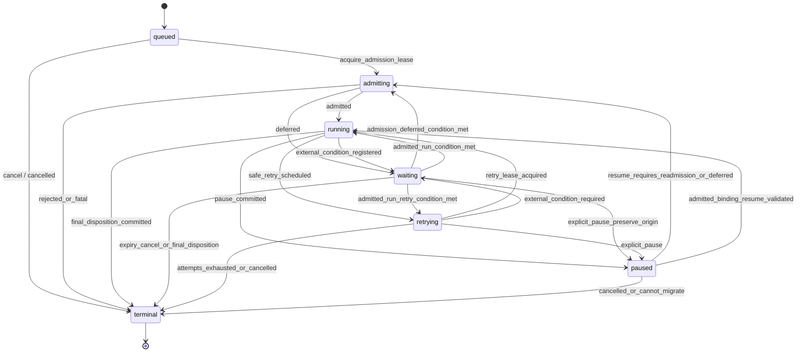
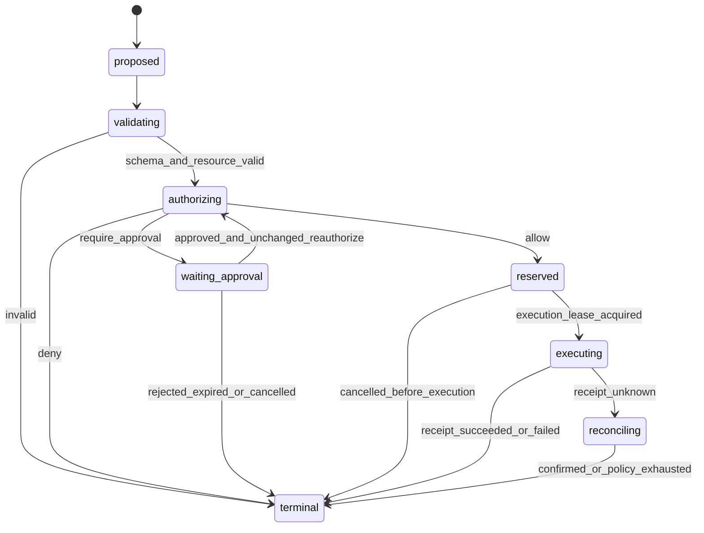

# UEAF 状态机与终态规范

版本：`0.1.0-draft`<br>
规范状态：Draft

## 1. 范围

本文规定 UEAF 的运行、等待、恢复、取消、动作、审批和发布生命周期。重点是把“当前执行阶段”与“最终业务处置”分开，使同步、流式、异步、暂停恢复和不同 Agent Runtime 对外呈现相同的终态语义。

本文不规定业务领域内部状态机。订单、合同、工单、账户等业务状态仍由各自 System of Record 定义和拥有。

文中的 MUST、SHOULD、MAY 具有规范等级；含义见[统一术语与对象模型规范](01-统一术语与对象模型.md)。

## 2. 状态建模原则

1. 状态 MUST 由权威 State Writer 提交，不能由日志、Trace、Projection 或调用方猜测。
2. 当前阶段、等待原因、尝试次数和最终处置 MUST 使用独立字段，不能压缩进一个无限扩张的 `status`。
3. 状态转换 MUST 有命令、前置条件、版本检查、事件和审计依据。
4. 终态 MUST 明确且不可反向转换；再次处理必须创建新 Run 或显式派生 Run。
5. 外部副作用的未知结果 MUST 保持未知并进入对账，不能因超时自动宣称失败。
6. 恢复 MUST 重新校验身份、权限、版本、预算、有效期和在途动作状态。
7. 流式连接结束、模型停止生成、节点执行完成都不等于 Run 完成。
8. 状态枚举 MUST 是封闭集合；扩展只能通过新契约版本或命名空间化的原因码。

## 3. `RunRecord` 状态字段

| 字段 | 类型 | 规则 |
| --- | --- | --- |
| `phase` | `RunPhase` | MUST；表达当前生命周期阶段 |
| `completion_disposition` | `CompletionDisposition/null` | 仅 `phase=terminal` 时 MUST 非空；其他阶段 MUST 为 null |
| `wait_reason` | `WaitReason/null` | 仅 `phase=waiting` 时 MUST 非空 |
| `wait_condition_refs` | string[] | 等待时 MUST 至少一个；不得内嵌凭证或敏感正文 |
| `attempt` | integer | 从 1 开始，只在新执行尝试获得租约时递增 |
| `revision` | integer | 每次权威变更严格递增，用于乐观并发 |
| `sequence` | integer | 聚合事件序列严格递增，不要求跨 Run 全局有序 |
| `lease` | `RunLease/null` | 执行相关阶段必须存在有效租约 |
| `deadline_at` | timestamp/null | 壁钟截止时间；为空也必须受组织上限约束 |
| `budget_snapshot` | object | 记录各维度已用、预留和剩余预算 |
| `checkpoint_ref` | string/null | 暂停、等待或可恢复重试 SHOULD 提供 |
| `pending_action_refs` | string[] | 所有在途或未知动作 MUST 出现 |
| `terminal_reason_codes` | string[] | 终态 MUST 至少一个稳定原因码 |

### 3.1 `RunPhase`

`RunPhase` 是当前阶段，固定为：

| 值 | 含义 | 是否执行计算 | 是否允许自动推进 |
| --- | --- | ---: | ---: |
| `queued` | Run 已创建但尚未进入准入或尚未获得调度机会 | 否 | 是 |
| `admitting` | 正在验证身份、版本、策略、预算、配额和风险 | 有限确定性检查 | 是 |
| `running` | Runtime 正在推进 Agent Loop、工作流或本地确定性节点 | 是 | 是 |
| `waiting` | 等待已登记的外部条件，条件满足可自动继续 | 否 | 是 |
| `retrying` | 已判定某项可安全重试并等待或启动下一尝试 | 可能 | 是 |
| `paused` | 被显式暂停；必须收到恢复命令并完成恢复校验 | 否 | 否 |
| `terminal` | 已提交最终处置，不再接受推进命令 | 否 | 否 |

`RunPhase` MUST NOT 包含 `completed`、`failed`、`cancelled` 等结果词。这些词只能出现在 `CompletionDisposition`。

### 3.2 `CompletionDisposition`

| 值 | 规范含义 | 最低证据 | 调用方下一步 |
| --- | --- | --- | --- |
| `completed` | 所有声明的完成条件满足，必要副作用有确定收据 | 完成条件快照、结果引用、必要 ActionReceipt | 消费结果 |
| `rejected` | 权限、策略、安全或明确业务边界禁止继续 | PolicyDecision 或确定性拒绝证据 | 展示安全理由和允许的替代路径 |
| `incomplete` | Run 已安全结束，但信息、预算、依赖或确认不足 | 缺失条件、已完成部分、继续建议 | 补充信息、扩预算或创建后续 Run |
| `failed` | 技术或系统错误使 Run 无法完成且无法安全恢复 | 错误分类、尝试记录、恢复判断 | 按策略重启新 Run 或人工处理 |
| `cancelled` | 合法取消被接受，且不再启动新动作 | 取消主体、时间、在途动作处置 | 如有需要创建新 Run |

以下映射 MUST NOT 发生：

- 模型生成文本 → `completed`；
- 模型拒答或内容过滤异常 → 自动 `rejected`；
- 预算耗尽 → `failed`；默认应为 `incomplete`；
- 工具超时且副作用可能发生 → `failed`；应等待或最终 `incomplete`，并保留未知动作；
- 调用方断开流式连接 → `cancelled`，除非取消命令已被权威写入者接受；
- 审批长期未处理 → `completed` 或 `failed`；过期后通常为 `rejected` 或 `incomplete`，由完成契约决定。

### 3.3 `WaitReason`

固定值如下：

| 值 | 等待对象 | 典型恢复信号 |
| --- | --- | --- |
| `user_input` | 用户或调用方补充数据/确认 | `SubmitHumanInput` |
| `tool_result` | 异步工具完成 | `ToolResultObserved` |
| `approval` | 有效审批结果 | `ApprovalResolved` |
| `dependency` | 业务或编排依赖 | 依赖完成事件 |
| `capacity` | 已运行任务主动让出资源后等待容量 | 调度租约 |
| `reconciliation` | 未知副作用的确定结果 | `ActionReconciled` |

实现如需增加原因，MUST 升级契约次版本并提供消费者默认策略，或在 `wait_reason=dependency` 下使用命名空间化 `reason_code`。未知原因不得被旧消费者当作 `tool_result`。

## 4. Run 准入结果

准入不是第五种治理决定。它是多个确定性检查和 `PolicyDecision` 的聚合运行结果，规范名为 `RunAdmissionResult`。

### 4.1 生命周期入口与两级校验

UEAF MUST 区分边缘预校验（edge pre-validation）与 Run 准入（Run admission）：

1. 接入模块先完成协议解析、请求大小与基础 Schema、可信主体认证、租户绑定、重放防护和最低安全检查。此阶段尚无 `run_id`，MUST NOT 产生 `RunAdmissionResult`，也不得声称 Agent 已获准运行。
2. 边缘预校验失败时，接入模块提交 `ueaf.request.rejected` 并返回安全错误；MUST NOT 创建 `RunRecord`。
3. 边缘预校验成功时，接入模块提交 `ueaf.request.accepted`，形成不可变 `TaskEnvelope`，并把请求交给 Runtime Domain。
4. Runtime Domain 创建 `TaskState` 和 `RunRecord(phase=queued)`；创建 Run 时 MUST 冻结 `release_id`、`runtime_adapter_ref`、任务引用和初始预算引用。
5. Run Coordinator 获得 admission lease 后提交 `queued -> admitting`，由 Admission Controller 针对这个 `run_id` 完成发布清单、能力、预算、区域、策略及运行条件检查，生成唯一规范结果 `RunAdmissionResult`。
6. `admitted` 提交 `admitting -> running`；`deferred` 提交 `admitting -> waiting`；`rejected` 原子提交 `terminal/rejected`。因此 `admitting` 必须有确定出口，不能成为边缘接入的同义阶段或无消费者死状态。

边缘预校验结果 MAY 被 Run admission 作为证据引用，但后者 MUST 校验其版本、完整性与有效期；两级校验不能合并成一个 `AdmissionDecision`，也不能因边缘 accepted 而跳过 `RunAdmissionResult`。

### 4.2 规范对象

| 字段 | 类型 | 规则 |
| --- | --- | --- |
| `run_admission_result_id` | string | MUST |
| `run_id` | string | MUST |
| `outcome` | enum | `admitted/rejected/deferred` |
| `validation_refs` | string[] | 输入、身份、版本、区域、完整性验证 |
| `policy_decision_refs` | string[] | 运行时授权；缺失不得默认允许 |
| `budget_snapshot_ref` | string | MUST |
| `release_manifest_ref` | string | MUST 且当前环境有效 |
| `reason_codes` | string[] | MUST 非空 |
| `retry_after` | timestamp/null | `deferred` SHOULD 提供 |
| `created_at` | timestamp | MUST |
| `expires_at` | timestamp | MUST 且晚于 created_at；不得用空值表示永久有效 |

- `admitted` 允许 `admitting -> running`。
- `rejected` 必须原子提交 `terminal + rejected`。
- `deferred` 允许 `admitting -> waiting`，并设置 `wait_reason=approval|dependency|capacity`；不得伪装成策略允许。
- 应用结果前 MUST 校验 `expires_at`、完整性和所引用策略/Manifest 状态；过期结果不得复用，必须重新执行 Run admission。

## 5. Run 状态机



### 5.1 允许转换矩阵

| From | To | 必要前置条件 | 必须写出的事件 |
| --- | --- | --- | --- |
| `queued` | `admitting` | 调度资格和 admission lease 有效 | `ueaf.run.phase_changed` |
| `queued` | `terminal/cancelled` | 取消权限通过，无已启动动作 | `ueaf.run.terminal_committed` |
| `admitting` | `running` | `RunAdmissionResult.outcome=admitted` | `ueaf.run.admitted`、`ueaf.run.phase_changed` |
| `admitting` | `waiting` | `outcome=deferred` 且等待条件已持久化 | `ueaf.run.wait_registered` |
| `admitting` | `terminal/rejected` | 明确授权/策略拒绝 | `ueaf.run.terminal_committed` |
| `admitting` | `terminal/failed` | 准入基础设施不可恢复且没有可安全重试策略 | `ueaf.run.terminal_committed` |
| `running` | `waiting` | checkpoint 和条件订阅提交成功 | `ueaf.run.wait_registered` |
| `running` | `retrying` | 错误可重试、操作幂等、剩余预算足够 | `ueaf.run.retry_scheduled` |
| `running` | `paused` | checkpoint 完整且执行租约释放 | `ueaf.run.paused` |
| 任意非终态 | `terminal/*` | 终态前置条件满足，CAS 成功 | `ueaf.run.terminal_committed` |
| `waiting` | `admitting` | `wait_origin=admission_deferred`，或既有 admitted binding 已失效且必须重新准入；条件满足并取得新的 admission lease，旧 `RunAdmissionResult` 不得复用 | `ueaf.run.resumed`、`ueaf.run.phase_changed` |
| `waiting` | `running` | `wait_origin=admitted_execution`，信号匹配 wait token，且当前 `RunAdmissionResult`、身份、Release 与策略绑定仍有效；由 `admitting -> waiting(deferred)` 进入的 Run 禁止走此边 | `ueaf.run.resumed` |
| `waiting` | `retrying` | `wait_origin=admitted_execution`，retry condition 到期且既有 admitted binding、重试安全性、预算和 deadline 校验通过；准入 deferred 的 Run 禁止借此绕过重新准入 | `ueaf.run.retry_scheduled`、`ueaf.run.phase_changed` |
| `waiting` | `paused` | 显式暂停命令通过，等待条件、`wait_origin`、admission binding 状态和 checkpoint 已持久化 | `ueaf.run.paused` |
| `retrying` | `running` | 新执行尝试取得有效租约，attempt 与 fencing token 已提交 | `ueaf.run.phase_changed` |
| `retrying` | `waiting` | 重试前发现新的外部条件，条件订阅和 checkpoint 已提交 | `ueaf.run.wait_registered` |
| `retrying` | `paused` | 显式暂停命令通过，重试租约已释放且 checkpoint 完整 | `ueaf.run.paused` |
| `paused` | `running` | 暂停来源是已 admitted 的执行，且原 `RunAdmissionResult`、身份、Release、策略和动作校验仍有效 | `ueaf.run.resumed` |
| `paused` | `admitting` | 暂停继承 `admission_deferred` 来源，或恢复校验要求重新准入；取得新的 admission lease | `ueaf.run.resumed`、`ueaf.run.phase_changed` |

表中未列出的转换 MUST 被拒绝为 `invalid_state_transition`。

### 5.2 终态提交协议

State Writer 在提交终态前 MUST 依次验证：

1. 调用者持有当前 revision 或有效 fencing token；
2. 完成条件使用冻结版本进行判定；
3. 所有必需 ActionRecord 均有允许的终态，或被明确列为未解决；
4. `completed` 不包含 `unknown`/`unresolved` 的必需副作用；
5. TaskState、结果工件和证据引用已持久化或参与同一事务/outbox；
6. `phase=terminal`、disposition、reason、result/error refs 和终态事件原子提交；
7. 执行租约失效，后续迟到写入被 fencing token 拒绝；
8. 审计事件可由同一事务可靠发布。

终态写入 MUST 幂等。同一 disposition 和内容摘要的重复命令返回当前记录；不同 disposition 的竞争命令必须有且仅有一个成功，其余返回 `terminal_conflict`。

## 6. 等待、暂停与恢复

### 6.1 等待注册

进入 `waiting` 前 MUST 持久化：`wait_reason`、不可猜测的 `wait_token` 或等价关联、条件引用、到期时间、恢复目标阶段、Checkpoint、需要重新校验的策略列表。事件订阅与状态变化必须通过同一事务或 transactional outbox 保证不会丢失唤醒。

信号消费者 MUST 以 `event_id + wait_token` 去重。迟到、重复或不匹配信号 MUST 记录为非致命事件，不能推进错误 Run。

### 6.2 暂停

`paused` 表示显式运营、用户或治理暂停。进入 paused 后：

- MUST 停止创建新 Turn 和新 ActionRecord；
- MUST 撤销或让执行租约自然失效；
- 已提交的外部副作用不能回滚为“未发生”；
- 在途动作 MUST 等待确认或保留为未知并进入对账；
- 恢复 MUST 由显式命令触发，不能只因消息到达自动恢复。

### 6.3 恢复校验

恢复 MUST 检查：Checkpoint 完整性、冻结 ReleaseManifest 可用性、契约兼容性、Principal 有效性或重新绑定规则、策略版本可否继续、预算与截止时间、审批有效期、所有 pending action 的最新收据、TaskState revision 和执行租约。

恢复失败的处理：

- 可显式迁移且风险允许：迁移后进入 `admitting`；
- 缺少用户/依赖条件：进入 `waiting`；
- 版本或安全边界不允许继续：`terminal/rejected`；
- 技术状态损坏且无法修复：`terminal/failed`；
- 未知副作用无法确认：进入 `waiting/reconciliation`，达到终止策略后 `terminal/incomplete`。

## 7. 重试、租约和并发

### 7.1 重试前置条件

重试 MUST 同时满足：

- 错误分类允许重试；
- 当前操作是只读、天然幂等或已有有效 idempotency key；
- 重试不会绕过 PolicyDecision 或过期 ApprovalRequest；
- 剩余时间、步骤、费用和调用预算足够；
- 退避和最大尝试次数来自冻结策略；
- 对副作用未知结果，已先完成查询/对账，不得直接重放执行。

重试只递增执行 `attempt`，不得创建新的 `run_id`。若调用方希望改变目标、版本或预算边界，SHOULD 创建派生 Run 并通过 `parent_run_id` 关联。

### 7.2 `RunLease`

执行 lease MUST 包含 `lease_id`、`holder_id`、`fencing_token`、`acquired_at`、`heartbeat_at`、`expires_at`。State Writer 必须拒绝小于当前 fencing token 的写入。Heartbeat 丢失只表示执行权可能失效，不表示 Run 失败或动作未发生。

### 7.3 并发控制

- `revision` MUST 使用 compare-and-set 或等价事务条件更新。
- 同一 Run 同一时刻只能有一个推进执行者；并行子节点必须由单一协调器合并或拥有独立子 Run。
- 事件序列 `sequence` MUST 对单一 aggregate_id 连续；检测到缺口时 Projection MUST 停止声称强一致。
- 迟到模型、工具和子 Agent 结果 MUST 校验 Run phase、turn/action identity、revision 和 fencing token 后再接纳。

## 8. Action 状态机

动作权威聚合规范名为 `ActionRecord`；“ActionAggregate”只可作为实现模式描述，不得作为线级对象名。

### 8.1 字段

| 字段 | 类型 | 规则 |
| --- | --- | --- |
| `action_id` | string | 一个动作生命周期 |
| `action_key` | string | 一个逻辑副作用的稳定幂等身份 |
| `tool_intent_ref` | string | MUST |
| `run_id` / `turn_id` | string | MUST |
| `phase` | `ActionPhase` | MUST |
| `disposition` | `ActionDisposition/null` | 仅 terminal 非空 |
| `action_fingerprint` | string | 绑定主体、租户、能力版本、资源与规范化参数 |
| `policy_decision_ref` | string/null | 执行前 MUST 非空且有效 |
| `approval_request_ref` | string/null | 策略要求审批时 MUST |
| `idempotency_reservation_ref` | string/null | 有副作用动作执行前 MUST |
| `receipt_refs` | string[] | 按观察顺序追加，不覆盖 |
| `reconciliation_state` | object/null | unknown 时 MUST |
| `revision` / `sequence` | integer | 严格递增 |

### 8.2 枚举

`ActionPhase` 固定为：

`proposed`、`validating`、`authorizing`、`waiting_approval`、`reserved`、`executing`、`reconciling`、`terminal`。

`ActionDisposition` 固定为：

`executed`、`denied`、`approval_rejected`、`invalid`、`failed`、`unresolved`、`cancelled`。

### 8.3 转换



动作不变量：

- `PolicyDecision.outcome=allow` 才能从 authorizing 进入 reserved；`require_approval` 还必须有有效 approved ApprovalRequest。
- 审批通过只允许 `waiting_approval -> authorizing`；05 必须按当前主体、参数、资源、能力、策略、预算和环境重新求值，取得 fresh `PolicyDecision.outcome=allow` 后才能进入 reserved，禁止从 waiting_approval 直达 reserved。
- 预留 action_key MUST 在执行前提交，且相同 action_key 与不同指纹冲突时失败关闭。
- 开始 executing 后，取消请求不能直接得到 `cancelled`；必须确认执行未发生或进入 reconciling。
- `ActionReceipt` 是不可变观察。`unknown` 不得覆盖成 `failed`；后续确认写入新的 ActionReceipt，并使用 `supersedes_receipt_ref` 或 `confirmation_of_ref` 关联。
- `executed` 必须有 `status=succeeded` 的确定收据；`failed` 必须有确定失败收据或确定未执行证明。
- 对账策略耗尽且仍未知时，ActionRecord 为 `terminal/unresolved`，所属 Run 不得为 `completed`。

## 9. Approval 状态机

`ApprovalRequest.status` 固定为：`pending/approved/rejected/expired/cancelled`。

| From | To | 规则 |
| --- | --- | --- |
| 创建 | `pending` | 动作指纹、审批策略、有效期完整 |
| `pending` | `approved` | 审批者身份与职责范围有效，完整性校验通过 |
| `pending` | `rejected` | 明确拒绝并记录理由码 |
| `pending` | `expired` | 可信时钟超过 expires_at；不可恢复为 approved |
| `pending` | `cancelled` | 请求方或治理系统有权取消 |

所有终态不可逆。参数、主体、目标资源、能力版本或风险等级变化 MUST 创建新的 ApprovalRequest；复制旧决定被禁止。审批结果只允许当前动作继续，不等于 Runtime 最终完成或发布批准。

## 10. Task 与 Run 的关系

- Task MAY 有多个串行或并行 Run；每个 Run 只推进一个 `task_id`。
- 一个 Run 的 terminal 不自动等于 Task terminal。
- Task 完成 MUST 由 Task Domain 根据跨 Run 的完成条件和业务事实提交。
- `RunRecord.completion_disposition=completed` 表示该 Run 的完成契约满足；若其职责只是一个子目标，Task MAY 仍未完成。
- 新 Run 不得覆盖旧 Run；重试同一执行尝试和创建后续 Run 必须区分。
- TaskState 的 revision 冲突 MUST 显式合并或重新规划，不得以最后写入胜出覆盖已确认事实。

## 11. Release 状态与四类决定

四类决定的状态与 ReleaseManifest 生命周期必须分开：决定是带范围和有效期的证据，Manifest 是允许共同运行的版本集合。

### 11.1 决定生命周期

`QualityGateDecision`、`SecurityGateDecision`、`OperationalReadinessDecision` 和 `ReleaseDecision` MUST 包含 `status=active|expired|revoked|superseded`。其 outcome 不因 status 改变；撤销或过期通过状态表达，不覆盖历史结论。

### 11.2 `ReleaseManifest.lifecycle_status`

固定为：`draft/under_review/approved/rolling_out/active/superseded/rolled_back/withdrawn`。

- 进入 `approved` MUST 有有效 `ReleaseDecision`，且前三类决定均存在并满足 Release Policy。
- `conditional` 决定 MUST 将全部条件写入 Manifest，并由控制面强制执行。
- `rolling_out` 只能在批准的环境、窗口、比例和观察条件下发生。
- `active` 不表示永远合格；决定撤销、SLO 破坏或安全事件可触发暂停、回滚或 withdrawn。
- 回滚 MUST 生成新的部署动作和状态事件；不得删除失败清单或改写历史 active 状态。

## 12. 状态接口

语言无关的最小命令接口如下：

```text
CreateRun(task_ref, release_ref, runtime_ref, idempotency_key) -> RunRecord
AdmitRun(run_id, expected_revision) -> RunAdmissionResult + RunRecord
RegisterWait(run_id, reason, condition_refs, checkpoint, expected_revision) -> RunRecord
ResumeRun(run_id, resume_signal_ref, expected_revision) -> RunRecord
PauseRun(run_id, actor_ref, reason, expected_revision) -> RunRecord
ScheduleRetry(run_id, failure_ref, retry_policy_ref, expected_revision) -> RunRecord
CancelRun(run_id, actor_ref, reason, expected_revision) -> RunRecord
CommitRunTerminal(run_id, disposition, evidence_refs, expected_revision) -> RunRecord
GetRun(run_id, consistency_requirement) -> RunRecord

CreateAction(tool_intent_ref, expected_run_revision) -> ActionRecord
AdvanceAction(action_id, command, evidence_refs, expected_revision) -> ActionRecord
AppendActionReceipt(action_id, receipt, expected_revision) -> ActionRecord
ReconcileAction(action_id, reconciliation_evidence, expected_revision) -> ActionRecord
```

命令 MUST 携带幂等键、调用主体、关联上下文和期望 revision。查询 MUST 声明 `strong/bounded_staleness/eventual` 中的一致性要求；Projection 不能伪装为 strong。

## 13. 版本兼容与迁移

1. Run、Action、Approval 和 Release 状态枚举是封闭集合；新增、删除或改变转换语义属于主版本变化。
2. 原生 Runtime 状态 MUST 通过 Adapter 映射到本文状态；无法无损映射时必须保留 `native_state_ref` 并选择安全的 UEAF 状态，不能发明伪终态。
3. 旧系统的复合状态如 `waiting_for_approval` MUST 映射为 `phase=waiting, wait_reason=approval`。
4. 旧系统的 `succeeded` MUST 根据完成条件映射；仅节点成功不得直接映射 `terminal/completed`。
5. 状态迁移 MUST 保留旧对象、转换规则版本、迁移时间、操作者和完整性证明。
6. 长运行恢复跨主版本时 MUST 先在隔离环境验证状态、Checkpoint、ActionReceipt 与完成条件迁移。
7. 兼容窗口结束时尚未迁移的 Run MUST 进入显式等待、拒绝或失败处置，不得静默弃置。

## 14. 失败语义

| 错误码 | 含义 | 可否重试 | 状态影响 |
| --- | --- | --- | --- |
| `invalid_state_transition` | 来源/目标状态组合不合法 | 否，除非刷新状态后改命令 | 不变 |
| `revision_conflict` | expected revision 已过期 | 是，重新读取并重新决策 | 不变 |
| `lease_lost` | 执行者失去租约或 fencing 过期 | 由新持有者恢复 | 不自动终态 |
| `wait_registration_failed` | 状态与订阅未能原子提交 | 是，幂等重试 | 保持原阶段 |
| `resume_validation_failed` | 恢复时身份、版本、预算或动作校验失败 | 视原因 | waiting、admitting 或 terminal |
| `unsafe_retry` | 操作非幂等或副作用未知 | 否；先对账 | waiting/reconciliation |
| `terminal_conflict` | 竞争者试图提交不同终态 | 否 | 已成功提交的终态保持 |
| `checkpoint_corrupt` | 快照完整性或 Schema 失败 | 尝试早期点或迁移 | paused；不可恢复则 failed |
| `action_key_conflict` | 同一 action_key 对应不同指纹 | 否 | Action failed/安全事件；Run 不得 completed |
| `approval_stale` | 审批与当前动作指纹或版本不匹配 | 新建审批 | waiting 或 rejected |
| `reconciliation_exhausted` | 未知动作达到对账边界 | 不执行重放 | Action unresolved；Run incomplete |

状态存储不可用时，执行者 MUST 停止创建新副作用。仅靠内存继续并在稍后“补日志”不符合规范。

## 15. 验收条件

实现通过本规范验收必须至少证明：

- `RunPhase` 与 `CompletionDisposition` 分字段保存，所有非 terminal Run 的 disposition 均为 null。
- 五种 Run disposition 的外部响应、事件和持久化语义一致。
- 状态转换矩阵之外的命令全部失败且不产生部分写入。
- 同一终态命令可幂等重放；竞争终态只有一个成功。
- 等待注册不存在“状态已等待但订阅丢失”或“订阅存在但状态未提交”的窗口。
- 恢复会重新校验 ReleaseManifest、Principal、PolicyDecision、ApprovalRequest、预算和未知动作。
- 旧执行者在 lease 过期后无法用旧 fencing token 写入。
- 工具超时会产生 unknown ActionReceipt 并进入 reconciliation，不会盲重试。
- Action unresolved 时 Run 无法提交 completed。
- 流式断开不会自动取消 Run；只有被接受的取消命令可提交 cancelled。
- 通过故障注入验证状态存储中断、重复事件、乱序信号、进程崩溃、Checkpoint 损坏和对账耗尽。
- 发布控制面无法在任一必需治理决定缺失、过期、撤销或范围不匹配时激活 ReleaseManifest。
