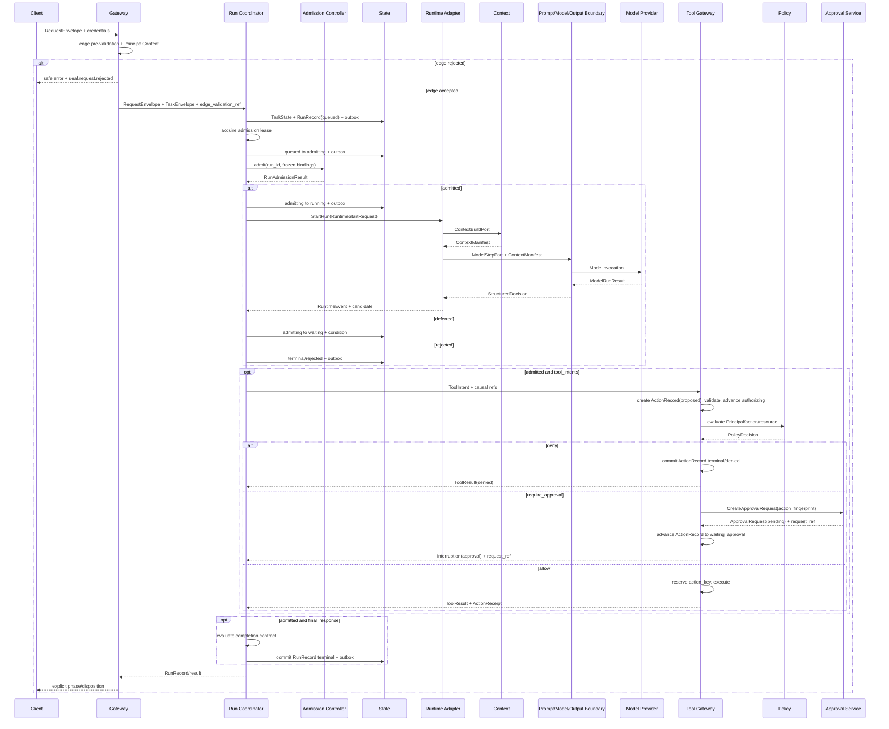

# UEAF 跨模块契约与事件规范

版本：`0.1.0-draft`<br>
规范状态：Draft

## 1. 范围

本文规定 UEAF 能力域之间的同步契约、命令、事件、交付保证、顺序、幂等、失败传播和版本兼容。它使运行时、模型、上下文、知识、工具、安全、评测与发布组件能够独立替换，而不暴露供应商 SDK 内部对象。

本文不要求使用事件溯源，也不规定消息中间件。实现可以使用 HTTP、gRPC、队列、事件流或进程内调用，但跨边界时 MUST 保持本文语义。

文中的 MUST、SHOULD、MAY 具有规范等级；含义见[统一术语与对象模型规范](01-统一术语与对象模型.md)。

## 2. 交互类型

| 类型 | 意图 | 返回 | 重放规则 |
| --- | --- | --- | --- |
| Command | 请求权威 State Writer 尝试改变状态 | 接受/拒绝及权威对象引用 | MUST 有幂等键和期望 revision（创建命令除外） |
| Query | 读取权威对象或 Projection | 数据、来源位置与新鲜度 | MUST 无副作用；可安全重复 |
| Event | 陈述已经提交的不可变事实 | 不以消费者成功作为事实成立条件 | 消费者 MUST 按 event_id 幂等 |
| Stream Event | 传输一次进行中调用的有序片段 | 最终流事件或断流 | 不直接作为权威业务事件；完成后归一化 |

事件名称 MUST 使用过去式事实，例如 `ueaf.run.terminal_committed`。`CancelRun` 是 Command，`ueaf.run.cancel_requested` MAY 是请求已记录事件，`ueaf.run.terminal_committed` 才证明取消终态已提交。

## 3. 公共命令契约

跨进程 Command MUST 使用 `CommandEnvelope`。

| 字段 | 类型 | 必需 | 规则 |
| --- | --- | ---: | --- |
| `command_id` | string | 是 | 全局唯一 |
| `command_name` | string | 是 | `ueaf.<domain>.<imperative>`，例如 `ueaf.run.resume` |
| `command_version` | semver | 是 | Payload Schema 版本 |
| `issued_at` | timestamp | 是 | 可信时钟 |
| `deadline_at` | timestamp | 是 | 消费者不得在过期后启动新副作用 |
| `tenant_id` | string | 是 | 与目标对象一致 |
| `actor_ref` | string | 是 | 指向可信 PrincipalContext 或系统主体 |
| `target_type` | string | 是 | Canonical Name |
| `target_id` | string/null | 条件 | 创建命令 MAY 为空 |
| `expected_revision` | integer/null | 条件 | 更新命令 MUST |
| `idempotency_key` | string | 是 | 在命令名、租户和目标作用域内稳定 |
| `correlation_id` | string | 是 | 通常为 request_id 或业务相关标识 |
| `causation_id` | string/null | 否 | 触发本命令的 event_id/command_id |
| `trace_id` | string | 是 | 观测关联，不等于审计 ID |
| `release_id` | string | 条件 | Run 内命令 MUST |
| `payload_schema_ref` | string | 是 | 可验证 Schema |
| `payload` | object | 是 | 仅包含执行所需最小数据 |
| `classification` / `purpose` | string / string[] | 是 | 控制传输、日志和保留 |
| `integrity_ref` | string | 条件 | 高风险、审批、发布命令 MUST |

State Writer MUST 先校验租户、actor、deadline、版本、幂等键和 expected revision，再执行命令。相同幂等键与相同规范化 payload 必须返回同一结果；相同键与不同 payload MUST 返回 `idempotency_conflict`。

## 4. 公共事件契约

所有跨模块权威事件 MUST 使用 `EventEnvelope`。

| 字段 | 类型 | 必需 | 规则 |
| --- | --- | ---: | --- |
| `event_id` | string | 是 | 全局唯一且不可复用 |
| `event_name` | string | 是 | `ueaf.<domain>.<past_tense_fact>`；不包含版本后缀 |
| `event_version` | semver | 是 | Payload Schema 版本 |
| `occurred_at` | timestamp | 是 | 领域事实发生时间 |
| `recorded_at` | timestamp | 是 | 权威写入时间，不能早于系统允许的时钟偏差 |
| `tenant_id` | string | 是 | 由权威对象继承 |
| `aggregate_type` | string | 是 | Canonical Name，例如 `RunRecord` |
| `aggregate_id` | string | 是 | 权威对象 ID |
| `aggregate_version` | integer | 是 | 事件提交后的对象 revision |
| `sequence` | integer | 是 | 对同一 aggregate_id 严格递增 |
| `producer` | string | 是 | 逻辑 State Writer |
| `producer_version` | string | 是 | 实现/规则版本 |
| `correlation_id` | string | 是 | 端到端工作关联 |
| `causation_id` | string/null | 否 | 直接触发本事实的 command/event |
| `trace_id` | string | 是 | 运行观测关联 |
| `principal_ref` | string/null | 条件 | 涉及主体动作时 MUST |
| `release_id` | string/null | 条件 | Run/评测/发布事件 MUST |
| `payload_schema_ref` | string | 是 | Schema Registry 可解析引用 |
| `payload` | object | 是 | 事实最小载荷；不能依赖日志文本解释 |
| `classification` | string | 是 | 数据分类 |
| `purpose` | string[] | 是 | 合法消费目的 |
| `integrity_ref` | string | 条件 | 动作、审批、安全、审计和发布事件 MUST |

### 4.1 事件不变量

- EventEnvelope 一经发布 MUST 不可改写；纠正通过新的补偿/更正事件表达。
- `occurred_at` 不能用于并发仲裁；并发必须使用 aggregate_version、sequence 或 fencing token。
- 生产者 MUST 保证单 aggregate 顺序，不需要承诺跨 aggregate 全局顺序。
- 消费者 MUST 允许重复交付，并按 `event_id` 去重。
- 消费者检测到 sequence 缺口 MUST 停止宣称该 Projection 完整，触发补取或重建。
- payload MUST 自足地表达事实；不得要求解析自然语言 message 才能判断状态。
- Event 不得携带明文凭证、完整 Prompt 私密内容、未经最小化的模型上下文或跨租户数据。
- Trace/Log 事件只有在由权威 State Writer 提交为 EventEnvelope 时才是领域事件；普通遥测不得反向驱动权威状态。

### 4.2 交付保证

UEAF 基线采用 **at-least-once delivery + consumer idempotency**。实现 MAY 提供更强保证，但不得要求“exactly once 网络传输”才能正确。

权威状态与事件发布 MUST 使用 transactional outbox、同一事务日志或可证明等价机制。消费者副作用 MUST 使用 inbox/deduplication 记录和业务幂等键。事件总线暂时不可用时，权威事务 MAY 提交，但 outbox 必须可靠保留并重发；不得丢事件或手工从日志猜测补写。

## 5. 跨模块对象矩阵

| 契约 | Semantic Owner / 生产者 | 主要消费者 | 消费者可依赖 | 消费者不得推断 |
| --- | --- | --- | --- | --- |
| `PrincipalContext` | Identity & Delegation | Gateway、Runtime、Policy、Evidence、Tool | 已验证主体、租户、委托和有效期 | 当前动作已授权 |
| `RequestEnvelope` | Admission/Gateway | Task、Run | 原始请求引用、协议、deadline、关联标识 | Run 已创建或目标正确 |
| `TaskEnvelope` | Task Domain | Run、Context、Orchestrator | 版本化目标、约束和完成条件 | 当前 Run 已完成 |
| `TaskState` | Task Domain | Run、Orchestrator、Gateway、Operations | 公开的确定性进度、确认事实、未决条件和完成条件状态 | Prompt 摘要等于确认事实 |
| `BudgetEnvelope` | Budget Control | Run、Model、Tool、Orchestrator | 当前上限和分配 | 子组件可以重置预算 |
| `RunAdmissionResult` | Run Admission | Run Coordinator、Audit | 本次准入的聚合结果 | 长期授权或发布健康 |
| `RunRecord` | Runtime Domain | Gateway、Task、Recovery、Operations | 权威阶段与 disposition | 业务事实已改变 |
| `ContextManifest` | Context Domain | Model、Eval、Audit | 本次调用实际装入内容的清单 | 所有来源正文或结果正确 |
| `ModelInvocation` | Model Gateway Client | Model Adapter | 已批准的模型、Prompt、上下文、Schema、预算 | 供应商可扩张用途或保留 |
| `ModelRunResult` | Model Gateway | Output Validator、Runtime、Eval | 归一化模型终态、用量、输出引用 | Run 终态或业务授权 |
| `StructuredDecision` | Output Contract Service | Runtime、Tool、Orchestrator | 通过 Schema 的候选下一步 | 工具已授权或完成条件已满足 |
| `EvidencePack` | Evidence Service | Context、Model、Eval | 权限过滤后的来源、版本和引用 | 模型必然正确采用 |
| `ToolIntent` | Runtime/Structured Decision | Tool Gateway、Policy | 模型/编排提出的候选动作 | 可以执行 |
| `PolicyDecision` | Policy Decision Point | Tool Gateway、Runtime、Audit | 对指定输入哈希、范围和有效期的运行时授权 | 质量或发布被批准 |
| `ApprovalRequest` | Approval Service | Tool Gateway、UI、Audit | 对具体动作指纹的决定状态 | 修改后的动作仍获批准 |
| `ActionRecord` | Action Domain / Tool Gateway | Runtime、Reconciliation、Audit、Operations | 动作的权威阶段、终态、尝试与最新收据引用 | 超时等于动作未发生 |
| `ActionReceipt` | Action Executor/Tool Gateway | Runtime、Reconciliation、Audit | 动作成功、确定失败或未知的观察 | unknown 表示未发生 |
| `ToolResult` | Tool Gateway | Runtime、Output Validator、Eval | 供 Agent 继续所需的最小归一结果 | 完整业务对象或内部凭证 |
| `HandoffEnvelope` | Orchestrator | 目标 Agent、Runtime、Eval | 显式子目标、最小上下文、权限和预算 | 父 Agent 全部隐式状态 |
| `EvalResult` | Evaluation | Quality/Security/Operations Gate | 版本化评分、证据和不确定性 | 自动允许发布 |
| `QualityGateDecision` / `SecurityGateDecision` / `OperationalReadinessDecision` | 各自治理域 | Release Control | 指定范围、环境和有效期的独立结论 | 最终发布已批准 |
| `ReleaseDecision` | Release Governance | Release Controller | 对指定 Manifest 候选的最终裁决 | 当前部署已 active |
| `ReleaseManifest` | Release Control | 所有运行组件 | 可共同加载的版本集合和回滚目标 | 运行结果一定成功 |

## 6. 模型与结构化输出契约

### 6.1 `ModelInvocation`

| 字段 | 类型 | 规则 |
| --- | --- | --- |
| `model_invocation_id` | string | MUST |
| `run_id` / `turn_id` | string | MUST |
| `model_route_ref` | string | 冻结版本 |
| `prompt_contract_ref` | string | 冻结版本 |
| `rendered_prompt_ref` | string | SHOULD 为受控工件引用，不在事件中复制全文 |
| `context_manifest_ref` | string | MUST |
| `output_schema_ref` | string | 结构化输出时 MUST |
| `tool_capability_refs` | string[] | 只包含本次可见候选集 |
| `deadline_at` | timestamp | MUST |
| `budget_slice` | object | Token、费用、时间上限 |
| `data_handling` | object | 区域、保留、训练使用和出站约束 |
| `attempt` | integer | MUST；模型重试不得伪装为同一调用 |

`PromptContract`、输出 Schema 和 `ContextManifest` MUST 在调用模型前完成绑定。正确顺序是：

```text
Runtime -> Context Builder -> Prompt Contract Renderer -> Model Gateway
Model Gateway -> ModelRunResult -> Structured Output Validator -> StructuredDecision -> Runtime
```

Prompt 模块既参与调用前的确定性装配，也参与调用后的 Schema/拒绝校验。实现 MUST NOT 采用“先让模型自由生成，再补 PromptContract”的逆序流程。

### 6.2 模型流事件

供应商流式输出必须归一为 `ModelStreamEvent`，字段至少有 `model_invocation_id`、`stream_sequence`、`kind`、`payload_ref/payload`、`observed_at`。`kind` 固定核心值：`output_delta/tool_call_delta/usage/final/error`。

- `stream_sequence` MUST 对单次调用连续递增。
- 只允许一个 `final`；final MUST 包含归一 `finish_reason` 和最终用量（若供应商提供）。
- 断流且未收到 final 时，Model Adapter MUST 产生本地 `error`，不能伪造 final。
- Stream Event 是传输事件，不得直接提交 Run terminal。

### 6.3 `ModelRunResult` 与 `StructuredDecision`

`ModelRunResult` MUST 包含 `model_invocation_id`、`status=succeeded|refused|failed|unknown`、`output_ref`、`finish_reason`、`usage`、`provider_request_ref`、`model_identity`、`latency_ms`、`error`、`integrity_ref`。供应商响应丢失但可能计费时 MAY 为 unknown；这不等于 Run failed。

`StructuredDecision` MUST 包含 `structured_decision_id`、`run_id`、`turn_id`、`kind`、`payload`、`schema_ref`、`validation_result`、`evidence_refs`、`source_model_result_ref`。核心 `kind` 为：

- `final_response`：候选最终输出，仍需 Runtime 完成条件判定；
- `tool_intents`：一个或多个 ToolIntent；
- `handoff`：HandoffEnvelope 候选；
- `need_input`：登记 user_input wait；
- `refusal`：模型/内容层拒绝，Runtime 再判断 disposition；
- `no_progress`：无安全可行步骤，触发预算/终态判断。

Schema 失败 SHOULD 在预算内进行受控修复；超过修复边界时通常形成 Run incomplete 或 failed，取决于是否能安全交付部分结果。

## 7. 工具与动作契约

### 7.1 `ToolResult`

`ToolResult` 只用于回填 Agent Loop，至少包含 `tool_result_id`、`tool_intent_ref`、`action_ref`、`status=succeeded|failed|unknown|denied`、`safe_summary`、`result_schema_ref`、`result_ref`、`citation_refs`、`retry_advice`、`observed_at`。

它 MUST NOT 包含：明文凭证、审批者不必要身份、内部 Policy 全文、原始错误栈、超出任务目的的完整业务对象。外部副作用的权威证据是 `ActionReceipt`，不是 ToolResult 自然语言摘要。

### 7.2 动作链路

以下步骤 MUST 保持因果引用：

```text
ToolIntent
  -> schema/resource validation
  -> PolicyDecision
  -> ApprovalRequest (when required)
  -> action_key reservation
  -> ActionReceipt(succeeded | failed | unknown)
  -> reconciliation when unknown
  -> ToolResult
```

任何工具适配器、MCP Server 或 Agent Runtime MUST NOT 绕过该链路直接调用高风险业务系统。`PolicyDecision`、ApprovalRequest 和 ActionReceipt 必须引用同一 `action_fingerprint` 或可验证输入哈希。

## 8. 知识、记忆与交接契约

### 8.1 Evidence

Evidence Service 接受 `QueryIntent`，最小字段为 `query_intent_id`、`task_id`、`principal_context_ref`、`query`、`purpose`、`source_constraints`、`freshness_requirement`、`citation_requirement`、`budget_slice`。它输出 `EvidencePack` 或结构化拒绝。

权限过滤 MUST 发生在相关性排序之前。缓存键 MUST 包含租户、授权范围、目的、知识版本和查询规范化摘要；不得仅用 query 文本跨主体复用。

### 8.2 Memory

Runtime 只能提交 `MemoryCandidate`，不能直接提交 `MemoryRecord`。Memory Service 的晋升、冲突、更正、过期和删除事件 MUST 独立于 Run terminal；除非任务明确要求持久化记忆，否则记忆流水线失败 SHOULD NOT 把已完成业务动作改成 Run failed，但必须暴露可观测失败。

### 8.3 `HandoffEnvelope`

最小字段：`handoff_id`、`parent_run_id`、`source_agent_ref`、`target_agent_ref`、`subgoal`、`completion_criteria`、`principal_context_ref`、`delegated_scope`、`budget_slice`、`context_refs`、`evidence_refs`、`artifact_refs`、`state_summary`、`return_contract`、`ownership_mode`、`expires_at`、`integrity_ref`。

`ownership_mode` MUST 为 `manager_retains/receiver_assumes/workflow_node`。交接必须传最小充分上下文，不得传递源 Runtime 私有对象、完整隐式状态或源 Agent 的高权限凭证。目标 Agent MUST 重新准入和验证 delegated_scope。

## 9. 评测与发布契约

发布证据链固定为：

```text
EvalResult(s)
  -> QualityGateDecision
  -> SecurityGateDecision
  -> OperationalReadinessDecision
  -> ReleaseDecision
  -> ReleaseManifest approval/rollout
```

`QualityGateDecision`、`SecurityGateDecision` 与 `OperationalReadinessDecision` MAY 并行生成；图中顺序不表示安全或运维依赖质量先通过。Release Controller MUST 验证：

- 所有决定针对同一候选版本集合、目标环境和风险范围；
- 决定未过期、未撤销、未被替代；
- conditional 的约束可被控制面机器强制执行；
- 决定者职责分离满足组织策略；
- ReleaseManifest 的每个版本均在决定覆盖范围内；
- 回滚目标本身有有效兼容性记录。

运行时 `PolicyDecision` MUST NOT 被当作 `SecurityGateDecision`；安全发布门也不能替代每次动作的运行时授权。

## 10. 规范事件目录

### 10.1 接入、任务与运行

`ueaf.request.accepted/rejected` 只表达边缘预校验结果，此时 MAY 尚无 `run_id`。只有 accepted 请求才可形成不可变 `TaskEnvelope` 并由 Runtime Domain 创建 `RunRecord(queued)`。`ueaf.run.admitted` 必须引用绑定该 `run_id` 的 `RunAdmissionResult`；Run 准入拒绝通过 `ueaf.run.terminal_committed(disposition=rejected)` 表达，不得复用 `ueaf.request.rejected`，也不得创建 `AdmissionDecision`。

| event_name | aggregate_type | 最小 payload |
| --- | --- | --- |
| `ueaf.request.accepted` | `RequestEnvelope` | request_id、validation_ref、deadline_at |
| `ueaf.request.rejected` | `RequestEnvelope` | request_id、reason_codes、safe_problem_ref |
| `ueaf.task.created` | `TaskState` | task_id、task_envelope_ref、revision |
| `ueaf.task.revised` | `TaskState` | task_id、from_revision、to_revision、change_refs |
| `ueaf.run.created` | `RunRecord` | run_id、task_id、release_id、runtime_adapter_ref |
| `ueaf.run.admitted` | `RunRecord` | admission_result_ref、budget_snapshot_ref |
| `ueaf.run.phase_changed` | `RunRecord` | from_phase、to_phase、reason_codes |
| `ueaf.run.wait_registered` | `RunRecord` | wait_reason、condition_refs、expires_at |
| `ueaf.run.resumed` | `RunRecord` | from_phase、resume_signal_ref、validation_refs |
| `ueaf.run.retry_scheduled` | `RunRecord` | attempt、not_before、failure_ref、policy_ref |
| `ueaf.run.paused` | `RunRecord` | actor_ref、reason_codes、checkpoint_ref |
| `ueaf.run.terminal_committed` | `RunRecord` | disposition、reason_codes、result_ref、error_ref |

### 10.2 Context、模型和编排

| event_name | aggregate_type | 最小 payload |
| --- | --- | --- |
| `ueaf.context.manifest_created` | `ContextManifest` | run_id、turn_id、source_refs、omission_summary |
| `ueaf.model.invocation_started` | `ModelInvocation` | run_id、turn_id、route_ref、context_manifest_ref |
| `ueaf.model.invocation_completed` | `ModelRunResult` | status、finish_reason、usage、result_ref |
| `ueaf.structured_decision.validated` | `StructuredDecision` | kind、schema_ref、source_model_result_ref |
| `ueaf.handoff.requested` | `HandoffEnvelope` | source/target refs、subgoal_ref、ownership_mode |
| `ueaf.handoff.accepted` | `HandoffEnvelope` | target_run_ref、accepted_scope、budget_slice |
| `ueaf.handoff.completed` | `HandoffEnvelope` | result_ref、evidence_refs、ownership_result |
| `ueaf.handoff.failed` | `HandoffEnvelope` | failure_ref、retryability、partial_result_refs |

### 10.3 工具、授权、审批和动作

| event_name | aggregate_type | 最小 payload |
| --- | --- | --- |
| `ueaf.tool.intent_recorded` | `ToolIntent` | capability_ref、proposal_hash、run_id |
| `ueaf.policy.decision_recorded` | `PolicyDecision` | outcome、input_hash、policy_versions、expires_at |
| `ueaf.approval.requested` | `ApprovalRequest` | action_fingerprint、approver_policy、expires_at |
| `ueaf.approval.resolved` | `ApprovalRequest` | status、decided_by_ref、reason_codes |
| `ueaf.action.reserved` | `ActionRecord` | action_key、action_fingerprint、reservation_ref |
| `ueaf.action.execution_started` | `ActionRecord` | action_key、attempt、executor_ref |
| `ueaf.action.receipt_recorded` | `ActionRecord` | receipt_ref、status、external_reference |
| `ueaf.action.reconciliation_scheduled` | `ActionRecord` | receipt_ref、policy_ref、next_attempt_at |
| `ueaf.action.terminal_committed` | `ActionRecord` | disposition、latest_receipt_ref、reason_codes |

### 10.4 知识、记忆、评测与发布

| event_name | aggregate_type | 最小 payload |
| --- | --- | --- |
| `ueaf.evidence.pack_created` | `EvidencePack` | query_intent_ref、source_versions、expires_at |
| `ueaf.memory.candidate_created` | `MemoryCandidate` | subject_ref、source_refs、required_controls |
| `ueaf.memory.record_created` | `MemoryRecord` | subject_ref、scope、expires_at、consent_ref |
| `ueaf.memory.record_expired` | `MemoryRecord` | record_ref、expired_at、reason_codes |
| `ueaf.memory.record_deleted` | `MemoryRecord` | record_ref、deletion_scope、proof_ref |
| `ueaf.eval.result_recorded` | `EvalResult` | candidate_set_ref、metric_summary、evidence_refs |
| `ueaf.quality_gate.decision_recorded` | `QualityGateDecision` | outcome、scope、expires_at、evidence_refs |
| `ueaf.security_gate.decision_recorded` | `SecurityGateDecision` | outcome、scope、expires_at、evidence_refs |
| `ueaf.operational_readiness.decision_recorded` | `OperationalReadinessDecision` | outcome、scope、expires_at、evidence_refs |
| `ueaf.release.decision_recorded` | `ReleaseDecision` | outcome、manifest_candidate_ref、condition_refs |
| `ueaf.release.manifest_approved` | `ReleaseManifest` | release_id、release_decision_ref、environment |
| `ueaf.release.rollout_started` | `ReleaseManifest` | rollout_plan_ref、environment、started_by |
| `ueaf.release.activated` | `ReleaseManifest` | release_id、environment、activation_evidence_ref |
| `ueaf.release.rolled_back` | `ReleaseManifest` | from_release_id、to_release_id、reason_codes |
| `ueaf.release.withdrawn` | `ReleaseManifest` | release_id、reason_codes、actor_ref |

事件目录是最小公共集。组件 MAY 发布内部事件，但只有 `ueaf.*` 且通过注册 Schema 的事件可作为跨模块稳定事实。

## 11. 端到端契约流程



每条箭头 MUST 传递实际存在的 request/task/run/turn/action/release/trace 关联，不得生成“一号通吃”的万能 ID。

## 12. 失败传播

### 12.1 接纳前与接纳后

- Request 尚未被接受时，契约、认证、大小或协议失败 MAY 直接返回 `ProblemDetail`，并发布 `ueaf.request.rejected`。
- RunRecord 创建后，所有不可继续的失败 MUST 反映为其权威阶段/终态，不能只抛出异常让调用方猜测。
- 下游超时只证明响应未确认。涉及副作用时必须进入 unknown/reconciliation；只读调用可按幂等策略重试。
- 控制面故障对高风险能力 MUST 失败关闭；低风险只读降级必须由预先批准的 Policy 和 ReleaseManifest 明确允许。

### 12.2 事件链路失败

| 失败 | 处理 |
| --- | --- |
| Outbox 发布暂时失败 | 保留未发布记录、退避重试、告警；不得回滚已经成立的领域事实 |
| Consumer 暂时失败 | inbox 不确认、按策略重投；处理逻辑必须幂等 |
| Poison event | 隔离到 quarantine/DLQ，保留原 envelope、失败原因和重放权限；不得跳过后仍声称 Projection 完整 |
| Schema Registry 不可用 | 可使用已验证且未过期缓存；无缓存时新版本失败关闭 |
| 不支持 event_version | 不确认并告警；不得以忽略未知字段猜测主版本语义 |
| sequence 缺口 | 暂停该 aggregate 投影，补取事件或从权威快照重建 |
| 重复 event_id 但 payload 不同 | 完整性事故，隔离并触发安全告警 |
| 跨租户引用 | 丢弃消费结果、记录安全审计，不返回目标存在性 |

### 12.3 错误契约

跨模块失败 MUST 使用 `ProblemDetail`，字段至少为：

`code`、`category`、`message_safe`、`retryability=never|safe|conditional|after_reconciliation`、`source`、`object_ref`、`field_paths`、`correlation_refs`、`cause_ref`、`observed_at`、`details_ref`。

`message_safe` 面向跨边界传播，`details_ref` 指向受限诊断信息。消费者不得根据自然语言 message 判断重试或业务分支。

## 13. 版本兼容

1. Command、Event、对象 Schema 分别版本化，不得假设实现版本等于契约版本。
2. 生产者和消费者 MUST 在部署/注册时声明支持范围；控制面只连接存在非空兼容交集的组件。
3. 主版本变化不得在运行中自动协商到“最新”；需要 Adapter 或迁移计划。
4. 次版本新增字段必须是可选或具有明确默认解释；安全相关枚举新增通常需要消费者显式支持。
5. Event 上转换器 MUST 是纯函数、可版本化、可重放，并保留 source_event_ref；不得填造缺失安全证据。
6. 下转换如果会丢失 tenant、principal、purpose、classification、policy、approval、action_key、provenance、integrity 或 release 范围 MUST 被禁止。
7. 事件名称保持语义稳定；语义变化使用新 event_name 或主版本，不得复用旧名。
8. Projection 重建必须指定事件版本集合、转换规则版本和重建水位。
9. ReleaseManifest MUST 固定本次运行允许的契约范围和 Adapter 版本；长运行恢复遵循该清单。

## 14. 验收条件

实现通过本规范验收必须至少满足：

- 所有跨进程 Command 和权威 Event 分别符合 CommandEnvelope、EventEnvelope Schema。
- 相同命令幂等键与相同 payload 返回同一结果；不同 payload 返回冲突。
- 单 aggregate 事件严格有序，消费者能检测缺口、重复和篡改。
- 权威状态与 outbox 在崩溃测试中不会出现只提交一方的状态。
- Consumer 重放全部事件不会重复执行外部副作用。
- ModelInvocation 在 PromptContract、Schema 和 ContextManifest 绑定后才发生；模型结果在进入 Runtime 前经过结构化校验。
- ToolIntent 无法绕过 PolicyDecision、必要 ApprovalRequest、action_key 预留和 ActionReceipt。
- `GateDecision` 泛型事件不存在；四类治理决定有独立 Schema 和 event_name。
- 运行时 PolicyDecision 无法作为安全发布门证据，反向亦然。
- 断流、超时、重复投递、乱序、Schema 不可用、DLQ、跨租户和版本不兼容均有自动化测试。
- Event payload 和 ProblemDetail 不泄漏凭证、未最小化上下文、跨租户存在性或受限内部错误。
- 从权威事件重建的 Projection 与同一水位的权威快照在规范字段上等价。
