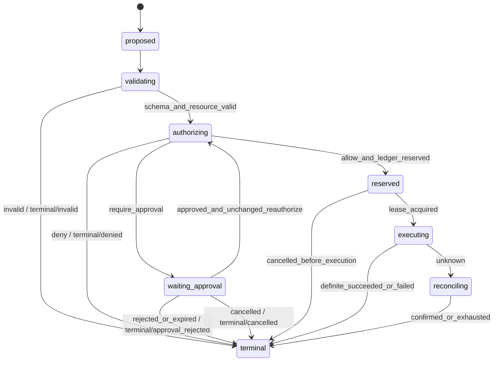

# 工具、MCP 与动作执行

## 1. 定位

本模块是 UEAF 中所有企业副作用的唯一执行入口。它把模型产生的 `ToolIntent` 或工作流的确定性动作请求，转换为经过参数校验、资源解析、运行时授权、必要审批、幂等预留、受控执行和结果对账的 `ActionRecord`。对 Runtime 返回的 `ToolResult` 只是安全投影；外部副作用是否发生，以不可变 `ActionReceipt` 和权威业务系统对账为准。

```text
ToolIntent
  -> bind/canonicalize server-side principal, resource and arguments
  -> compute stable action_fingerprint + action_key
  -> create ActionRecord(proposed)
  -> proposed -> validating -> authorizing
  -> PolicyDecision
  -> ApprovalRequest (when required)
  -> reserve the existing action_key + fingerprint in Idempotency Ledger
  -> execute through capability adapter
  -> ActionReceipt(succeeded | failed | unknown)
  -> reconcile unknown
  -> terminal ActionRecord + ToolResult
```

MCP、函数调用、SDK、HTTP、RPC、消息和 RPA 都只是能力协议或执行适配器。任何 MCP Server、Runtime Adapter 或业务连接器都不能绕过上述链路自行解释身份、批准动作或提交根 Run 终态。

### 1.1 非职责

- 不拥有根 `TaskState`、`RunRecord` 或完成判断；02 只消费动作终态并决定 Run。
- 不相信模型给出的 tenant、principal、scope、凭证、风险等级或“已审批”文本。
- 不用发布质量/安全/运维决定替代每次动作的 `PolicyDecision`。
- 不把工具返回自然语言当作外部系统权威收据。
- 不直接保存业务对象为自己的权威事实；业务系统仍是 record owner。
- 不将 MCP capability discovery 视为 Agent 可用权限；发现与授权严格分离。

## 2. 职责

- 登记、版本化和发布 `CapabilityDescriptor`、输入/输出 Schema、风险和幂等能力。
- 验证 `ToolIntent` 的来源、Schema、参数 provenance、目标资源和调用预算。
- 使用可信 `PrincipalContext` 服务端重绑定租户、主体、委托链与资源，不接受参数自报权限。
- 请求 07 产生当前动作的 `PolicyDecision`，并强制执行 constraints。
- 调用 Approval Service 创建并订阅绑定动作指纹的 `ApprovalRequest`；05 只协调引用和等待，审批后重新校验变化与有效期。
- 在创建 `ActionRecord(proposed)` 前或同一原子提交中生成稳定 `action_key` 与 `action_fingerprint`；授权通过后仅预留这组既有值，阻止重复副作用和键/指纹冲突。
- 通过受控 Tool/MCP/业务适配器执行，记录不可变 `ActionReceipt`。
- 对超时、断线、丢响应等不确定结果执行对账，不把 unknown 猜成 failed。
- 清洗、裁剪并返回结构化 `ToolResult`，为审计提供完整因果链。
- 管理取消、限流、熔断、重试、执行租约和人工处置。

## 3. 子组件

| 组件 | 职责 | 不变量 |
| --- | --- | --- |
| Capability Registry | 管理能力描述、Schema、风险、owner 和适配器版本 | Release 只引用已签名版本 |
| Tool Intent Validator | 校验结构、来源、Prompt/Release/Run 绑定 | 模型参数不得携带可信凭证或权限 |
| Resource Resolver | 将 hint 解析为规范资源身份 | 解析必须在授权前完成并可审计 |
| Action Coordinator | `ActionRecord` 唯一 State Writer | CAS、租约和状态机保护 |
| Policy Client/PEP | 向 07 请求并执行 `PolicyDecision` | deny/过期/不一致均失败关闭 |
| Approval Broker | 创建、等待、验证和撤销审批 | 审批绑定完整 action_fingerprint |
| Idempotency Ledger | 预留 `action_key` 与指纹 | 执行前持久化；冲突不得复用 |
| Execution Router | 按 capability/version/region 选择适配器 | 不改变动作语义或授权范围 |
| MCP Adapter | 握手、能力映射、协议与传输 | MCP 仅协议；不拥有状态或策略 |
| Execution Lease Manager | 防止并发 worker 重复执行 | fencing token 单调增长 |
| Receipt Store | 追加不可变 `ActionReceipt` | 不覆盖 unknown，确认写新收据 |
| Reconciliation Worker | 查询、回调、事件或人工确认 unknown | 对账耗尽才可 unresolved |
| Result Projector | 生成最小化 `ToolResult` | 不泄露凭证、内部策略或多余数据 |
| Secret Broker | 为适配器短时注入凭证 | secret 不进入模型、参数或日志 |

## 4. Canonical 契约

### 4.1 输入：`ToolIntent`

最小字段遵循核心规范：

| 字段 | 规则 |
| --- | --- |
| `tool_intent_id` | 候选唯一标识；不是幂等键 |
| `run_id` / `turn_id` | 必须引用 02 中有效运行上下文 |
| `capability_ref` | 绑定能力名称和不可变版本 |
| `arguments` | 仅业务参数；身份/租户/凭证字段忽略或拒绝 |
| `argument_provenance` | 指明用户、Evidence、Memory、模型或确定性系统来源 |
| `purpose` | 与 Run、授权和 Release 一致 |
| `target_resource_hints` | 供服务端解析，不能自证可访问 |
| `risk_hint` | 非可信提示；最终风险由 Registry/Policy 计算 |
| `requested_by` | agent/release/adapter 引用，不等于 Principal |
| `proposal_hash` | 绑定结构化模型决定与原始候选 |

Runtime 或 06 也可提交确定性的 `ActionCommand`，但必须归一为相同 `ToolIntent` 链路，不得拥有更宽松的“系统调用”旁路。

### 4.2 `CapabilityDescriptor`

至少包含：`capability_id/version`、owner、输入/输出 Schema、side_effect 分类、允许用途、资源类型、风险等级、授权动作、审批策略引用、幂等策略、超时、重试语义、对账能力、取消能力、数据分类、region、适配器引用、速率限制、deprecation 和完整性签名。

`read_only=true` 也不能自动跳过授权；读取可能泄露敏感信息。未声明 side-effect/idempotency/reconciliation 语义的能力不得用于生产写操作。

### 4.3 `ActionRecord`

`ActionRecord` 是动作域的线级、事件级和持久化权威对象。`ActionAggregate` 仅可描述 Action Coordinator 内部实现模式，不得出现在跨模块 API、事件 Schema 或公共数据库模型中。

| 字段 | 规则 |
| --- | --- |
| `action_id` | 一个动作生命周期的唯一标识 |
| `action_key` | 一个逻辑副作用的稳定幂等身份 |
| `action_fingerprint` | 绑定 tenant、principal、delegation、capability/version、resource、规范化参数、purpose |
| `tool_intent_ref` | 指向不可变候选 |
| `run_id` / `turn_id` | 因果关联；Run 终态由 02 拥有 |
| `capability_ref` | 不可变能力版本 |
| `phase` | `ActionPhase` |
| `disposition` | 仅 `phase=terminal` 时非空 |
| `policy_decision_ref` | 执行前必须有效 |
| `approval_request_ref` | 要求审批时必须有效且 approved |
| `idempotency_reservation_ref` | 有副作用执行前必须持久化 |
| `latest_receipt_ref` / `receipt_refs` | 最新引用和完整追加链 |
| `attempt` | 执行尝试号；重试不改变 action_key |
| `reconciliation_state` | unknown 时必需 |
| `lease_fencing_token` | 防止过期执行者提交结果 |
| `revision` / `sequence` | 严格递增，CAS 更新 |
| `created_at` / `updated_at` | 可信时钟 |

### 4.4 `PolicyDecision`

07 返回的运行时决定仅允许 `allow/deny/require_approval`，必须包含 principal、action、resource、environment、constraints、reason codes、policy versions、input hash 和有效期。05 必须验证 decision 的输入哈希与 `action_fingerprint` 对应，并在执行瞬间检查未过期、未撤销、环境未改变。

### 4.5 `ApprovalRequest`

审批绑定 `action_fingerprint`、ToolIntent、Principal、PolicyDecision、审批人策略和 expires_at。其状态固定为 `pending/approved/rejected/expired/cancelled`。参数、主体、目标资源、能力版本、风险、用途或策略约束任何一项变化，都必须废弃旧审批并重新发起。

审批内容应显示规范化资源、实际影响、敏感字段脱敏摘要、回滚/不可逆说明和过期时间；不得要求审批者认可隐藏参数。

### 4.6 `ActionReceipt`

每次观察追加一个不可变收据，至少包括 action key/fingerprint、ToolIntent/Policy/Approval 引用、capability、executor、`status=succeeded|failed|unknown`、attempt、起止时间、外部引用、结果摘要、错误、reconciliation 信息和 integrity。

- `succeeded` 必须证明目标副作用已按指纹发生。
- `failed` 必须证明未发生或以确定性失败结束；可重试性另设字段，不能从异常类型猜测。
- `unknown` 表示外部结果可能发生但尚无法证明；超时、断线、worker 崩溃、响应丢失默认属于此类。
- 后续确认必须追加新 receipt，并以 `confirmation_of_ref` 或 `supersedes_receipt_ref` 关联，不能改写旧 unknown。

### 4.7 输出：`ToolResult`

`ToolResult` 回填 Agent Loop，最少包含：`tool_result_id`、`tool_intent_ref`、`action_ref`、`status=succeeded|failed|unknown|denied`、`safe_summary`、`result_schema_ref`、`result_ref`、`citation_refs`、`retry_advice`、`observed_at`。

它不得包含明文 secret、审批者非必要身份、内部 Policy 全文、原始堆栈、未授权业务字段或将 unknown 描述成确定失败的自然语言。

## 5. Action 状态机

`ActionPhase` 固定为：`proposed`、`validating`、`authorizing`、`waiting_approval`、`reserved`、`executing`、`reconciling`、`terminal`。

`ActionDisposition` 固定为：`executed`、`denied`、`approval_rejected`、`invalid`、`failed`、`unresolved`、`cancelled`。



状态不变量：

- 非 terminal 时 `disposition=null`；terminal 后不可逆。
- `action_key` 与 `action_fingerprint` 是 `ActionRecord` 创建时的必填字段；必须在创建 `proposed` 前或与创建同一原子提交中完成确定性计算，后续阶段不得首次生成或改写。
- `PolicyDecision.outcome=allow` 才能进入 reserved；`require_approval` 还需有效 approved ApprovalRequest。
- `PolicyDecision.outcome=deny` 必须提交 `terminal/denied`；审批拒绝或过期必须提交 `terminal/approval_rejected`，审批取消提交 `terminal/cancelled`，均不得只返回错误而遗漏终态记录。
- Idempotency Ledger 对既有 `action_key + action_fingerprint` 的预留必须先于任何可能产生副作用的网络调用；预留不得重新计算或替换 `ActionRecord` 中的键与指纹。
- reserved 到 executing 需要有效执行租约和 fencing token；过期 worker 的结果只能作为待核查观察，不能直接提交终态。
- executing 后收到取消，只有权威证据证明未执行才可 cancelled；否则进入 reconciling。
- terminal/executed 需要 succeeded receipt；terminal/failed 需要确定失败或未执行证明。
- 对账策略耗尽且仍 unknown 时为 terminal/unresolved；关联 Run 不得 completed。

## 6. 主流程

### 6.1 验证、授权与审批

1. 记录 `ToolIntent` 及来源哈希；服务端绑定 tenant、Principal/Delegation、不可变 capability/version，规范化参数并通过 Resource Resolver 得到规范资源身份。该准备步骤只建立稳定动作身份，不产生授权结论或副作用。
2. 基于规范化后的 tenant、principal、delegation、capability/version、resource、参数和 purpose，确定性计算 `action_fingerprint` 与稳定 `action_key`；在同一原子提交中创建同时包含二者的 `ActionRecord(proposed)`。同一逻辑请求恢复时读取既有记录，不生成新键。
3. 以 CAS 将 `proposed -> validating`，检查 Run/Turn/Release/Capability 有效性、完整 Schema、参数 provenance、风险和预算；失败时提交 `terminal/invalid`。
4. 校验通过后提交 `validating -> authorizing`，再向 07 请求与当前 `action_fingerprint` 绑定的 `PolicyDecision`。`deny` 必须提交 `terminal/denied`；`require_approval` 创建审批、提交 `waiting_approval` 并让 02 注册 wait。
5. 审批拒绝或过期必须提交 `terminal/approval_rejected`，审批取消必须提交 `terminal/cancelled`。审批通过恢复时先回到 `authorizing`，重新验证 Principal、参数、资源、能力、Policy 版本、预算和有效期并重新求值；任何变化不得沿用旧审批。
6. 只有当前 PDP 返回 `allow` 后，才使用 `ActionRecord` 中已经存在的 `action_key + action_fingerprint` 在 Idempotency Ledger 幂等预留；不再计算或替换 action_key。同 key/同 fingerprint 返回既有状态，同 key/异 fingerprint 失败关闭并提交可审计终态；预留成功后进入 `reserved`。

### 6.2 执行

1. 获取执行租约和 fencing token，再从 Secret Broker 获取短时最小权限凭证。
2. Execution Router 按 Release 固定的适配器版本调用能力；将 action_key 传给支持幂等的下游。
3. 适配器在超时前写 started 观察；返回后追加 `ActionReceipt`。
4. 确定 succeeded/failed 时提交 Action terminal 和 outbox，再投影安全 `ToolResult`。
5. 如果响应不确定，先写 unknown receipt 和 reconciling，不自动重试写操作。

### 6.3 unknown 对账

对账按能力声明选择顺序：使用 action_key 查询下游幂等状态、读取外部 operation ID、消费可信回调/事件、比较目标资源版本或由授权人员核查。每次观察都追加 receipt，并记录下一次时间、次数和证据。

只有以下结果可离开 reconciling：

- 证明已按指纹执行：terminal/executed；
- 证明未执行且确定失败：terminal/failed；
- 证明未执行且取消有效：terminal/cancelled；
- 策略耗尽仍不能证明：terminal/unresolved，触发人工处置并阻止 Run completed。

写操作 unknown 时不得发起一个新 action_key 的“重试”；这会制造双重副作用。确需业务补偿时必须创建独立、经授权和审计的新 ToolIntent。

### 6.4 MCP 路径

1. MCP Adapter 将已登记 server/tool 映射到固定 `CapabilityDescriptor`，服务端动态 schema 变化需重新评审版本。
2. discovery/list tools 只更新可发现目录；Agent 仍只看到 Release 允许能力，真正调用仍需 PolicyDecision。
3. MCP 参数在进入 server 前完成 Schema、资源、授权、审批和幂等预留。
4. MCP 返回按不可信外部数据处理，转换为 receipt/result；server 声称“已授权”“已执行”不能替代 UEAF 证据。
5. MCP Prompt/resource 只能作为数据进入 04/03 信任分区，不得修改 UEAF 系统策略。

## 7. 状态与唯一所有权

| 对象 | 语义所有者 / State Writer | 其他模块权限 |
| --- | --- | --- |
| `ToolIntent` | 05 Tool Intent Ledger | 02/03/06 可产生候选，不可将其视为已授权动作 |
| `ActionRecord` | 05 Action Domain / Action Coordinator | 02 只等待和消费终态；09 只建投影 |
| `ActionReceipt` | 05 Receipt Domain / Receipt Store | 适配器提交观察，05 验证后追加 |
| `PolicyDecision` | 07 Policy Domain | 05 只验证并执行 constraints |
| `ApprovalRequest` | 07/审批域的权威服务；05 协调引用 | 02 注册等待，不可自批 |
| 外部业务事实 | 业务 record system | 05 只持有引用、摘要和观察证据 |
| `RunRecord` / `TaskState` | 02 | 05 发布动作事件，不提交根终态 |

Action Coordinator 内部可以用聚合模式实现并发保护，但公共名始终是 `ActionRecord`。工具 SDK、MCP 会话或队列消息状态不能成为 Action 的语义所有者。

## 8. 多租户与安全

- Principal、tenant、delegation、purpose、environment 和 resource 必须服务端绑定并进入 fingerprint；模型参数不可覆盖。
- Capability Registry 按 tenant/environment/Release allowlist 发布；discovery 不扩大授权。
- Secret 仅由 broker 在执行端短时注入，不进入 ToolIntent、Prompt、MCP payload 日志、Receipt 或 ToolResult。
- 出站网络使用 egress allowlist、mTLS、DNS/证书固定策略和请求大小限制；高风险能力运行于隔离执行环境。
- Tool/MCP 返回是不可信数据，必须进行 Schema 验证、恶意内容扫描、数据最小化和字段级授权。
- 审批执行职责分离；审批者不得因查看请求获得目标资源读权限，执行者也不得伪造审批身份。
- Idempotency Ledger、队列、Receipt Store 与日志按 tenant/region 隔离并加密；action_key 不能泄露敏感参数。
- 所有策略拒绝、审批和执行记录保留 reason code 与版本，但对调用者返回最小安全错误。
- 禁止通用 shell、任意 URL、动态代码或未登记 MCP server 作为默认生产能力；如确需使用必须有沙箱、网络/文件 allowlist 和独立高风险策略。

## 9. 故障、取消与恢复

| 场景 | 处理 | 禁止行为 |
| --- | --- | --- |
| Schema/资源无效 | terminal/invalid | 让适配器“尽量执行” |
| Policy 服务不可用/决定过期 | 保持 authorizing 或失败关闭 | 使用旧 allow 默认放行 |
| 审批拒绝/过期 | terminal/approval_rejected | 复制旧 approved 结果 |
| 审批取消 | terminal/cancelled | 将取消后的审批继续用于授权 |
| action_key 同键异指纹 | 安全冲突并告警 | 覆盖或新建相同键 |
| worker 在发送前崩溃 | 由预留与租约安全恢复 | 未查 ledger 直接执行 |
| 调用超时/断线/响应丢失 | unknown -> reconciling | 自动标 failed 后重试 |
| 下游明确限流且证明未执行 | 按策略同 action_key 重试 | 更换 key 绕过限流 |
| 取消发生于 executing 后 | 对账是否发生 | 直接 cancelled |
| Receipt Store 暂时失败 | 不返回成功；用事务/outbox 恢复 | 先向 Runtime 宣称 executed |
| MCP schema 漂移 | 隔离 capability/version | 接受未评审字段 |

恢复顺序：读取 ActionRecord revision 与全部 receipts，核验租约 fencing、查询 Idempotency Ledger、刷新 Policy/Approval 有效性、再决定继续执行或对账。任何恢复过程不得删除 unknown 观察。多活部署必须确保 action_key 预留和终态提交具有单一写入/一致性边界。

## 10. 观测指标

- `action_total{capability,phase,disposition,risk}`；
- `action_end_to_end_latency_ms`、`authorization_latency_ms`、`approval_wait_seconds`；
- `action_idempotency_hit_total`、`action_idempotency_conflict_total`；
- `action_execution_attempt_total`、`action_duplicate_prevented_total`；
- `action_receipt_unknown_total`、`action_reconciliation_age_seconds`、`action_unresolved_total`；
- `action_policy_deny_total`、`action_approval_rejected/expired_total`；
- `capability_error_ratio`、`adapter_timeout_ratio`、`mcp_protocol_error_total`；
- `execution_lease_fenced_total`、`stale_worker_receipt_total`；
- `secret_injection_failure_total`、`result_redaction_total`；
- 每能力的 SLO、外部系统依赖健康和未决动作队列深度。

Trace 必须串起 tool_intent、action、policy、approval、reservation、execution、receipt、reconciliation 与 ToolResult 引用。禁止把 arguments、secret、完整审批说明或高基数资源 ID 直接放入指标标签。

## 11. 可替换端口

| 端口 | 语义 | 可能适配器 |
| --- | --- | --- |
| `CapabilityRegistryPort` | 读取不可变能力版本和 Release allowlist | 数据库、配置仓、服务目录 |
| `ActionStatePort` | Create/Advance/Get ActionRecord，CAS+事件追加 | 关系库、事件存储 |
| `PolicyDecisionPort` | principal-action-resource-environment -> PolicyDecision | 07 Policy Service、OPA/Cedar 适配器 |
| `ApprovalPort` | create/get/cancel/subscribe ApprovalRequest | 企业审批平台、工单系统 |
| `IdempotencyPort` | reserve/get/confirm action_key+fingerprint | 关系库唯一键、强一致 KV |
| `ExecutionLeasePort` | acquire/renew/release + fencing | 数据库租约、共识 KV |
| `CapabilityExecutionPort` | 执行固定 capability/version | SDK、HTTP/RPC、消息、RPA |
| `McpProtocolPort` | initialize/list/call/resource 协议映射 | stdio、Streamable HTTP 等适配器 |
| `ReceiptPort` | 追加和读取不可变收据 | 事务库、WORM/审计存储 |
| `ReconciliationPort` | query/callback/event/manual evidence | 业务查询 API、事件总线 |
| `SecretPort` | 工作负载身份换取短时凭证 | Vault/KMS/云 Secret Manager |
| `ToolResultPort` | 安全结果投影到 Runtime | 进程内、事件或 RPC |

适配器契约测试必须覆盖：同键同指纹、同键异指纹、执行前崩溃、执行后丢响应、重复回调、晚到结果、审批过期、Policy 撤销、取消竞态和租约 fencing。

## 12. 配置项

| 配置 | 说明 | 原则 |
| --- | --- | --- |
| `capability_allowlist` | Release/Agent 可见能力版本 | 显式发布，默认拒绝 |
| `capability_risk_policy` | 风险、授权动作和审批要求 | 版本化并由 07 引用 |
| `action_key_strategy` | 各能力稳定幂等键生成规则 | 语义字段固定，不含随机重试号 |
| `execution_timeout` | 单次适配器调用上限 | 小于 Run deadline，超时不等于失败 |
| `retry_policy` | 仅对证明安全的错误重试 | 写操作默认不在 unknown 时自动重试 |
| `reconciliation_policy` | 间隔、次数、期限和人工升级 | 每能力声明；不可为空 |
| `approval_ttl` | 审批有效期 | 不长于 Policy、Principal、预算有效期 |
| `lease_ttl/heartbeat` | 执行租约和续租 | 支持 fencing，避免双执行 |
| `result_size_limit` | 工具结果和正文外置阈值 | 大结果进 Artifact Store |
| `egress_allowlist` | 允许目标与协议 | 默认拒绝动态地址 |
| `mcp_server_allowlist` | 评审过的 server 和 transport | 固定身份、版本和 Schema |
| `circuit_breaker/rate_limit` | 能力/租户/下游保护 | 不得通过更换 action key 绕过 |

所有配置必须成为 `ReleaseManifest` 的版本化引用。在线覆盖仅能收紧权限、熔断或停止能力；扩大权限和变更动作语义必须经过新发布。

## 13. 验收标准

- 所有副作用路径均产生 `ToolIntent -> action_fingerprint/action_key -> ActionRecord(proposed) -> validating -> authorizing -> PolicyDecision -> 必要审批 -> 既有 action_key 幂等预留 -> ActionReceipt -> ToolResult` 的完整证据链。
- 公共 API、事件和持久化模型统一使用 `ActionRecord`；`ActionAggregate` 只出现在内部实现说明。
- ActionPhase、ActionDisposition 及允许转换与核心状态规范一致，非法转换和终态改写被拒绝。
- 同一 action_key/同一 fingerprint 的重复请求不重复执行；同键异指纹失败关闭并告警。
- 超时、断线、响应丢失和执行中 worker 崩溃进入 unknown/reconciling，不被自动标记 failed 或使用新 key 重试。
- unknown 能通过查询、回调、事件或人工证据确认；耗尽时为 unresolved，并阻止关联 Run completed。
- 审批与完整 action_fingerprint 绑定，参数/主体/资源/能力/风险变化后旧审批无法使用。
- MCP 仅作为协议和连接器；discovery、Prompt、resource 或 server 声明都不能绕过 UEAF Policy、审批、幂等和 Receipt。
- Principal、tenant、delegation、secret 与资源由服务端重绑定，模型或工具参数无法扩大权限。
- 取消、租约过期、重复回调、晚到 receipt、多活竞态和灾难恢复均通过故障注入验证。
- ToolResult 已脱敏且可追溯到权威 receipt；日志、指标和 Prompt 不含 secret 与越权业务字段。
- 每个生产写能力声明幂等、对账、取消、超时、风险、owner 和 runbook；缺任一项不得发布。
