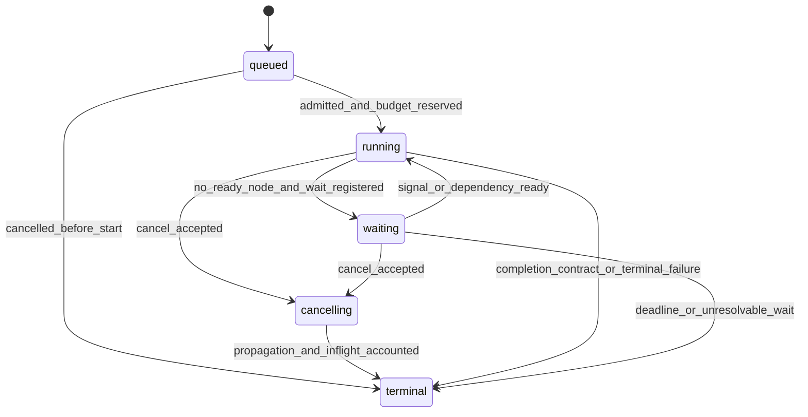
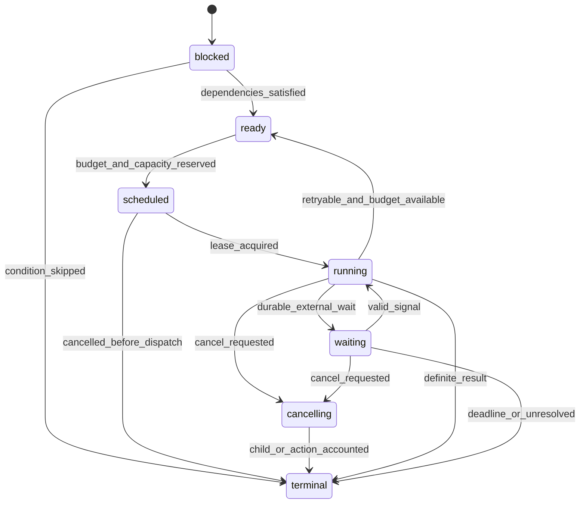

# 工作流与多 Agent

## 1. 定位

本模块把可版本化的流程定义、结构化编排意图和 Agent 交接，执行为可恢复、可取消、可预算、可审计的 `WorkflowRun` 与 `NodeRun`。它负责节点依赖、路由、并发、重试、聚合、补偿协调和 `HandoffEnvelope`，但不拥有根 `TaskState`、根 `RunRecord` 或最终任务完成语义。

```text
02 Runtime
  -> WorkflowStartCommand / WorkflowCommand
  -> 06 WorkflowRun
       -> NodeRun(agent)  -> NodeExecutionRequest -> 02
       -> NodeRun(action) -> ToolIntent           -> 05
       -> NodeRun(wait)   -> signal/timer/approval
       -> NodeRun(subflow)-> child WorkflowRun
       -> HandoffEnvelope -> target Run via 01/02 admission
  -> WorkflowProgress / WorkflowOutcome
  -> 02 evaluates root Run terminal
```

一个 Workflow 的“成功”只说明该流程定义的必要节点和聚合契约满足，不能自行证明根 Task 的完成条件满足。02 必须结合 TaskState、ActionReceipt、WorkflowOutcome、预算与开放问题提交根 Run 终态。

### 1.1 非职责

- 不写根 `TaskState` 或根 `RunRecord`，不把 Workflow terminal 直接映射为 Run completed。
- 不直接调用模型；Agent 节点必须通过 02 的 Runtime Adapter 和 03 的模型契约执行。
- 不绕过 05 执行工具或副作用；Action 节点只能提交受控 `ToolIntent`。
- 不自行扩大 Principal、委托范围、数据访问或工具能力。
- 不共享 Agent 框架的隐式内存；交接使用最小化 `HandoffEnvelope`。
- 不把补偿等同数据库事务回滚；补偿是新的可失败、需授权动作。
- 不允许动态计划修改绕过 Workflow Definition、Policy 或 Release 的版本治理。

## 2. 职责

- 登记和版本化 `WorkflowDefinition`，验证 DAG、循环上限、节点契约和兼容性。
- 创建、推进和恢复 `WorkflowRun`、`NodeRun`、`NodeAttempt`。
- 管理顺序、条件、并行、汇聚、限界循环、子流程、人工等待和定时器。
- 将 Agent 节点归一为 `NodeExecutionRequest`，由 02 创建或恢复受治理 Runtime 执行。
- 将动作节点归一为 `ToolIntent` 并经 05 的 Policy、审批、幂等和对账链路。
- 产生和验证 `HandoffEnvelope`，强制权限、上下文和预算收缩。
- 分配多维预算、预留父级收束预算并防止分支超卖。
- 传播 deadline 和取消，停止启动新节点，核实在途动作并隔离晚到结果。
- 对节点租约、重复消息、重试、竞态和恢复提供 fencing 与确定性聚合。
- 向 02 输出版本化 `WorkflowProgress`、`WorkflowOutcome` 和证据引用。

## 3. 子组件

| 组件 | 职责 | 关键约束 |
| --- | --- | --- |
| Workflow Registry | 管理 Definition、Schema、owner、兼容和发布 | 运行实例绑定不可变版本 |
| Definition Validator | 校验图、循环、节点类型、输入输出和风险 | 无界循环/隐式动态工具禁止发布 |
| Workflow Coordinator | `WorkflowRun` 唯一 State Writer | 单写者语义、CAS、租约和 outbox |
| Node Scheduler | 计算 ready 节点、优先级、容量和限流 | 必须先预留预算再调度 |
| Dependency Evaluator | 解析条件、join、skip 和失败策略 | 仅使用结构化已验证输出 |
| Node Attempt Manager | 管理尝试、租约、fencing 和重试 | 晚到结果不能覆盖胜出结果 |
| Budget Allocator | 父/子预算预留、结算和归还 | 子预算之和不得超过可分配余额 |
| Cancellation Coordinator | 记录和传播取消，追踪确认水位 | cancel 是命令，不是已完成事实 |
| Handoff Broker | 构造、准入、追踪跨 Agent/Runtime 交接 | 最小上下文、权限与预算只收缩 |
| Aggregator | 按显式策略合并分支结果 | 不以“最后回复”隐式胜出 |
| Compensation Coordinator | 反向调度已声明补偿动作 | 补偿本身进入 05 并可 unresolved |
| Timer/Signal Service | durable timer、人工输入、外部事件 | 信号需 tenant、correlation 与防重 |
| Workflow Projection | 进度图、SLA 和运维视图 | 不是语义所有者 |

## 4. Canonical 契约

### 4.1 `WorkflowDefinition`

| 字段 | 规则 |
| --- | --- |
| `workflow_id` / `workflow_version` | 不可变定义身份 |
| `owner` / `purpose` / `risk_class` | 用于治理与责任归属 |
| `input_contract` / `output_contract` | 版本化 Schema |
| `nodes` / `edges` | 显式节点、依赖、条件和数据映射 |
| `completion_contract` | 必需节点、允许缺口和输出要求 |
| `failure_policy` | fail-fast、continue、quorum、人工处置等 |
| `retry_policies` | 按节点类型声明，不覆盖 Action 语义 |
| `budget_policy` | 分配、预留、借用和收束规则 |
| `concurrency_policy` | 全局/租户/分组/节点上限 |
| `cancellation_policy` | 传播、宽限期和在途核实要求 |
| `compensation_graph` | 可选且显式；每个补偿也有契约 |
| `allowed_agent_refs` / `capability_refs` | Release 允许版本集合 |
| `compatibility` / `deprecation` | 恢复和迁移边界 |
| `integrity_ref` | 签名/内容哈希 |

节点类型至少区分 `agent`、`action`、`decision`、`transform`、`wait`、`subworkflow` 与 `handoff`。Decision/transform 节点若依赖模型，必须显式建为 Agent 节点，不得伪装成确定性代码。

### 4.2 输入：`WorkflowStartCommand`

最小字段：`command_id`、`root_task_id`、`root_run_id`、`workflow_ref`、`principal_context_ref`、`input_ref`、`task_state_ref/revision`、`release_manifest_ref`、`budget_allocation`、`absolute_deadline`、`purpose`、`idempotency_key`、`requested_by` 和公共 trace 元数据。

同一 idempotency key 与相同指纹返回既有 WorkflowRun；同键不同 workflow/input/principal/budget 指纹必须冲突失败。`RunAdmissionResult` 已 admitted 是开始根 Workflow 的前提之一，但不代表各 Handoff 或高风险 Action 已获授权。

### 4.3 `WorkflowRun`

| 字段 | 规则 |
| --- | --- |
| `workflow_run_id` | 一个定义实例 |
| `workflow_ref` | 固定 id/version，不在运行中漂移 |
| `root_task_id` / `root_run_id` | 只做父关联；06 不写父状态 |
| `parent_workflow_run_ref` | 子流程时存在 |
| `phase` | `queued/running/waiting/cancelling/terminal` |
| `disposition` | terminal 时 `completed/incomplete/failed/cancelled/unresolved` |
| `input_ref` / `output_ref` | 按定义 Schema 的工件引用 |
| `node_summary` | 各 phase/disposition 计数与关键节点引用 |
| `budget_ledger_ref` | 分配、预留、消耗、释放与余额 |
| `absolute_deadline` | 继承父级且只能收紧 |
| `cancellation_state` | 请求、传播、确认水位和晚到隔离计数 |
| `result_evidence_refs` | 聚合依据，不含未验证自然语言 |
| `lease/fencing` | 协调器单写者保护 |
| `revision/sequence` | CAS 与有序事件 |

### 4.4 `NodeRun` 与 `NodeAttempt`

`NodeRun` 表示一个定义节点在一个 WorkflowRun 中的权威编排状态：

- `node_run_id`、`workflow_run_id`、`node_ref`、`node_type`；
- `phase=blocked|ready|scheduled|running|waiting|cancelling|terminal`；
- terminal `disposition=succeeded|failed|skipped|cancelled|incomplete|unresolved`；
- `dependency_snapshot_ref`、`input_ref`、`output_ref`、`error_ref`；
- `budget_slice`、`consumed_budget`、`deadline_at`；
- `active_attempt_ref`、`winning_attempt_ref`、`action_refs`、`child_run_refs`；
- `lease_fencing_token`、`revision`、`created_at`、`updated_at`。

`NodeAttempt` 是每次可重试执行：`attempt_id/no`、node/run refs、execution target、lease/fencing token、started/finished、status、result/error、usage、retry classification。一个 NodeRun 最多有一个 winning attempt。Attempt 是 06 内部/跨 worker 运行对象，不能改写 02 的 Run attempt。

### 4.5 `NodeExecutionRequest` 与结果

Agent 节点给 02 的请求至少包含：node/workflow/root refs、agent/version、明确 subgoal、completion criteria、Principal/delegated scope、budget slice、deadline、Context/Evidence/Artifact refs、input/output contracts、attempt 和 fencing token。

02 返回 `NodeExecutionResult`：`status=succeeded|refused|failed|unknown|cancelled`、`target_run_ref`、`result_ref`、`evidence_refs`、usage、finished_at 和完整性。06 只接受当前 attempt、当前 fencing token 且未被取消屏障排除的结果。

Action 节点返回的不是普通 NodeExecutionResult，而是 05 的 `ActionRecord`/`ToolResult` 引用；unknown/unresolved 不得被聚合为节点 succeeded。

### 4.6 `HandoffEnvelope`

最小字段遵循核心规范：`handoff_id`、`parent_run_id`、source/target agent、`subgoal`、`completion_criteria`、`principal_context_ref`、`delegated_scope`、`budget_slice`、`context_refs`、`evidence_refs`、`artifact_refs`、`state_summary`、`return_contract`、`ownership_mode`、`expires_at` 和 integrity。

`ownership_mode` 只能是 `manager_retains/receiver_assumes/workflow_node`。交接不是共享内存：不得包含源 Runtime 私有对象、完整消息历史或源 Agent 高权限凭证。目标 Agent 必须通过 01/02 重新验证准入、Release、Principal、delegated scope 和预算。

### 4.7 输出：`WorkflowProgress` 与 `WorkflowOutcome`

`WorkflowProgress` 是非权威投影事件，包含 workflow revision、节点计数、关键等待、预算摘要、deadline 风险和下一可执行节点，不得被 02 当作终态。

`WorkflowOutcome` 在 WorkflowRun terminal 后生成，至少包含 disposition、completion contract 检查、required/optional node outcomes、output/evidence/action/child-run refs、缺口、unresolved items、budget usage 和 integrity。02 根据它和根 TaskState 独立判定根 Run。

## 5. 状态机与调度语义

### 5.1 WorkflowRun



非 terminal 时 disposition 必须为空。Workflow terminal 不触发根 Run 自动终态；06 先提交自身状态和 outbox，再通知 02。

### 5.2 NodeRun



Dependency Evaluator 只能使用已验证结构化输出、节点 disposition 和显式条件；不解析任意模型自然语言决定分支。并行 join 必须声明 `all/any/quorum/first_success/custom_deterministic`，以及未胜出分支的取消/保留策略。

### 5.3 重试

- 重试必须由节点类型、错误分类、预算和 deadline 共同允许。
- Agent 节点可创建新 NodeAttempt，并按 02 契约恢复或创建目标 Run；不得让两个 Attempt 写同一目标 Run。
- Action 节点遵循 05 的 action_key/unknown 语义；06 不得因节点超时生成新的逻辑 Action。
- 非幂等 transform、外部 signal 和 Handoff 必须有独立防重键。
- attempt 耗尽后按 Definition 明确转为 failed/incomplete/unresolved，不隐式跳过 required 节点。

## 6. 预算、取消与晚到结果

### 6.1 多维预算

预算至少包含 Token、模型费用、墙钟时间、节点数、并发、工具动作数和外部调用数。Budget Allocator 必须：

1. 从 02 提供的根预算分配受限子账本，不自行增加额度；
2. 在调度前预留，完成后按真实使用结算并释放余额；
3. 防止并行分支总预留超过父级可分配余额；
4. 为聚合、对账、取消和结果收束保留不可借用预算；
5. 子流程/Handoff 的 deadline 与预算只能等于或小于父级；
6. 以单调 ledger 记录 allocated/reserved/consumed/released/remaining；
7. 预算不足时停止新节点，按完成契约产生 incomplete/failed，而不是负余额继续执行。

预算归还是额度核算，不撤销已发生费用。Provider usage 晚到时通过追加调整记录结算，不能改写历史消耗。

### 6.2 取消

取消是命令与意图，只有 Workflow Coordinator 接受并持久化后才开始传播：

1. 建立 cancellation barrier 和单调 cancellation epoch，停止把新节点从 ready 调度出去；
2. 向 active Agent/child Workflow/Handoff 发送带 epoch 的取消请求；
3. 对尚未 executing 的 Action 请求 05 取消；executing/unknown Action 必须核实或对账；
4. 取消 timers/subscriptions，防重保留到所有可能晚到窗口结束；
5. 收集每个在途节点的 cancelled/definite result/unknown 状态；
6. 只有新工作已停止且在途工作已记录处置，才能提交 Workflow terminal/cancelled 或 unresolved。

流式客户端断开、节点超时或父级 UI 关闭都不自动等于取消。对不可撤销动作，取消只阻止后续工作，并在 outcome 中公开已经发生或仍待确认的影响。

### 6.3 晚到结果隔离

每个 dispatch 携带 `attempt_id + lease_fencing_token + cancellation_epoch + expected_node_revision`。结果提交时必须同时验证：

- attempt 仍是 active 或已被声明为 winning；
- fencing token 是当前值；
- node revision 与预期兼容；
- 结果产生时间不早于 dispatch 且完整性有效；
- cancellation barrier 未把该 attempt 隔离；
- 该 NodeRun 尚未有不可逆终态/胜出结果。

不满足条件的结果写入 `LateResultQuarantine`，保存因果引用、摘要、资源影响和处置状态，但不得更新 NodeRun output、预算重复结算或触发下游节点。若晚到结果证明外部 Action 已发生，必须转交 05 对账，不能简单丢弃证据。

## 7. 主流程

### 7.1 创建与推进

1. 02 提交 `WorkflowStartCommand`；06 校验 admitted Run、Principal、Release、Definition、input Schema、deadline 和预算。
2. 原子创建 WorkflowRun、Budget Ledger 和初始 blocked/ready NodeRun，提交 outbox。
3. Scheduler 为 ready 节点预留预算和容量，创建 NodeAttempt 并获取带 fencing 的租约。
4. Agent 节点发给 02，Action 节点发给 05，wait 节点注册 durable condition，subworkflow 创建受限子实例。
5. 结果回到 Coordinator 后先验 token/revision/epoch，再提交 Node terminal、预算结算和事件。
6. Dependency Evaluator 计算新 ready/skipped 节点；Aggregator 按定义聚合结构化输出。
7. required 节点与 completion contract 决定 WorkflowOutcome；提交 terminal 后通知 02。

### 7.2 多 Agent Handoff

1. source Agent 仅产生 handoff 候选；02/06 校验目标在 Release allowlist、子目标和返回契约完整。
2. 从父级 Principal 计算 delegated scope；禁止把权限、Memory scope、tool capability 或预算扩大。
3. 04 为目标构造最小 Context/Evidence 引用；不得复制源框架内部会话。
4. 生成有过期时间和完整性签名的 `HandoffEnvelope`。
5. 目标通过准入创建自己的 Run/Runtime binding；一个 Run 仍只绑定一个 Runtime Adapter。
6. 目标返回结构化结果、Evidence 和 owner mode 结果；06 验证并合入相应 NodeRun。
7. Handoff 超时、拒绝或部分完成按节点 failure policy 处理，不包装为成功。

### 7.3 动态计划修改

允许动态扩展时，模型只能输出 `WorkflowPatchProposal`。06 必须验证允许的节点模板、最大图大小、无环/限界循环、预算、权限、数据契约和 Release allowlist，并把批准后的 patch 作为不可变 revision 事件。已启动节点的语义不得被原地改变；需改变时创建新节点并显式废弃旧节点。

### 7.4 补偿

补偿图只在 Definition 明确声明时启动。每个补偿动作是新的 `ToolIntent`，拥有独立 action_key、PolicyDecision、审批和 Receipt。补偿失败或 unknown 必须在 WorkflowOutcome 中成为 unresolved；系统不得宣称“已完全回滚”。

## 8. 状态与唯一所有权

| 对象 | 语义所有者 / State Writer | 边界 |
| --- | --- | --- |
| `TaskState` | 02 Task Domain | 06 只读指定 revision，不写业务事实 |
| 根 `RunRecord` | 02 Runtime Domain | 06 输出进度/结果；不提交根终态 |
| `WorkflowDefinition` | 10/06 Definition Registry | 发布后不可变；Release 固定版本 |
| `WorkflowRun` | 06 Workflow Domain / Workflow Coordinator | 唯一写者 |
| `NodeRun` / `NodeAttempt` | 06 Workflow Domain / Workflow Coordinator | worker 只能提交带 fencing 的结果 |
| `HandoffEnvelope` | 06 Handoff Domain / Handoff Broker | 目标 01/02 重新准入 |
| `ActionRecord` | 05 Action Domain | 06 只提交意图并消费终态 |
| Agent 子 Run | 02 Runtime Domain | 06 引用，不复制状态 |
| Budget 根账本 | 02 | 06 维护获分配子账本并回报使用 |

状态数据库、队列、Temporal/Camunda/LangGraph 等引擎只是 Physical Store 或 Adapter；它们的内部状态名必须映射为 UEAF 契约，不能成为第二个语义真相源。

## 9. 多租户与安全

- Workflow/Node/Handoff/Signal/Timer/Budget/Event 均携带 tenant、region、principal/delegation、purpose 和 Release 引用。
- Definition、Agent、Capability 和 Handoff target 使用显式 allowlist；动态字符串不能选择任意服务或高权限 Agent。
- Handoff 权限、预算、deadline、Memory scope 和数据分类只能收缩，目标必须重新准入。
- 节点 input/output 采用 Schema 和字段级分类；工件大正文保存在受控 Artifact Store，事件只携带引用。
- 条件表达式运行在无网络、无文件、限时限内存的确定性沙箱，禁止动态代码执行。
- 信号与回调必须验签、防重、校验 tenant/correlation 和允许发送者；未知信号进入隔离队列。
- 并发与配额同时按 tenant、workflow、Agent、capability 和风险限制，防止一个租户耗尽全局 worker。
- 运维人员可暂停/重试/取消，但不能直接编辑 terminal、Action receipt 或提升 delegated scope；break-glass 必须独立审计和到期。
- Workflow 可视化与日志必须脱敏，不能因显示完整图而泄露无权节点输入或审批数据。

## 10. 故障与恢复

| 场景 | 处理 | 禁止行为 |
| --- | --- | --- |
| Definition/Schema 不兼容 | 创建前拒绝；恢复时暂停并要求受控迁移 | 运行中静默切新版 |
| Coordinator 崩溃 | 以 WorkflowRun revision、outbox、timer、lease 恢复 | 仅靠内存队列推断状态 |
| 重复 dispatch/result | 幂等命令和 fencing 去重 | 重复结算预算或触发下游 |
| Node worker 租约过期 | 新 attempt 获更高 token；旧结果隔离 | last-write-wins |
| Agent 子 Run unknown | 等待/查询 02；按期限 unresolved | 直接新建并行子 Run 猜测 |
| Action unknown | 等待 05 reconciliation | Workflow 自行重试副作用 |
| Budget 不足 | 停新节点并按 contract 收束 | 超卖或向子流程隐式借款 |
| Deadline 到达 | 触发取消屏障并核实在途 | 立即删除状态 |
| Signal 丢失/重复 | durable inbox/outbox、防重和重放 | 非持久化回调决定状态 |
| 跨区故障 | 按数据驻留从 checkpoint/event 恢复 | 未授权跨区复制正文 |
| 补偿失败 | outcome unresolved + 人工处置 | 宣称事务回滚成功 |

恢复必须固定原 Definition、Release、Principal/delegation、TaskState revision 兼容规则和预算账本。若适配器能力不支持精确恢复，必须从 UEAF 已提交节点边界重建；不能依赖未持久化的框架内部上下文。

## 11. 观测指标

- `workflow_runs_total{workflow,version,phase,disposition}`；
- `workflow_end_to_end_latency_ms`、`workflow_wait_duration_ms`；
- `node_runs_total{node_type,phase,disposition}`、`node_queue_latency_ms`、`node_attempt_total`；
- `workflow_critical_path_ms`、`parallelism_active`、`ready_queue_depth`；
- `workflow_budget_allocated/reserved/consumed/remaining`、`budget_exhausted_total`、超支率（目标为零）；
- `workflow_cancel_propagation_ms`、`cancel_inflight_node_total`、`cancel_inflight_action_total`；
- `late_result_quarantined_total`、`stale_fencing_result_total`、`duplicate_result_total`；
- `handoff_requested/accepted/completed/failed_total`、`handoff_scope_rejection_total`；
- `workflow_unresolved_action_total`、`workflow_compensation_failed_total`；
- timer/signal backlog、lease expiry、outbox lag 和恢复时长。

Trace 必须以 root task/run 为根，串起 workflow、node、attempt、target Run、Action、Handoff、Budget 和 Evidence refs。指标标签不得包含自然语言 subgoal、业务对象正文或高基数敏感 ID。

## 12. 可替换端口

| 端口 | 语义 | 可能适配器 |
| --- | --- | --- |
| `WorkflowRegistryPort` | 发布/读取不可变 Definition | 配置仓、关系库、制品库 |
| `WorkflowStatePort` | Workflow/Node CAS、事件和快照 | 关系库、事件存储、工作流引擎适配层 |
| `SchedulerPort` | ready 队列、优先级、容量与公平调度 | 消息队列、任务调度器 |
| `LeasePort` | acquire/renew/release + fencing | 数据库、共识 KV |
| `RuntimeNodePort` | NodeExecutionRequest/Result | 02 Runtime Service |
| `ActionNodePort` | ToolIntent/ActionRecord subscription | 05 Tool Gateway |
| `ContextBuildPort` | 为交接构建最小 Context/Evidence 引用 | 04 Context Service |
| `AdmissionPort` | 目标 Agent/Handoff 重新准入 | 01/02 |
| `TimerPort` | durable timer 与 deadline | 工作流引擎、队列延迟消息 |
| `SignalPort` | 验签、防重的外部信号 inbox | 事件总线、Webhook Gateway |
| `BudgetPort` | reserve/settle/release/snapshot | 02 Budget Ledger、独立配额服务 |
| `ArtifactPort` | 节点输入输出和聚合工件 | 对象存储、制品服务 |
| `EventPort` | outbox 发布和订阅 | Kafka/Pulsar/Service Bus |

引入 Temporal、Camunda、LangGraph、Microsoft Agent Framework 或其他引擎时，必须通过这些端口映射；契约测试覆盖暂停恢复、重复投递、取消确认、并行 join、fencing、晚到结果、预算超卖和 Handoff 权限收缩。

## 13. 配置项

| 配置 | 说明 | 原则 |
| --- | --- | --- |
| `workflow_allowlist` | Agent/Release 可启动定义版本 | 默认拒绝动态定义 |
| `max_nodes/max_depth` | 单实例节点数与子流程深度 | 防止计划爆炸 |
| `loop_iteration_limit` | 每个限界循环上限 | 禁止无界循环 |
| `concurrency_limits` | tenant/workflow/group/node 上限 | 公平和风险感知 |
| `node_retry_policies` | 按类型错误的次数/backoff | 不覆盖 Action unknown 规则 |
| `workflow_timeout/node_timeout` | 绝对 deadline 和节点上限 | 子级不得超过父级 |
| `budget_allocation_policy` | 分支权重、收束预留、借用规则 | 默认禁止跨分支隐式借用 |
| `cancel_grace_period` | 取消传播和核实宽限 | 到期可 unresolved，不能伪造 cancelled |
| `late_result_retention` | 隔离结果保留期 | 覆盖最大回调/执行窗口 |
| `join_policy_defaults` | all/any/quorum 等默认 | 高风险流程必须显式声明 |
| `handoff_allowlist` | 目标 Agent/Runtime/协议 | 固定版本和权限收缩 |
| `dynamic_patch_policy` | 可用模板、图上限和审批要求 | 默认关闭 |
| `compensation_policy` | 启动条件、顺序和人工升级 | 明确其非事务性 |

配置必须版本化并由 `ReleaseManifest` 固定。暂停、熔断和收紧并发可以作为受审计运行控制；扩大节点、Agent、工具或权限必须通过新发布。

## 14. 验收标准

- 根 `TaskState`/`RunRecord` 唯一归 02；06 唯一拥有 `WorkflowRun`、`NodeRun` 和 `NodeAttempt`，Workflow terminal 不自动提交根 Run completed。
- Agent 节点经 02/03 执行，Action 节点经 05 完整治理链；没有模型、工具或 MCP 旁路。
- Workflow Definition、输入输出、完成、失败、重试、join、预算、取消和补偿契约均版本化并由 Release 固定。
- 并行预算在调度前预留，任何并发竞态下均不超卖；为取消、对账与最终聚合保留收束预算。
- deadline 与预算对子流程和 Handoff 只能收紧，目标 Agent 必须重新准入且不能继承隐式状态或高权限凭证。
- 取消建立 barrier 后不再启动新节点；在途 Agent、Action、子流程和 Handoff 的处置被逐项确认或列为 unresolved。
- 每个结果校验 attempt、fencing token、cancellation epoch 和 revision；晚到/重复结果隔离且不触发下游或重复计费。
- Action unknown 由 05 对账，06 不使用新 action_key 重试；晚到副作用证据不会被简单丢弃。
- required/optional 节点、部分结果和未解决事项在 `WorkflowOutcome` 中显式表达，02 可据此独立判断根终态。
- Coordinator/worker/队列/区域故障后可从权威状态与事件恢复，且不双重调度、不丢 durable wait/signal。
- 动态计划只能提交受验证 patch，不能引入未发布 Agent/Capability、无界循环或越权数据流。
- 至少通过 DAG/循环、并行 join、重复消息、租约过期、晚到结果、取消竞态、预算耗尽、Handoff 越权、补偿失败和灾难恢复测试。
