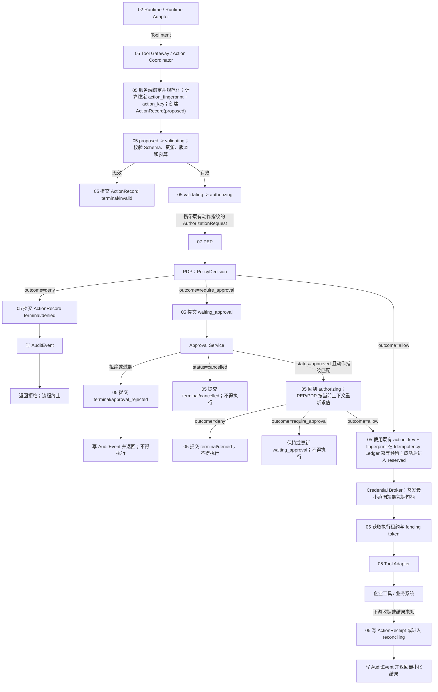

# 07｜身份、权限与安全治理

## 1. 模块定位

本模块为 UEAF 提供统一身份上下文、在线策略授权、人工审批、最小权限凭据、执行隔离和安全证据。它回答的是“哪个主体在什么委托和环境下，能否对哪个资源执行什么动作”，并在每个敏感能力的必经路径强制执行答案。

本模块的权威边界如下：

- 身份提供方是认证事实的权威来源；UEAF 只验证、映射并生成 `PrincipalContext`。
- PDP 是运行授权结论的唯一语义所有者，输出 `PolicyDecision`。
- 审批服务是人工授权事实的唯一语义所有者，输出绑定具体动作的审批凭证。
- Credential Broker 是下游短期凭据的唯一签发入口；模型、Prompt、Runtime Adapter 均不得持有长期凭据。
- 工具或业务系统仍是业务事实和下游动作结果的权威来源；模块 05 将其收据规范化为 `ActionReceipt` 并写入 `ActionRecord`。
- 安全发布评审输出 `SecurityGateDecision`；它不是 `PolicyDecision`，不能授权一次在线动作。

## 2. 职责与非职责

### 2.1 职责

1. 验证用户、服务、Agent 工作负载和人工审批者的身份及租户归属。
2. 保留受限且可验证的委托链，防止身份在转交、重试和恢复时被扩大。
3. 将主体、动作、资源、环境、用途和风险规范化为策略输入。
4. 对入口、数据读取、模型路由、工具调用、记忆读写、Agent 交接和管理操作实施 PEP。
5. 对高风险动作编排审批，并把审批绑定到不可变动作摘要。
6. 以短期、最小范围、限定受众的凭据访问下游系统。
7. 对代码执行、文件、网络、MCP 和远程 Agent 调用实施沙箱、DLP 与结果最小化。
8. 生成不可抽样丢弃的安全 `AuditEvent` 和候选版本的 `SecurityGateDecision`。

### 2.2 非职责

- 不让模型或框架原生 Guardrail 充当最终授权者。
- 不根据工具“可发现”推断工具“可执行”。
- 不直接执行企业工具，不计算 `action_key`，也不拥有 `ActionRecord` 或动作 fencing；这些属于模块 05。
- 不替业务系统定义资源所有权、交易状态或补偿结果。
- 不使用 Trace 代替合规审计。
- 不在本模块聚合质量、运行就绪度并决定发布；聚合由发布治理产生 `ReleaseDecision`。

## 3. 身份与信任模型

| 对象 | 语义 | 必要约束 |
|---|---|---|
| `UserPrincipal` | 经企业身份源认证的人类主体 | 具有认证强度、认证时间和租户归属 |
| `ServicePrincipal` | 调用 UEAF 的服务主体 | 与部署环境、调用受众和证书/令牌绑定 |
| `AgentIdentity` | 逻辑 Agent 定义和版本的身份 | 不等同于用户，也不自动继承用户全部权限 |
| `WorkloadIdentity` | 某环境中实际运行实例的短期身份 | 与 Agent 版本、运行池、环境和有效期绑定 |
| `HumanApprover` | 有资格审批特定风险动作的人类主体 | 必须满足职责分离与审批策略 |
| `DelegationContext` | 用户到服务、Agent、工具的受限委托链 | 每一跳只能保持或收窄用途、范围和有效期 |
| `PrincipalContext` | 当前请求可消费的规范化身份快照 | 包含来源与有效期，不包含原始长期令牌 |

`PrincipalContext` 至少携带：`tenant_id`、`subject_id`、`principal_type`、`identity_provider`、`assurance_level`、`authenticated_at`、`roles`、受控属性、`delegation_chain`、`workload_identity_ref`、`purpose`、`residency_scope` 和 `expires_at`。外部传入的租户、角色、Trace 标识和 Agent 名称均是未验证声明，必须在信任边界内重新解析。

身份不变量：

1. 用户身份、Agent 身份、工作负载身份和审批者身份不能合并成一个字符串。
2. 恢复、重试、Agent 交接和灾备切换都必须重新验证委托有效期与撤销状态。
3. 租户归属由可信映射确定，不能由 Prompt、模型输出或工具参数覆盖。
4. 供应商 SDK 的 Thread、Session 或 Run 标识不能作为授权主体。

## 4. 逻辑组件

| 组件 | 主要输入 | 主要输出 | 明确不拥有 |
|---|---|---|---|
| Identity Adapter | IdP 令牌、证书、会话证明 | 已验证 Claims | 业务角色策略 |
| Principal Mapper | Claims、租户目录、身份关联规则 | `PrincipalContext` | IdP 原始认证事实 |
| Resource Resolver | 资源引用、租户、关系目录 | 规范资源与关系快照 | 业务资源内容 |
| Capability Catalog | Tool/数据/模型能力定义及风险标签 | 可见能力和策略属性 | 当前执行权限 |
| Policy Administration | 策略源、审批规则、数据分类 | 已签名策略包 | 在线动作结果 |
| PDP | 主体、动作、资源、环境、风险、策略版本 | `PolicyDecision` | 动作执行和发布决定 |
| PEP | 调用请求、`PolicyDecision`、审批凭证 | 放行、收窄或拒绝 | 自行修改策略语义 |
| Risk Classifier | 能力标签、数据级别、影响范围 | 风险等级与控制要求 | 最终授权结论 |
| Approval Service | `ApprovalRequest`、审批人资格、动作摘要 | `ApprovalRequest.status/decision` 与审批事实 | 动作本身的成功状态 |
| Credential Broker | 已授权范围、工作负载身份、目标受众 | 短期凭据句柄 | 用户原始凭据转发 |
| Execution Sandbox | 代码、文件、网络和资源限制 | 隔离执行结果 | 在线策略豁免 |
| DLP / Result Minimizer | 工具结果、数据分类、用途 | 最小化结果与处置事实 | 修改业务原始记录 |
| Security Evidence Service | 安全测试、漏洞、威胁模型、控制证明 | `SecurityGateDecision` | `ReleaseDecision` |
| Audit Sink | 规范安全事件 | 不可变 `AuditEvent` | Trace、Log 或 Eval 的语义所有权 |

PEP 必须部署在所有可越权边界，至少包括入口网关、Context/RAG/Memory Gateway、Model Gateway、Tool Gateway、Runtime Adapter 出口、管理 API 和发布控制器。中心 PDP 可以统一决策语义，但不能形成可绕过的单点执行路径。

## 5. 在线授权与审批流程



执行顺序不得颠倒：模块 05 先服务端绑定身份、租户与权威资源，确定性计算稳定 `action_fingerprint` 和 `action_key`，并在创建 `ActionRecord(proposed)` 时将二者作为必填字段持久化；随后按 `proposed -> validating -> authorizing` 推进，才向 PDP 求值。`outcome=deny` 必须提交 `terminal/denied`；审批拒绝或过期必须提交 `terminal/approval_rejected`，审批取消提交 `terminal/cancelled`，均不得只返回错误。只有审批指纹仍匹配且重新求值得到 `outcome=allow` 后，模块 05 才可使用记录中既有的 `action_key + action_fingerprint` 在 Idempotency Ledger 幂等预留，不能此时首次计算或改写 action_key。模块 07 只提供身份、策略、审批事实、凭据约束和安全执行点；动作记录、预留、fencing 与企业工具执行仍由模块 05 拥有。工具超时只说明结果未知，不能推导动作未发生。

## 6. 规范契约

### 6.1 `AuthorizationRequest`

```yaml
authorization_request_id: string
tenant_id: string
principal_context_ref: string
workload_identity_ref: string
delegation_context_ref: string
action: string
resource:
  type: string
  id: string
  relationship_snapshot_ref: string
environment:
  name: string
  region: string
  network_zone: string
purpose: string
risk_level: string
input_digest: string
policy_bundle_version: string
requested_at: timestamp
```

动作摘要必须由规范化后的工具版本、参数、资源、租户、主体、用途和影响边界计算。任何影响授权语义的字段变化都产生新摘要并使旧审批失效。

### 6.2 `PolicyDecision`

```yaml
policy_decision_id: string
authorization_request_id: string
tenant_id: string
principal_context_ref: string
action: string
resource: object
environment: object
outcome: allow | deny | require_approval
constraints: object
reason_codes: [string]
policy_versions: [string]
input_hash: string
evaluated_at: timestamp
expires_at: timestamp
```

`PolicyDecision` 仅表示一次运行时访问或动作授权。它不得包含质量评分、漏洞门禁、SLO 就绪度、候选流量比例或发布结论；这些分别属于 `QualityGateDecision`、`SecurityGateDecision`、`OperationalReadinessDecision` 和 `ReleaseDecision`。

PEP 接受 `PolicyDecision` 前必须验证：签发者、租户、输入摘要、动作/资源范围、策略版本、有效期、撤销信号和附加约束。缓存只能在这些条件均满足时使用。

### 6.3 审批契约

`ApprovalRequest` 至少包含 `approval_request_id`、`action_fingerprint`、`tool_intent_ref`、`principal_context_ref`、`policy_decision_ref`、影响预览、风险原因、`approver_policy`、`status`、`decision`、`decision_reason`、`decided_by`、`created_at`、`expires_at`、`revision` 和职责分离规则。只有 `status=approved` 且 `decision=approve` 的当前版本可以作为重新求值证据。

审批只证明有资格的人同意该动作，不证明动作成功，也不覆盖 PDP。动作摘要、租户、主体、工具版本或参数变化时必须重新审批。

### 6.4 `SecurityGateDecision`

```yaml
security_gate_decision_id: string
candidate_ref: string
environment: string
scope: object
outcome: pass | conditional | fail
status: active | expired | revoked | superseded
evidence_refs: [string]
condition_refs: [string]
waiver_refs: [string]
control_profile_version: string
issued_by: string
issued_at: timestamp
expires_at: timestamp
integrity_ref: string
```

该对象面向候选版本发布，证据可包括威胁模型、依赖与镜像扫描、密钥扫描、越权/提示注入测试、租户隔离验证、数据流审查和未关闭风险。证据不足时不得使用额外 outcome，应签发 `fail` 或不签发决定。`status` 只表达决定的有效生命周期，不改写历史 `outcome`。它不能被 PEP 用作在线动作授权。

## 7. 隔离与数据保护

### 7.1 租户与资源隔离

- 所有策略键、缓存键、队列消息、审计事件、凭据句柄和工件引用都包含可信 `tenant_id`。
- 数据访问先执行租户、用途、分类、驻留和主体过滤，再做相关性排序或内容读取。
- 共享基础设施使用行级/分区级约束与租户感知密钥；高隔离 Profile 使用独立存储、队列、密钥和运行 Cell。
- “资源不存在”和“无权访问”可返回相同外部错误，内部审计仍保留真实原因。

### 7.2 凭据与网络

- 长期密钥保存在企业密钥系统中，Runtime 只得到短期句柄或限定受众的凭据。
- 凭据的权限、地域、网络出口、次数和有效期不得超过 `PolicyDecision.constraints`。
- 用户原始令牌不得透传给模型、MCP Server、远程 Agent 或框架插件。
- 本地代码、浏览器、文件和 Shell 能力使用独立沙箱、只读挂载、允许列表网络与资源上限。

### 7.3 内容信任与最小化

检索片段、网页、文件、工具返回和远程 Agent 消息都是不可信内容。内容指令不能改变身份、策略、工具范围、发布版本或数据用途。进入模型前进行来源标注与敏感字段最小化；离开工具和模型后再次进行输出过滤，但过滤不能篡改权威业务收据。

## 8. 可靠性与故障安全

| 故障 | 安全响应 | 禁止行为 | 恢复条件 |
|---|---|---|---|
| 身份源不可用 | 拒绝新认证；仅允许未过期、可撤销的受限会话按策略运行 | 猜测主体或租户 | 重新验证身份和撤销状态 |
| PDP 不可用 | 高风险/写操作关闭；低风险读取仅可使用仍有效的签名快照 | 默认允许或无限使用缓存 | 策略新鲜度和签名校验通过 |
| 资源目录过期 | 拒绝关系敏感动作或收窄到已知安全范围 | 依据模型描述资源归属 | 取得权威关系快照 |
| 审批服务不可用 | 保持等待，可取消 | 绕过审批 | 获得有效审批并重新求值 |
| Credential Broker 不可用 | 不执行需要下游凭据的动作 | 回退到共享长期密钥 | 恢复短期签发并核验受众 |
| Audit Sink 不可用 | 高风险写关闭；低风险按明确策略降级并保留本地不可变缓冲 | 用 Trace 代替审计 | 审计链恢复且缓冲完整回放 |
| 工具超时 | `ActionRecord` 进入 `ActionPhase=reconciling` | 自动按失败重试 | 查询权威状态或人工对账 |
| 策略/身份撤销 | 停止新动作，取消未开始能力，标记运行重验 | 让长运行静默沿用旧授权 | 新 `PolicyDecision` 生效 |

PDP、审批和凭据服务应跨故障域部署；策略包采用签名、单调版本和有界缓存；撤销信号优先于缓存 TTL。PEP 必须报告决策命中率、过期拒绝、策略延迟和旁路探测，但这些 Metric 不能成为授权真相源。

## 9. 证据边界

| 信号 | 本模块用途 | 保留与采样 |
|---|---|---|
| `AuditEvent` | 证明谁在何时基于何策略授权、审批、签发凭据并执行何动作 | 安全策略决定；关键事件不可抽样 |
| `Trace` | 定位授权链路延迟和调用关系 | 可采样；敏感字段默认不采集 |
| `Log` | 结构化诊断 PDP/PEP/适配器故障 | 可分级保留；不是合规证明 |
| `Metric` | 低基数统计拒绝率、审批时延、缓存新鲜度和异常 | 聚合保留；不得含用户内容 |
| `EvalResult` | 证明安全案例、越权回归和隔离验证结果 | 由评测治理持有，引用安全证据 |

所有信号通过稳定的 `tenant_id`、`task_id`、`run_id`、`action_id` 和版本引用关联，但有独立 Schema、访问、保留、删除和导出策略。

## 10. 验收条件

实现进入 Enterprise Profile 前必须通过以下验收：

1. 伪造租户、角色、Agent 名称或外部 Trace 标识不能改变授权结果。
2. 同一动作在入口、编排、工具和数据 PEP 得到语义一致的决定；任一 PEP 无法验证时不能旁路。
3. `PolicyDecision` 只包含运行授权语义，不能被当作安全发布门禁或发布批准。
4. 高风险动作在参数、资源、工具版本或主体变化后，旧审批必然失效。
5. 模型、Prompt、Trace、Log 和 Runtime Adapter 输出中找不到长期凭据或用户原始令牌。
6. PDP、审批、凭据或审计故障时符合故障矩阵，且不会静默放宽权限。
7. 两个测试租户不能通过数据库、缓存、向量索引、队列、工件、日志或凭据句柄互相访问。
8. 工具超时进入 unknown/reconciling 并完成对账，不能产生未经证明的重复副作用。
9. 每个高风险动作能从 `ActionReceipt` 回溯到主体、委托、策略版本、审批和动作摘要。
10. 每个候选版本能生成独立、带范围和有效期的 `SecurityGateDecision`，并由发布治理验证而不是自行发布。
