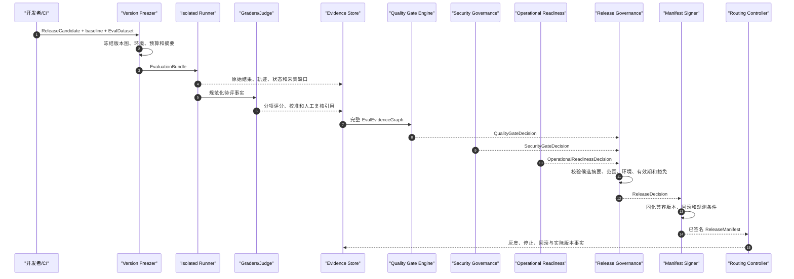

# 08｜评测与发布治理

## 1. 模块定位

本模块把 Agent 质量证据、独立安全结论、生产就绪证明和版本兼容图组合成可执行的发布治理。其目标不是给候选算一个总分，而是回答以下问题：候选相对基线在哪些范围改善或退化、证据是否有效、风险是否被独立评审、部署条件是否具备，以及哪个不可变版本集合可以进入哪个环境。

本模块拥有以下语义：

- `EvalCase`、`EvalDataset`、`EvalRun`、`EvalResult` 和评测证据图；
- 质量治理输出的 `QualityGateDecision`；
- 对三个独立门禁结论进行聚合后输出的 `ReleaseDecision`；
- 依据已批准 `ReleaseDecision` 签发唯一可部署清单 `ReleaseManifest`。

本模块不拥有在线动作授权。`PolicyDecision` 只由运行授权链产生，不参与替代任何发布门禁。`SecurityGateDecision` 由安全治理产生，`OperationalReadinessDecision` 由生产治理产生；发布治理只能验证并聚合它们，不能伪造缺失结论。

## 2. 决策对象边界

| 对象 | 唯一问题 | 典型签发者 | 消费者 | 不得替代 |
|---|---|---|---|---|
| `PolicyDecision` | 当前主体能否执行当前运行时动作 | PDP | PEP | 任一发布门禁 |
| `QualityGateDecision` | 候选在指定案例、切片和质量阈值上是否可接受 | Quality Gate Engine | Release Governance | 安全与生产就绪 |
| `SecurityGateDecision` | 候选在指定安全控制范围内是否可接受 | Security Evidence Service | Release Governance | 在线授权与质量结论 |
| `OperationalReadinessDecision` | 平台容量、SLO、回滚、迁移和可观测条件是否具备 | Operational Readiness Service | Release Governance | 质量与安全结论 |
| `ReleaseDecision` | 三类独立结论能否在同一候选、环境和时限下组合发布 | Release Governance | Manifest Signer、变更审批者 | 在线授权 |
| `ReleaseManifest` | 实际部署和运行固定使用哪一组兼容版本 | Manifest Signer | Routing Controller、Runtime | 任一评审过程或可变配置 |

禁止定义或对外传递无领域前缀、含义模糊的门禁对象。所有决策必须使用完整类型名，并携带候选摘要、环境、范围、证据、有效期和签发者。

## 3. 评测模型

### 3.1 评测对象

| 对象 | 内容 | 不变量 |
|---|---|---|
| `EvalCase` | 输入、前置状态、允许能力、期望约束、评分标尺和敏感级别 | 版本化且不可原地改写 |
| `EvalDataset` | 案例清单、切片、采样权重、用途、暴露与污染元数据 | 内容摘要唯一，保留集访问受控 |
| `EvalConfig` | 候选、基线、环境、预算、评分器、Judge 和重复策略 | 启动后冻结 |
| `EvalRun` | 一次可复现批次及其子运行 | 记录真实版本、环境和证据缺口 |
| `EvalResult` | 单案例/切片/批次的分项事实和不确定性 | 原始事实追加，不覆盖历史 |
| `EvalEvidenceGraph` | 案例、运行、轨迹、评分、校准、人工复核和豁免之间的引用图 | 发布所需引用必须闭合 |

### 3.2 五类评价

1. **结果评价**：任务完成度、事实正确性、结构约束、拒答和业务规则。
2. **轨迹评价**：检索、模型、工具、审批、交接、重试和终止路径是否符合约束。
3. **状态评价**：`RunPhase`、`CompletionDisposition`、Checkpoint、恢复和 `ActionRecord` 是否保持不变量。
4. **安全评价**：越权、提示注入、敏感数据、租户隔离、凭据、沙箱和供应链回归；其事实提供给安全签发者。
5. **性能评价**：延迟、吞吐、令牌/调用/金额预算、稳定性和资源消耗；其生产承载结论仍由运行就绪签发者决定。

最终答案正确不能掩盖危险轨迹；安全硬失败不能被平均分抵消；测量失败必须表示为 `inconclusive` 或无效批次，而不是“不通过”或“通过”。

## 4. 逻辑组件

| 组件 | 职责 | 主要端口 |
|---|---|---|
| Eval Registry | 管理 Case、Dataset、评分标尺、切片和版本 | `EvalAssetRegistry` |
| Version Freezer | 固定候选、基线、环境、依赖和预算图 | `EvaluationBundleBuilder` |
| Isolated Runner | 使用专用低权限身份执行配对案例 | `CandidateExecutionPort` |
| Trace Normalizer | 将框架原生事件映射为 UEAF 轨迹语义并标记缺口 | `TraceNormalizationPort` |
| Outcome/Trajectory/State Grader | 分别产出结果、路径和状态证据 | `GraderPort` |
| Judge Provider | 对开放语义维度评分；禁止拥有工具和发布权限 | `JudgePort` |
| Human Review Queue | 处理低置信、分歧和高影响样本 | `HumanReviewPort` |
| Calibration Service | 维护 Judge 与人工标签一致性、漂移和适用范围 | `CalibrationPort` |
| Evidence Aggregator | 配对基线与候选，计算切片差值、区间和证据完整性 | `EvidenceAggregationPort` |
| Quality Gate Engine | 按版本化门槛签发 `QualityGateDecision` | `QualityGatePort` |
| Release Governance | 验证并聚合三个独立门禁，签发 `ReleaseDecision` | `ReleaseDecisionPort` |
| Manifest Builder/Signer | 构建、验证和签名不可变 `ReleaseManifest` | `ReleaseManifestPort` |
| Rollout Feedback Ingestor | 接收灰度、回滚和线上异常事实，生成新评测输入 | `ProductionFeedbackPort` |

被测 Runtime、Judge、评分器、数据集、证据存储和发布控制器必须使用不同服务身份和最小权限。被测候选不能读取保留集答案或修改证据；Judge 不能调用业务工具；发布控制器不能重算评分。

## 5. 从候选到发布清单



关键顺序是“先固化运行事实，再解释事实；先独立签发三个门禁，再聚合发布；先批准候选，再生成唯一发布清单”。任何证据、决策或版本引用缺失时，不得以人工口头结论或 CI 成功状态补位。

## 6. 规范契约

### 6.1 `EvalResult`

```yaml
eval_result_id: string
eval_run_id: string
candidate_ref: string
baseline_ref: string
dataset_version: string
case_id: string
slice_ids: [string]
dimension: outcome | trajectory | state | security | performance
measurement: object
verdict: pass | fail | inconclusive | invalid
grader_version: string
evidence_refs: [string]
produced_at: timestamp
```

`EvalResult` 是评测事实，不是发布授权；它可引用经过最小化的 Trace 或 Audit，但不能改变它们。评分器重跑产生新版本结果，不能覆盖原始输出、轨迹或旧评分。

### 6.2 `QualityGateDecision`

```yaml
quality_gate_decision_id: string
candidate_ref: string
environment: string
scope: object
outcome: pass | conditional | fail
status: active | expired | revoked | superseded
baseline_ref: string
threshold_profile_version: string
evidence_graph_ref: string
hard_failure_refs: [string]
condition_refs: [string]
waiver_refs: [string]
issued_by: string
issued_at: timestamp
expires_at: timestamp
integrity_ref: string
```

质量门禁至少检查：关键切片硬失败、相对基线退化、不确定性、案例覆盖、轨迹完整性、评分器校准、数据污染和预算约束。豁免必须有所有者、原因、范围、补救动作和到期时间；豁免不能把安全硬失败改写为质量通过。

### 6.3 `ReleaseDecision`

```yaml
release_decision_id: string
candidate_ref: string
environment: string
outcome: approved | conditional | rejected
status: active | expired | revoked | superseded
release_policy_version: string
quality_gate_decision_ref: string
security_gate_decision_ref: string
operational_readiness_decision_ref: string
condition_refs: [string]
waiver_refs: [string]
rollout_constraints: object
issued_by: string
issued_at: timestamp
expires_at: timestamp
integrity_ref: string
```

聚合器必须验证三个上游决定指向相同 `candidate_ref` 和目标环境，范围覆盖本次流量，且 `status=active`、证据可访问、签发者可信、豁免没有冲突。`EvalResult.verdict=inconclusive`、关键证据缺失或范围不覆盖时，对应门禁必须为 `fail` 或不签发 active 决定，不能自动视为通过。决策签发者与候选提交者应职责分离；决定的 `status` 变化不改写历史 `outcome`。

### 6.4 `ReleaseManifest`

`ReleaseManifest` 是生产部署和运行的唯一发布清单。开发、CI、框架配置、镜像标签或控制面“最新版本”都不能成为并行清单。清单至少包含：

- `release_id`、目标 `environment`、`lifecycle_status`、生成时间和 `integrity_ref`；
- `agent_version`、`prompt_version`、输入/输出 `schema_version` 和 `model_route_version`；
- `capability_versions`、`adapter_versions`、`knowledge_index_version`、`memory_policy_version` 和 `policy_bundle_version`；
- 支持的 UEAF contract version ranges 与兼容矩阵引用；
- 状态、数据和 Adapter migration 引用；
- `quality_gate_decision_ref`、`security_gate_decision_ref`、`operational_readiness_decision_ref` 和 `release_decision_ref`；
- rollout 切片、停止条件、观察窗口和容量上限；
- rollback 目标、不可逆迁移说明和恢复前置条件。

`ReleaseCandidate` 用于决策前描述候选版本图；它不是可部署清单。只有签名、完整且处于可消费生命周期状态的 `ReleaseManifest` 可以被 Routing Controller 和 Runtime 加载。长运行的 `RunRecord` 固定 `release_id`；恢复不得静默切换到新清单。

## 7. 评测隔离、隐私与公平性

- 生产样本进入评测前执行用途校验、脱敏、租户隔离、保留和删除传播；证据引用不等于复制全部载荷。
- 保留集的读取权限与候选代码、Prompt 和发布权限分离；暴露或污染事件会使受影响结果失效。
- 基线和候选在同一环境、预算、工具模拟和采样策略下配对；无法等价时显式记录差异。
- 外部副作用默认使用模拟器、沙箱或只读影子；确需真实调用时使用独立测试租户、动作允许列表和可清理数据。
- Judge 输入可能包含提示注入；Judge 只能输出带版本和置信的评分证据，不能执行工具、审批动作或写发布状态。
- 在线点赞、投诉或任务中断是观察事实，不直接等同于正确/错误标签；需经采样、去偏和人工确认后进入案例资产。

## 8. 一致性与可靠性

### 8.1 一致性边界

1. `EvalDataset`、`EvalConfig` 和候选版本图在 `EvalRun` 启动后不可变。
2. 原始运行事实、评分、门禁和发布决定均追加写；纠正通过新版本和因果引用表达。
3. 单案例重试保留 attempt 和随机性信息；不能选择性删除不利尝试。
4. Evidence Graph 可以最终聚合，但 `QualityGateDecision` 只能在所需引用闭合后签发。
5. `ReleaseDecision` 与 `ReleaseManifest` 的签发必须使用并发版本检查，避免较旧决定覆盖新安全结论。
6. Routing Controller 应以 `release_id` 原子切换期望路由；实例不得自行拉取“最新”组件。

### 8.2 故障处理

| 故障 | 结论 | 恢复单元 |
|---|---|---|
| 运行环境漂移或隔离失败 | 受影响批次 `invalid` | 从冻结环境重跑案例/批次 |
| 轨迹或状态证据缺失 | 相关维度 `inconclusive`，质量门禁不通过 | 补采后重跑必要案例 |
| Judge 不可用或偏差超限 | 转人工或已校准备用 Judge，不自动通过 | 单评分任务 |
| Evidence Store 不可用 | 暂停决定签发；保留原始不可变缓冲 | 从原始事实重建派生证据 |
| 任一门禁过期或范围不匹配 | `ReleaseDecision.outcome=rejected` 或不签发 | 重新签发对应门禁 |
| Manifest 签名/兼容校验失败 | 禁止部署 | 重建并重新签名清单 |
| 灰度触发硬停止条件 | 阻止新流量并按清单执行排空/回滚 | 单 `release_id` 路由切片 |
| 回滚目标不可用或迁移不可逆 | 维持安全停止，执行前向修复或恢复计划 | 预演过的恢复单元 |

评测执行可横向按租户、数据集、案例和候选分区；门禁与清单签发必须有唯一协调和幂等键。任何自动重试都不得重复真实副作用或重复签发不同内容的同一决策 ID。

## 9. 发布反馈闭环

生产运行持续输出实际 `release_id`、错误预算、尾延迟、成本、容量、异常终态、动作 unknown、策略拒绝、审计缺口和用户影响。反馈进入以下不同路径：

- 运行异常形成新的 EvalCase 或切片，不直接修改既有结果；
- 新漏洞或安全事件撤销/重签 `SecurityGateDecision`，并触发发布停止；
- SLO、容量、迁移或恢复条件变化撤销/重签 `OperationalReadinessDecision`；
- 候选语义或依赖版本变化必须形成新候选摘要和新 `ReleaseDecision`；
- 路由、回滚和人工介入作为发布事实写入 Audit 与发布证据，不能只留在 Log。

## 10. 验收条件

1. 基线与候选在冻结、可复现的版本图和等价预算下完成配对评测。
2. 结果、轨迹、状态、安全和性能证据可分别查询；最终答案得分不能覆盖路径硬失败。
3. 测量失败产生 `inconclusive/invalid`，不能被错误归类为候选通过。
4. `QualityGateDecision`、`SecurityGateDecision`、`OperationalReadinessDecision` 和 `PolicyDecision` 具有不同 Schema、签发者和权限。
5. `ReleaseDecision` 只在三个独立发布门禁范围、候选、环境、有效期一致时签发。
6. `ReleaseManifest` 是 Routing Controller 与 Runtime 接受的唯一发布清单，任意可变“最新配置”均被拒绝。
7. 每个运行可还原实际 `release_id` 及 Agent、Prompt、模型路由、能力、Adapter、知识、记忆和策略版本。
8. 旧清单可与新清单并存服务不同运行；暂停恢复不会静默升级。
9. 灰度硬停止、回滚、豁免和人工覆盖均有 Audit 与证据引用，并能验证职责分离。
10. 删除、保留集暴露、Judge 漂移和安全撤销能传播到受影响证据和发布状态。
