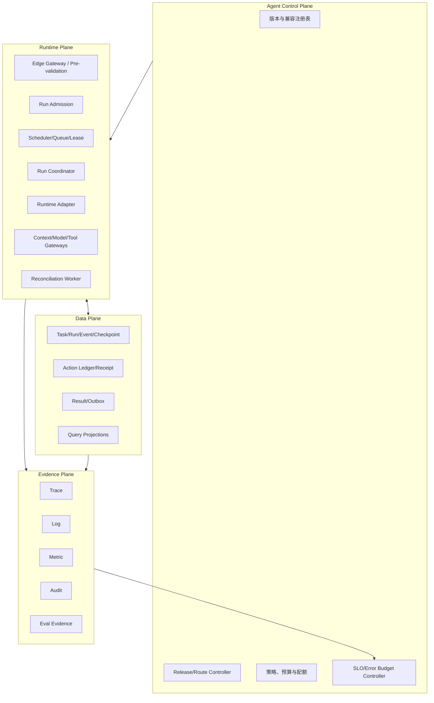
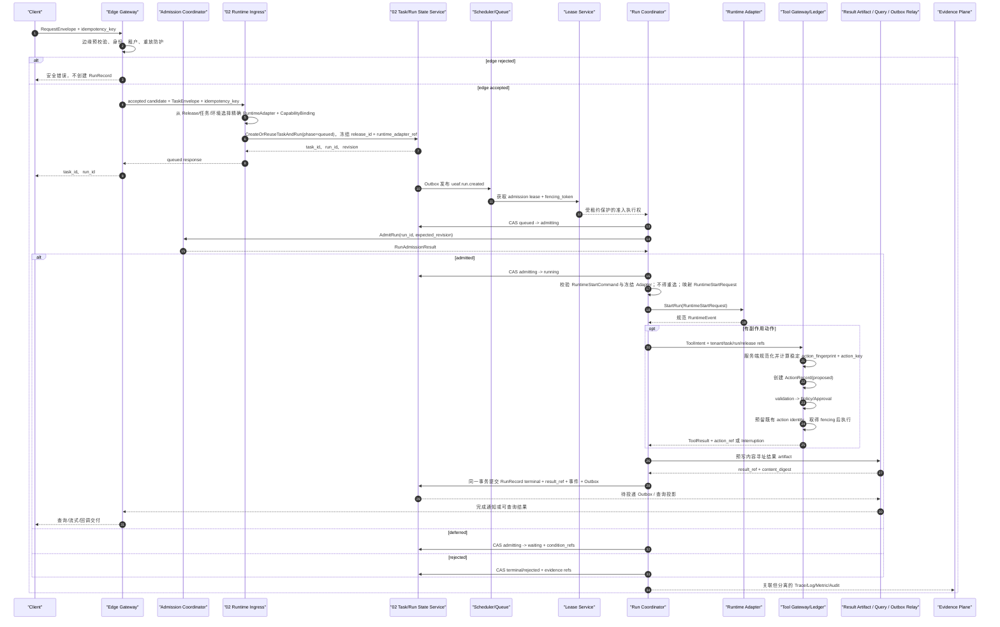

# 09｜生产运行与可观测性

## 1. 模块定位

本模块把已批准的 `ReleaseManifest` 承载为可持久、可恢复、可限流、可对账且可观察的企业服务。它为模块 01 的接入/准入、模块 02 的 Task/Run、模块 05 的动作可靠性提供生产调度、存储、结果交付、SLO、渐进发布和灾备能力；不取得这些领域对象的语义所有权，不重新定义 Agent 内部推理图，也不让进程内对象成为任务真相源。

生产运行遵循以下不变量：

1. `TaskState`、`RunRecord`、`ActionRecord` 和业务收据分别有唯一语义所有者。
2. `RunPhase` 与 `CompletionDisposition` 分离；只有 `RunPhase=terminal` 才能写终态处置。
3. 队列采用至少一次投递，副作用采用幂等、fencing、收据和对账实现 effectively-once。
4. Tool 超时只会产生 `ActionReceipt.status=unknown` 或暂缺收据，动作进入 `reconciling`，不得盲目重试。
5. 每个运行固定一个不可变 `ReleaseManifest`；实例不能读取“最新”组件替换正在运行的语义。
6. Trace、Log、Metric、Audit 和 Eval 是不同资产，只通过稳定标识关联。

## 2. 平面与职责



| 平面 | 拥有 | 不拥有 | 故障时原则 |
|---|---|---|---|
| Agent Control Plane | 期望版本、路由、配额、停止条件、SLO 策略 | 运行事实和业务结果 | 不篡改已开始运行；冻结高风险变更 |
| Runtime Plane | 协调、租约、执行顺序、Gateway 和 Adapter 调用 | 持久任务真相、业务工具真相 | 停止接纳或暂停，不退回进程内状态 |
| Data Plane | 物理承载 Task/Run/Action/Event/Checkpoint/Result 权威记录与查询投影 | 这些对象的语义所有权、发布审批和模型判断 | 保证版本化写入、恢复和删除传播 |
| Evidence Plane | 五类独立证据与关联 | Task/Run 权威状态 | 标记缺口；审计/门禁最低证据不能靠采样补写 |

Developer Plane 只构建、校验和发布工件，不在生产数据路径内；其输出必须经过发布治理形成 `ReleaseManifest` 后才可被 Agent Control Plane 消费。

## 3. 核心组件

| 组件 | 主要职责 | 可靠性边界 |
|---|---|---|
| Edge Gateway | 认证入口服务、限流、载荷限制、内部关联标识重建 | 外部 Trace/租户声明均不可信 |
| Admission Coordinator | 模块 01/Admission Domain 针对已有 `run_id` 组合契约、身份、`PolicyDecision`、预算、配额和清单验证 | 输出 `RunAdmissionResult`，不做边缘预校验、不新增泛型 Decision |
| Request Idempotency Service | 以租户、调用者、端点和幂等键去重 | 同键异载荷必须拒绝 |
| Task/Run State Service | 作为模块 02 的唯一 State Writer 持久化 `TaskState`、`RunRecord`、事件和并发版本 | Edge 和模块 09 不能直写；禁止内存兜底成为真相源 |
| Scheduler | 按租户、优先级、风险、地域和容量选择可执行工作 | 公平调度和背压，不能无限重试 |
| Durable Queue | 至少一次投递、延迟和死信隔离 | 消息不是任务完成证明 |
| Lease Service | 为 Run 签发有时限租约和单调 fencing token | 过期持有者不能提交 `RunRecord`；动作 fencing 由模块 05 管理 |
| Run Coordinator | 驱动规范状态、预算、暂停、恢复和取消 | 所有迁移使用 CAS/事件版本 |
| Runtime Adapter | 将 UEAF 命令转换为框架原生执行并回传规范事件 | 框架状态只作投影或 opaque ref |
| Context/Model/Tool Gateway 运行承载 | 承载模块 04/03/05/07 定义的策略、版本、预算、重试和供应商适配 | 不改变各 Gateway 的领域契约和语义所有权 |
| Action Ledger | 物理持久化由模块 05 唯一写入的 `ActionRecord`、`action_key`、动作 fencing 与收据 | 模块 09 不生成 action_key 或推进动作语义；保存 unknown |
| Reconciliation Worker | 查询下游权威状态、获取迟到收据或转人工 | 对账优先于再次执行 |
| Checkpoint Service | 保存可恢复点及 Release/Adapter/Schema 引用 | Checkpoint 不是 Conversation 或业务事实 |
| Result Service | 持久化稳定结果与状态查询 | 写成功后才能宣告可读取终态 |
| Transactional Outbox | 与状态/结果原子记录待发布事件 | 发布至少一次，下游去重与处理乱序 |
| Telemetry Pipeline | 分别路由 Trace、Log、Metric | 不承担 Audit/Eval 权威存储 |
| Audit Exporter | 追加关键身份、授权、动作、发布和恢复事实 | 不受普通采样影响 |
| SLO Controller | 计算用户旅程 SLI、错误预算和停止信号 | 指标缺口本身是风险信号 |
| Release/Route Controller | 原子收敛清单路由、灰度、排空和回滚 | 只消费有效 `ReleaseManifest` |
| Recovery Coordinator | 编排分平面恢复、验证和对账 | 先可见、后对账、再恢复写入 |

## 4. 准入与运行状态

### 4.1 `RunAdmissionResult`

生产准入不是另一个通用门禁决定，也不是边缘接入的同义词。接入层先完成协议、基础 Schema、可信主体、租户绑定、重放防护和最低安全预校验；预校验失败不创建 `RunRecord`。预校验成功后，Runtime Domain 原子创建或复用 `TaskState` 与 `RunRecord(phase=queued)`，冻结 `release_id`、`runtime_adapter_ref`、任务引用和初始预算引用。

Run Coordinator 获得 admission lease 并提交 `queued -> admitting` 后，Admission Coordinator 才能针对确定的 `run_id` 组合 `TaskEnvelope`、`PrincipalContext`、入口 `PolicyDecision`、预算和配额、目标 `ReleaseManifest` 的签名/环境/兼容性、区域、Adapter 能力及依赖健康度，输出：

```yaml
run_admission_result_id: string
run_id: string
outcome: admitted | rejected | deferred
validation_refs: [string]
policy_decision_refs: [string]
budget_snapshot_ref: string
release_manifest_ref: string
reason_codes: [string]
retry_after: timestamp | null
created_at: timestamp
expires_at: timestamp
```

`admitted` 原子提交 `admitting -> running`；`rejected` 原子提交 `terminal/rejected`；`deferred` 提交 `admitting -> waiting` 并登记 `approval|dependency|capacity` 等等待条件。三者不能都映射成失败重试。`RunAdmissionResult` 必须包含 `run_id` 和非空 `expires_at`；应用前校验有效期，过期后重新准入。它不替代 PDP 的 `PolicyDecision`，也不替代发布治理的四类决定。

### 4.2 规范状态

`RunPhase` 的闭集为：

```text
queued | admitting | running | waiting | retrying | paused | terminal
```

仅 `RunPhase=terminal` 可以设置：

```text
CompletionDisposition = completed | rejected | incomplete | failed | cancelled
```

等待态使用独立 `WaitReason`：

```text
user_input | tool_result | approval | dependency | capacity | reconciliation
```

扩展等待原因必须使用命名空间，不能新造与 `RunPhase` 冲突的状态。`waiting`、`paused`、`retrying` 均不是终态；超时也不能直接推导 `failed`。

模块 09 仅为观测、告警和恢复消费模块 05 的 `ActionRecord` 投影，不生成 `action_key`、不签发动作 fencing，也不提交动作状态。规范动作阶段为：

```text
proposed | validating | authorizing | waiting_approval | reserved | executing | reconciling | terminal
```

只有动作阶段为 `terminal` 时才写：

```text
ActionDisposition = executed | denied | approval_rejected | invalid | failed | unresolved | cancelled
```

`ActionReceipt.status=succeeded|failed|unknown`。`unknown` 必须先进入 `ActionPhase=reconciling`；达到明确对账截止时间仍无法确认，才可终结为 `unresolved`，并保留人工处理义务。

## 5. 端到端生产时序



流式输出只是暂态交付，不代表持久终态。结果正文可以先写入内容寻址对象存储，但 `RunRecord` 终态、`result_ref`、领域事件和 Outbox 必须由模块 02 State Service 在同一事务提交；Result/Outbox 组件只负责对象引用、查询投影和投递，不能成为第二个 Run State Writer。若该事务失败，运行保持非终态并重试，未被引用的预写对象由孤儿清理回收；不能先向调用方宣告完成再丢失结果。

## 6. 重复、超时与对账

1. 请求幂等键只去重入口任务；消息去重使用 `event_id`；动作唯一性使用 `action_key`，三者不可复用语义。
2. Scheduler 和 Queue 可重复投递，Coordinator 必须通过聚合版本、租约和 fencing 拒绝过期执行者。
3. Tool Gateway 在动作执行前原子预占 `ActionRecord`；相同 `action_key` 返回已有结果或当前状态。
4. 下游支持幂等键时透传稳定业务键；不支持时必须提供状态查询、外部引用、补偿或人工复核能力。
5. 网络超时后先查询 Action Ledger 和下游权威状态，禁止自动重新执行写动作。
6. 对账产生新的事实和收据引用，不覆盖原始 unknown、超时和重试历史。
7. 取消是意图，不保证已发出的外部动作撤销；在途动作仍需收据、对账或补偿。

## 7. 五类证据严格分离

| 资产 | 回答的问题 | 典型内容 | 采样与保留 | 禁止用途 |
|---|---|---|---|---|
| `Trace` | 一次逻辑运行经过哪些阶段、耗时和依赖 | Span 关系、阶段、错误类别、版本引用 | 可采样，载荷默认最小化 | 证明合规授权或业务终态 |
| `Log` | 组件当时记录了什么诊断事实 | 结构化错误、重试、局部上下文 | 分级保留，可限流 | 作为 Task/Run 状态真相源 |
| `Metric` | 系统整体趋势和 SLO 风险如何 | 低基数计数、直方图、队列、预算 | 聚合保留；严禁用户内容和高基数 ID | 回放单次运行或审计个人动作 |
| `Audit` | 谁基于何策略/审批对何资源做了什么 | 身份、决策、动作摘要、收据、发布/恢复事实 | 关键事件不可抽样，按合规策略保留 | 通用调试或模型评分 |
| `Eval` | 候选在固定方法和证据上表现如何 | Case、结果、轨迹评分、校准、门禁 | 由评测版本和数据用途治理 | 在线运行权威状态或授权 |

共同关联字段至少包括 `tenant_id`、`task_id`、`run_id`、`release_id`、`correlation_id` 和需要时的 `action_id`；共同关联不意味着共用存储、Schema、访问控制或删除策略。Prompt、模型输出、检索片段、记忆和工具参数不是默认遥测字段。

Telemetry Pipeline 应监控自身的丢弃率、关联断裂、时钟偏差、Schema 无效、采样变化和成本。若发布所需最低证据缺失，`OperationalReadinessDecision` 不得通过；若安全 Audit 链断裂，高风险写按安全策略关闭。

## 8. SLI、SLO 与容量保护

### 8.1 关键旅程

至少独立定义以下 SLI：

- 接入与准入：边缘预校验通过的请求创建 queued Run，并针对该 `run_id` 得到确定 `RunAdmissionResult` 的成功率和尾延迟；
- 执行：按任务类型和风险分层的完成率、尾延迟和预算超限率；
- 状态：已接收任务的查询新鲜度、状态一致性和结果可读取率；
- 动作：授权延迟、重复副作用率、unknown 比例和对账时长；
- 恢复：Checkpoint 可用率、恢复成功率、RPO/RTO 和恢复后不变量通过率；
- 证据：五类信号的独立可用性、关联完整度和门禁证据完整度。

SLO 必须按租户等级、任务类型、风险、同步/异步模式和区域分层，不能用全局平均掩盖关键切片。错误预算进入路由和发布控制：预算过快消耗时先停止扩量，再收缩低优先级工作，必要时回滚。

### 8.2 背压顺序

容量保护按下游向上游传播：依赖并发与速率限制 → Runtime 暂停/有界重试 → Queue 延迟和优先级 → Admission `deferred`/明确拒绝。禁止只在入口限流而下游仍无限重试。每个租户都有并发、队列、令牌、金额、工具和存储配额；共享池使用公平调度和隔离断路器。

## 9. 发布与运行就绪

### 9.1 `OperationalReadinessDecision`

```yaml
operational_readiness_decision_id: string
candidate_ref: string
environment: string
scope: object
outcome: pass | conditional | fail
status: active | expired | revoked | superseded
readiness_policy_version: string
slo_profile_ref: string
capacity_evidence_refs: [string]
observability_evidence_refs: [string]
migration_evidence_refs: [string]
rollback_evidence_refs: [string]
recovery_evidence_refs: [string]
condition_refs: [string]
waiver_refs: [string]
issued_by: string
issued_at: timestamp
expires_at: timestamp
integrity_ref: string
```

它至少验证：目标切片容量、依赖限额、SLO/错误预算、五类证据最低覆盖、数据与状态迁移、版本共存、回滚目标、不可逆变更、备份恢复、对账能力、告警和操作手册。证据不足时不得使用额外 outcome，应签发 `fail` 或不签发决定。`status` 只表达决定的有效生命周期，不改写历史 `outcome`。它不判断候选质量或安全控制结论，也不授权在线动作。

### 9.2 灰度与回滚

Routing Controller 只消费带签名且有效的 `ReleaseManifest`，按租户、风险、任务类型、地域、运行池和依赖能力分层灰度。停止条件至少覆盖质量硬失败、安全事件、错误预算、容量、成本、数据一致性、unknown 激增和观测缺口。

停止后先阻止新流量，再按清单决定让在途运行完成、暂停、排空或取消。回滚只改变新运行路由；长运行默认继续绑定原 `release_id`。若状态或数据迁移不可逆，必须执行清单中的前向修复/恢复计划，不能假设镜像回退等于语义回退。

## 10. 故障域与恢复

| 故障 | 生产响应 | 禁止行为 | 恢复验证 |
|---|---|---|---|
| Task/Run Store 不可用 | 停止新接纳和状态提交，保护已持久事实 | 用进程内状态继续写 | 聚合版本、租约和 Outbox 一致 |
| Queue 不可用 | 保留已接收任务，恢复后补调度 | 将任务视为丢失或重复建单 | 可执行状态与消息对账 |
| Model Provider 故障 | 按清单有界重试/批准降级，受预算控制 | 随意换“最新”模型 | 实际路由、质量影响和预算已记录 |
| Policy/Approval 故障 | 按安全模块关闭或保持等待 | 绕过授权 | 新鲜策略/审批重新验证 |
| Tool 结果未知 | 转 `reconciling`、查询或人工复核 | 盲目重试写动作 | 下游事实与 `ActionRecord` 对齐 |
| Result/Outbox 故障 | 保持非终态或积压发布 | 提前宣告成功、回滚业务完成 | 结果、终态、事件可重复验证 |
| Telemetry 故障 | 受控采样/缓冲并告警；最低证据不足停止扩量 | 假定系统健康 | 缺口范围和恢复时间已记录 |
| Audit 故障 | 高风险写关闭 | 用 Log/Trace 补作审计 | 不可变链完整回放 |
| 区域故障 | 按租户驻留和清单切换 Cell | 未对账就双区写入 | 身份、租约、动作和删除义务验证 |

灾备恢复顺序为：密钥与可信身份 → Control Plane 期望状态和有效清单 → Task/Run/Event 与 Action Ledger → 只读状态/结果查询 → 在途和 unknown 对账 → 受控写执行 → Outbox/通知 → 非关键分析。恢复后必须证明已完成结果可读、已取消任务未重跑、过期租约无写权、未知动作进入对账、已删除数据未被备份复活、发布和策略引用仍有效。

## 11. 验收条件

1. 重复 `TaskEnvelope`、重复队列消息和过期租约不会产生重复 Task、状态提交或业务副作用。
2. `RunPhase`、`CompletionDisposition`、`WaitReason`、`ActionPhase` 和 `ActionDisposition` 均符合规范闭集和终态约束。
3. Tool 超时被记录为 unknown/reconciling，并能通过收据、状态查询或人工流程完成对账。
4. Task/Run Store、Result 和 Outbox 的事务边界可证明；事件重复、乱序和发布积压不改变权威状态。
5. 每个运行固定有效 `release_id`，恢复、重试、灰度和回滚均不静默改变版本图。
6. Trace、Log、Metric、Audit、Eval 分别具有独立 Schema、访问、采样、保留和删除策略。
7. 两个租户在运行池、队列、数据库、缓存、遥测、工件和凭据上不能相互访问或耗尽对方保障容量。
8. SLO 覆盖接入、执行、查询、动作、恢复和证据旅程，错误预算能自动停止扩量。
9. `OperationalReadinessDecision` 能独立证明容量、可观测、迁移、回滚和灾备条件，且不混入质量、安全或在线授权语义。
10. 完整灾备演练满足声明 RPO/RTO，并验证任务、动作、删除、策略和发布不变量。
