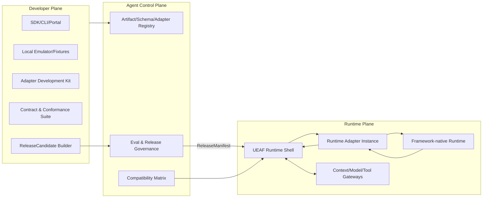
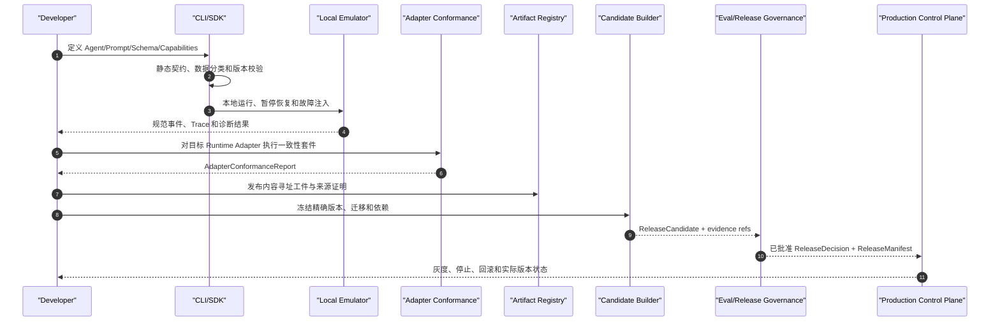

# 10｜开发者平台与框架适配

> 实施一致性说明：`RuntimeAdapter` 的公共最小 SPI 以 `docs/01-核心规范/04-端口与适配器规范.md` 为唯一规范来源。本文只说明 Developer Plane、Adapter 工程和可选扩展，不得定义第二套必需 SPI。

## 1. 模块定位

Developer Plane 为 Agent 团队和 Adapter 团队提供声明、构建、校验、仿真、评测、打包和候选发布能力。UEAF 不要求所有 Agent 使用同一种循环或图 DSL；LangGraph、Microsoft Agent Framework（MAF）、OpenAI Agents SDK、Google ADK、CrewAI 以及后续框架通过 `RuntimeAdapter` 接入稳定的企业运行契约。

框架适配的核心边界是：

- 框架负责其原生 Agent Loop、图/工作流、消息组织和本地执行机制。
- UEAF 负责身份、租户、准入、`TaskState`/`RunRecord`、预算、上下文来源、模型/工具 Gateway、授权、动作账本、审计、评测和发布。
- Adapter 只做能力协商、命令转换、事件规范化、状态投影和生命周期桥接；不得成为第二个企业真相源。
- Developer Plane 构建 `ReleaseCandidate` 和版本化工件，不签发生产 `ReleaseDecision`，也不能绕过治理直接制造可部署 `ReleaseManifest`。

## 2. Developer Plane 职责

### 2.1 职责

1. 提供 UEAF SDK、CLI、Portal、Schema 和代码生成器。
2. 管理 `AgentDefinition`、`PromptContract`、工具/能力声明、输入输出 Schema、评测资产和 Adapter 工件。
3. 提供本地仿真、受限沙箱、模型/工具/RAG 夹具和确定性故障注入。
4. 校验跨模块契约、版本范围、能力需求、数据分类和迁移声明。
5. 构建内容寻址、可重现、带供应链证明的 `ReleaseCandidate`。
6. 为 Runtime Adapter 提供 SPI、框架适配套件和一致性测试。
7. 将候选提交给评测与发布治理，并展示证据、门禁和实际发布状态。
8. 提供迁移、弃用、兼容矩阵和升级影响分析。

### 2.2 非职责

- 不持有生产用户凭据、审批凭证或高权限工具令牌。
- 不把本地成功、单元测试成功或 CI 成功等同于发布批准。
- 不直接修改生产路由、长期任务状态或 `ReleaseManifest`。
- 不要求框架暴露全部内部节点，也不把多个框架压成最低公分母 DSL。
- 不把框架的 Session、Thread、Run、Checkpoint 或 Memory 名称直接提升为 UEAF 规范对象。

## 3. 平面边界



Adapter 源码、测试和打包属于 Developer Plane；Adapter 工件与兼容元数据属于 Agent Control Plane；承载实际运行的 Adapter 实例属于 Runtime Plane。三者可以共享代码版本，但必须使用不同身份、权限和数据访问路径。

## 4. 开发者平台组件

| 组件 | 主要能力 | 输出 |
|---|---|---|
| Developer Portal | 项目、版本、依赖、证据、门禁和发布状态视图 | 只读生产状态、受控变更请求 |
| UEAF CLI | 初始化、校验、仿真、打包、提交和状态查询 | 机器可读结果和 CI 退出码 |
| SDK / Codegen | 规范对象、端口、错误、事件和 Schema 类型 | 指定 contract range 的客户端 |
| Definition Registry Client | 管理 Agent、Prompt、Tool、Schema 和评测引用 | 内容摘要和版本引用 |
| Local Emulator | 模拟准入、状态机、Gateway、队列、租约和暂停恢复 | 可复现本地运行证据 |
| Fixture Service | 模拟模型、RAG、Memory、Tool、MCP 和审批 | 带版本的输入/输出夹具 |
| Fault Injector | 注入超时、重复、乱序、限流、unknown 和过期租约 | 可靠性测试事实 |
| Adapter Development Kit | 核心 `RuntimeAdapter` SPI、事件桥和参考适配器 | Adapter 工件 |
| Contract Validator | 校验 Schema、必填来源、错误和版本范围 | 验证报告 |
| Conformance Suite | 验证状态、工具拦截、恢复、事件和隔离语义 | `AdapterConformanceReport` |
| Candidate Builder | 冻结组件摘要、依赖、迁移和 SBOM/来源证明 | `ReleaseCandidate` |
| Eval Client | 提交评测包并查询 `EvalRun/EvalResult` | 评测引用，不自行判定门禁 |
| Compatibility Analyzer | 分析 UEAF、Adapter、状态、Schema 和供应商版本 | 兼容/迁移要求 |
| Migration Toolkit | 生成、演练和验证状态/数据/Adapter 迁移 | migration refs 和回退限制 |

Registry 中的版本都是不可变对象；标签和别名只是可变指针，不能进入生产 `ReleaseManifest`。候选构建必须解析别名为内容摘要和精确版本。

## 5. 开发到生产流程



本地 Emulator 只证明规范行为可复现，不证明生产身份、容量、安全或数据驻留已经满足。生产工件必须由 CI/签名身份构建，且评测使用与候选摘要一致的内容。

## 6. `RuntimeAdapter` SPI

### 6.1 唯一规范最小 SPI

公共最小 SPI 直接复用核心规范 04：

```text
DescribeRuntime() -> RuntimeCapabilities
StartRun(RuntimeStartRequest) -> RuntimeSession
AdvanceRun(RuntimeAdvanceRequest) -> RuntimeEventStream
SuspendRun(RuntimeSuspendRequest) -> RuntimeCheckpointRef
ResumeRun(RuntimeResumeRequest) -> RuntimeSession
CancelRun(RuntimeCancelRequest) -> RuntimeCancellationObservation
InspectRun(RuntimeInspectRequest) -> RuntimeObservation
```

`RuntimeCapabilities` 至少声明：流式、暂停/恢复、持久化检查点、人工中断、并行分支、确定性重放、原生工具调用、结构化输出、Handoff、取消确认、最大上下文/步骤和支持的 UEAF 契约版本。

未支持的必需能力必须在准入前显式拒绝，不能运行中静默降级。

### 6.2 可选 Developer/Adapter convenience method

Adapter 实现 MAY 为工程便利额外提供：

```text
ValidateRelease(...)
StreamEvents(...)
Snapshot(...)
InspectProviderState(...)
Close(...)
```

但这些方法：

- 不是第二套公共 SPI；
- 不替代 `AdvanceRun/SuspendRun/InspectRun`；
- 不改变核心 request/result Schema；
- 不成为 UEAF Conformance 的替代验收标准；
- 若暴露跨进程接口，必须映射回核心 Port 契约。

### 6.3 `RuntimeStartRequest`

`RuntimeStartCommand` 是模块 02 的应用层命令，不是 Adapter SPI 参数。02 只有在校验 admitted 结果、当前 revision、租约、预算、Release 和 Adapter 能力后，才能把它映射为 `RuntimeStartRequest`。

`RuntimeStartRequest` 至少包含 `tenant_id`、`task_id`、`run_id`、`principal_context_ref`、`release_id`、解析后的 Agent/Prompt/Schema/Adapter 版本、可选初始 `ContextManifest`、预算、允许的能力引用和关联标识，并内含受限 `RuntimeExecutionContext`。

该上下文只提供超时/取消句柄，以及核心规范定义的 `ContextBuildPort`、`ModelStepPort`、`ToolIntentPort`、`HandoffPort` 与 `TelemetryPort` 能力句柄。Adapter 只能读取请求授予的引用，不能自行检索租户默认配置或“最新” Prompt，也不得持有模型长期凭据或绕过模块 03 调用模型。

### 6.4 事件规范化

框架原生事件通过 Adapter 映射为版本化 `RuntimeEvent`；只有权威 State Writer 提交的跨模块事实才封装为核心 `EventEnvelope`。

`EventEnvelope` 必须完整保留核心规范 03 的字段和 `ueaf.<domain>.<past_tense_fact>` 命名，不允许 Adapter 或 Developer Plane 定义删减 Envelope。

Adapter 不得伪造已经通过授权、动作成功、审计完成或发布批准。

### 6.5 状态与工具边界

- 框架原生状态可保存为投影或 opaque `provider_state_ref`；`TaskState` 与 `RunRecord` 仍由 UEAF 状态服务拥有。
- Conversation 内容、Provider Thread、框架 Session 和业务事实分别存储并显式映射。
- 框架产生的 tool/function call 只是 `ToolIntent`；UEAF Tool Gateway 执行验证、`PolicyDecision`、审批、`ActionRecord`、凭据和收据。
- Adapter 不得直接调用企业写工具。若框架无法拦截工具调用，则该 Adapter 不能声明支持 Enterprise Profile 的写能力。
- 原生 handoff 只是交接候选；UEAF 必须验证目标 Agent、版本、预算、身份委托和允许能力后再执行。
- 远程 Agent 只有在被登记为有界、工具式请求/响应能力时才能经 `ToolIntentPort` 暴露；一旦涉及目标 Agent 接管、委派、子任务生命周期或独立预算，必须经模块 06 的 `HandoffPort`。

## 7. 框架接入边界

下表中的“原生概念”只用于说明适配位置，不构成 UEAF 的跨模块契约。

| 框架 | 可直接复用的框架层 | Adapter 映射职责 | UEAF 必须保留的企业层 | 禁止形成的双重权威 |
|---|---|---|---|---|
| LangGraph | Graph、node、条件边、并行分支、interrupt、框架内 state/checkpointer | Graph 事件规范化；state/checkpoint 转为投影；interrupt 转为规范等待；Tool node 转为 `ToolIntent` | `TaskState`、`RunRecord`、`RunAdmissionResult`、身份/策略、`ActionRecord`、审计、评测与发布 | 原生 state 成为 Task/Run 真相源；checkpointer 直接证明业务副作用成功 |
| Microsoft Agent Framework（MAF） | Agent、Workflow、message、context、handoff、框架编排器 | Agent/Workflow 作为运行实现；消息、暂停和交接规范化；tool 调用转为 `ToolIntent` | 租户与主体、状态机、预算、上下文来源、Tool Gateway、动作账本和发布治理 | 框架 context 取代 `PrincipalContext`/`ContextManifest`；Workflow 状态覆盖 `RunRecord` |
| OpenAI Agents SDK | Agent、Runner、session、tool/function call、handoff、tracing hook、provider state | Runner 事件规范化；供应商状态保存为 opaque ref；函数调用和 hosted 能力进入受控 Gateway | 模型路由与预算、数据边界、`TaskState`、`RunRecord`、`ActionRecord`、审计、证据与发布 | Response/Thread/Run ID 直接作为 UEAF Task/Run；供应商工具绕过 Tool Gateway |
| Google ADK | Agent、Runner、Session、Artifact、Tool、event、Agent transfer | Runner/event 规范化；Session/Artifact 转为投影或受治理引用；Tool/transfer 进入 UEAF 控制点 | 身份、用途/分类、长期状态与记忆、动作控制、评测和发布 | ADK Session 同时成为 Conversation、Memory、Task 和 Run 的权威 |
| CrewAI | Agent、Crew、Task、Process、Flow、delegation、框架内 memory hook | Crew/Flow 映射为运行实现；Task 映射为节点投影而非 UEAF Task；delegation/tool 转为规范意图 | `TaskState`、`RunRecord`、WorkflowRun 所有权、企业记忆、策略审批、`ActionRecord`、审计与发布 | CrewAI Task 覆盖 UEAF Task；框架 memory 直接进入长期记忆；委派绕过身份与预算校验 |

每个框架 Adapter 均必须明确：支持的 UEAF Profile、contract ranges、事件覆盖率、顺序/重复语义、Checkpoint 可移植性、Provider State 删除能力、工具拦截能力、取消保证和已知语义缺口。框架升级只有通过兼容分析与一致性套件后才能进入候选。

## 8. Adapter 与 Provider Adapter 的区别

| 类型 | 作用 | 示例输出 | 不得承担 |
|---|---|---|---|
| Runtime Adapter | 桥接 Agent Loop 生命周期、状态投影和原生事件 | RuntimeEvent、Checkpoint projection | 企业授权、发布和持久 Task/Run 所有权 |
| Model Provider Adapter | 桥接模型请求、流式响应、用量和供应商错误 | `ModelRunResult`、usage、provider ref | 自行改 Prompt、预算或工具权限 |
| Tool/Enterprise Adapter | 桥接工具协议、业务 API、MCP，或仅以有界工具能力暴露的远程 Agent | `ActionReceipt`、外部引用 | 把真正 handoff/delegation 冒充工具；绕过模块 06 `HandoffPort`、子任务准入、权限或预算校验 |
| Data Provider Adapter | 桥接 RAG、Memory、Artifact 和数据服务 | 来源引用、版本、删除状态 | 绕过租户/用途/分类过滤 |

这些 Adapter 可以部署在同一进程以降低 MVP 成本，但接口、身份、错误语义和证据必须保持分离，后续可无语义变化地拆分。

## 9. 隔离与供应链安全

- Adapter 构建使用锁定依赖、SBOM、来源证明、签名和可重现构建；注册表拒绝覆盖相同版本。
- 生产 Adapter 实例使用独立工作负载身份、只读工件、受限网络出口和资源上限；默认不能访问控制面写 API 或其他租户存储。
- 本地 Emulator 使用测试身份和合成/授权数据，不能复用生产令牌或导出未脱敏生产载荷。
- 插件、回调和框架中间件均视为不可信扩展；安装权限不等于工具执行权限。
- Adapter 日志、异常和调试快照先分类与最小化，再进入 Log/Trace；Audit 和 Eval 通过独立端口产生。
- Provider State、上传文件、工件和框架缓存必须实现租户归属、驻留、保留、删除传播和孤儿清理。

## 10. 兼容、可靠性与迁移

### 10.1 兼容维度

兼容矩阵至少覆盖：UEAF contract range、Runtime Adapter 版本、框架版本、状态/Checkpoint Schema、事件语义、工具拦截、结构化输出、取消、Provider State、模型/工具 Provider 以及目标 Profile。字段可解析不等于语义兼容。

变更分级：

- 增加可忽略字段或可选能力，可在兼容范围内演进；
- 修改状态含义、事件顺序、工具拦截、默认重试、Checkpoint 或身份传播，必须提高语义版本并重新评测；
- 无法读取旧状态或安全恢复的变更必须提供双读/双写、离线迁移、排空或长运行共存方案；
- Adapter 退役前必须证明没有活动 `ReleaseManifest`、长运行或 Provider State 依赖该版本。

### 10.2 故障处理

| 故障 | Runtime Shell 响应 | Adapter 责任 |
|---|---|---|
| Adapter 启动失败 | Run 不进入 Adapter 执行；按状态机/策略重试或安全终止 | 返回规范错误和版本信息 |
| 事件断流/乱序 | 保持可恢复状态，按序号去重和检测缺口 | 声明顺序保证并提供原始引用 |
| Adapter 进程崩溃 | 释放/到期租约，从持久状态恢复 | 不依赖仅内存的权威状态 |
| 原生 Checkpoint 不兼容 | 暂停迁移或使用原 Adapter 继续运行 | 提供 migration ref 或显式不可移植 |
| 取消不确定 | 记录取消意图并继续对账在途动作 | 不声称已撤销外部副作用 |
| Provider State 不可用 | 按清单恢复/降级；无法证明时终结为 incomplete/failed | 返回可区分的缺失、过期和权限错误 |
| 能力不支持 | 准入 `rejected`，给出缺失 capability | 禁止静默模拟不等价语义 |

## 11. Adapter 一致性套件

每个 Adapter 版本至少验证：

1. 可信租户、主体、`run_id` 和 `release_id` 不会被框架对象覆盖。
2. 规范 `RunPhase/CompletionDisposition/WaitReason` 可从原生事件无歧义地产生。
3. 重复、乱序和丢失事件可检测，核心 `EventEnvelope` 的关联与因果链完整。
4. 所有工具调用先形成 `ToolIntent` 并经过 UEAF Tool Gateway；不存在直接写旁路。
5. 暂停、恢复、重试、过期租约和进程崩溃不会重复副作用。
6. Checkpoint、Provider State 和 UEAF 权威状态的所有权清晰，删除可传播。
7. 取消和超时不会把 unknown 动作误报为失败或成功。
8. Trace、Log、Metric、Audit、Eval 从不同端口产生，Adapter 不用一种信号冒充另一种。
9. 结构化输出失败、模型限流、工具拒绝和框架异常映射为核心 `PortError/ProblemDetail` 语义。
10. 不支持的 Profile 能力在构建或准入阶段显式失败。

## 12. 验收条件

1. 同一 `AgentDefinition` 能通过至少两个 Runtime Adapter 完成等价的只读案例，跨模块对象和审计语义不变。
2. LangGraph 与 Reference Adapter #2 至少有实际 Conformance 证明；其他框架必须有明确能力声明/映射设计后才进入实现 Backlog。
3. 框架原生 Session/Thread/Run/State 不会成为 `TaskState`、`RunRecord`、Conversation、Memory 或业务事实的并行权威。
4. 任一框架产生的企业写动作都能被 Tool Gateway 拦截并回溯到 `PolicyDecision`、审批、`ActionRecord` 和 `ActionReceipt`。
5. Developer Plane 无权签发 `ReleaseDecision`、生产 `ReleaseManifest` 或修改生产路由。
6. 候选只引用精确版本和内容摘要；别名、“latest”和本地未发布文件不能进入生产清单。
7. Adapter 升级通过完整一致性、恢复、隔离和迁移验证，长运行可按旧版本继续或被显式迁移。
8. Adapter 崩溃、事件乱序、取消不确定和 Provider State 丢失均按故障矩阵处理，没有静默语义降级。
9. 两个测试租户不能通过 Adapter 缓存、Provider State、调试快照、文件、工件或遥测互相访问。
10. 替换 Runtime Adapter 后，UEAF 的身份、租户、状态、动作、审计、评测和发布契约保持不变。
