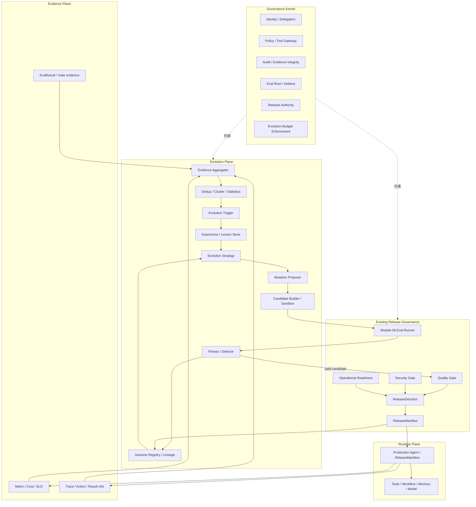

# UEAF 演化闭环与成本控制参考架构

本文给出模块 11“经验记忆与受控递归进化”的参考实现拓扑。它是参考性文档；规范语义以核心规范和功能模块为准。

## 1. 目标

参考架构需要同时满足：

- 从真实生产中学习，但不让每个任务都追加 LLM 反思；
- 历史 Experience 可以增长，但 Active Working Set 保持有界；
- 候选能够修改 Prompt、Tool、Workflow、Memory Policy、Model Route 等 Agent Genome；
- 当前生产 Release 不可被原地修改；
- 评测、Judge、Security、Release 与被优化对象隔离；
- 能力提升必须考虑 Token、费用、延迟和复杂度；
- EvolutionRun 有明确预算和终止状态。

## 2. 平面拓扑



## 3. 两条路径：便宜路径与昂贵路径

### 3.1 默认便宜路径

```text
Production Event
  -> structured field extraction
  -> counters / histograms
  -> exact dedup
  -> semantic dedup / embedding cluster
  -> significance / threshold
  -> no trigger
  -> STOP
```

这一条路径不需要强模型。

### 3.2 有价值异常路径

```text
validated anomaly
  -> retrieve small relevant Experience/Lesson set
  -> cheap classifier / deterministic diagnosis if possible
  -> strong reasoning only when necessary
  -> 1..N sparse MutationProposal
  -> sandbox build
  -> deterministic/statistical eval first
  -> model Judge only for unresolved semantic dimensions
  -> selection
```

## 4. 参考数据分层

| 层级 | 典型内容 | 存储 | 是否默认进入 LLM Context |
|---|---|---|---|
| Raw Evidence | Trace/Metric/Log/Eval/Action refs | Evidence/Data Plane | 否 |
| Pattern | 聚类、计数、窗口、异常 | 分析投影 | 否 |
| EvolutionExperience | 已验证可复用经验 | Experience Store | 条件 |
| EvolutionLesson | 归纳规则、失败原因、适用范围 | Lesson Store | 条件 |
| Skill/Tool/Policy | 已编译能力 | Registry | 不以文本记忆形式 |
| AgentGenome | 当前/候选能力组合 | Genome Registry | 只加载必要引用 |
| LineageGraph | 父子版本、失败实验、发布关系 | Lineage Store | 否 |

总存储可以增长，但上下文增长必须受 Active Working Set 限制。

## 5. Token 预算漏斗

示例：

```text
1,000,000 raw observations
  -> 80,000 deduplicated events
  -> 4,000 clusters
  -> 120 significant patterns
  -> 20 evolution cases
  -> 5 strong-model analyses
  -> 3 candidates
```

具体比例取决于业务，不构成规范阈值。架构目标是让昂贵模型调用与“有价值的新问题”规模相关，而不是与全部生产请求规模线性相关。

## 6. Candidate 评测漏斗

```text
Candidate
  -> schema / contract check
  -> unit / deterministic tests
  -> statistical evaluation
  -> regression suite
  -> security hard checks
  -> cheap model judge if needed
  -> strong model judge if needed
  -> human review if high-impact/inconclusive
  -> Quality/Security/Operational Gates
```

任一确定性 hard failure 发生后，默认不继续消耗更昂贵的 Judge Token，除非为了故障诊断而显式授权。

## 7. Sparse Mutation 示例

当前失败集中在 RAG 召回：

```text
mutable:
  context_policy_ref
  retrieval/rerank parameters

frozen:
  identity
  tool permissions
  workflow topology
  model route
  release authority
```

候选数量可限制为 3，而不是生成 100 个全 Genome 随机变体。

当局部搜索平台期明显、自动评价廉价且搜索空间适合 Population Search 时，才考虑 GA/EA 扩展人口规模。

## 8. EvolutionRun 参考配置

```yaml
evolution_run:
  trigger_ref: evt-trigger-123
  baseline_genome_ref: genome-42
  strategy_ref: llm-guided-sparse-v3
  mutable_gene_scope:
    - context_policy
  stop_policy:
    improvement_plateau_generations: 2
    minimum_improvement: 0.005
    max_generations: 3
    stop_on_safety_failure: true
    novelty_threshold: 0.97
  budget:
    max_model_calls: 80
    max_strong_model_calls: 8
    max_input_tokens: 1200000
    max_output_tokens: 250000
    max_candidates: 5
    max_amount_usd: 15
```

## 9. Experience Consolidation Job

Consolidation SHOULD 是批处理或阈值触发流程，而不是每任务同步路径：

```text
new evidence refs
  -> dedup
  -> merge same-pattern records
  -> confidence update
  -> contradiction detection
  -> lesson promotion
  -> skill/policy/tool compilation candidate
  -> active-set eviction
  -> archive / retention
```

如果一个 Lesson 已被 Tool/Policy/Workflow 完整吸收，且长期没有独特反例，则 Active 记录只保留对该能力和证据的引用即可。

## 10. 失败实验复用

Lineage Store 应保存：

- Mutation 摘要；
- 环境/模型/工具版本；
- 失败或退化的原因；
- 相关 Fitness；
- 失效条件。

再次遇到相似 Proposal 时：

```text
same idea observed
  -> environment unchanged
  -> reject as duplicate

same idea observed
  -> model/tool/environment materially changed
  -> permit controlled re-test
```

这样“失败经验”同样能降低未来 Token 和实验成本。

## 11. 递归深度参考

推荐初期只实现：

```text
L0 Business Agent
  <- L1 Evolution System
```

后续才允许：

```text
L1 Strategy parameters
  <- L2 Meta-Evolution
```

即使启用 L2，Governance Kernel 仍保持外部固定参照，不允许同一递归链改动 Eval root、Release Authority、Budget Enforcement、Identity、Permission、Audit 或 Secrets。

## 12. 生产反馈闭环

新版本 Canary 后，生产事实只形成新 Evidence：

```text
Candidate
  -> Canary
  -> Metrics / Eval / Incidents
  -> Evidence
  -> Trigger Engine
```

线上短期指标不能直接把 Candidate 标记为“进化成功”。模块 08/09 的门禁、回滚和证据有效期继续生效。

## 13. 推荐落地顺序

1. 先实现结构化 Experience 引用、Lineage 和 EvolutionBudget，不使用自动 Mutation。
2. 增加 Trigger Engine 和统计/规则聚类，证明稳定时期额外 Token 接近零。
3. 接入一个 `llm_guided_sparse_mutation` 策略，只允许 Prompt/Context Policy 低风险 Gene。
4. 候选复用模块 10 Sandbox 和模块 08 Eval/Release 流程。
5. 增加 Tool/Workflow Candidate。
6. 当自动评价足够可靠且候选成本可控后再引入 Population/Genetic Search。
7. 最后才评估 Meta-Evolution；不得把治理内核纳入同一递归链。
