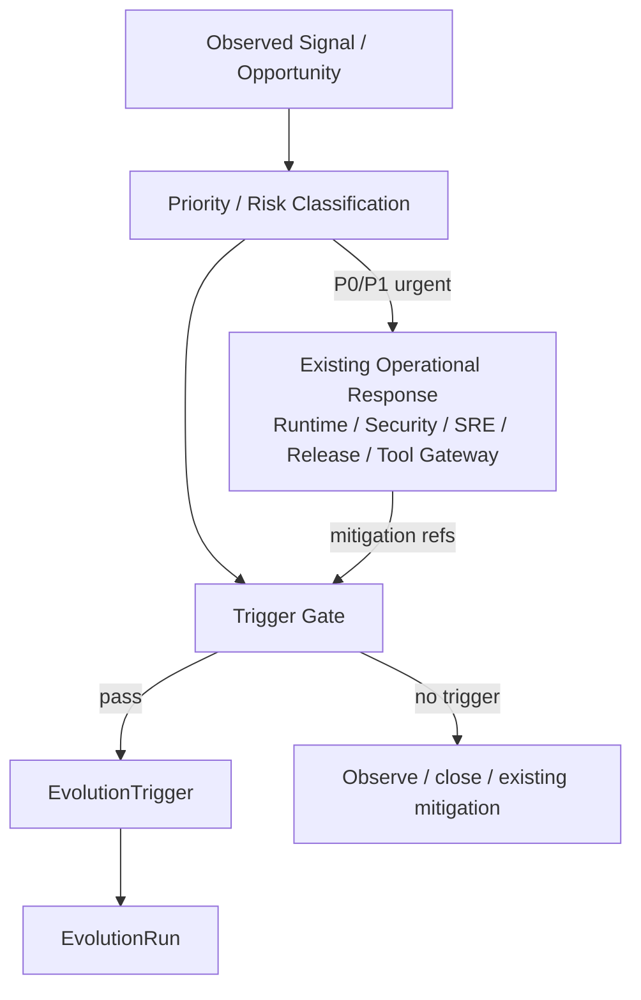
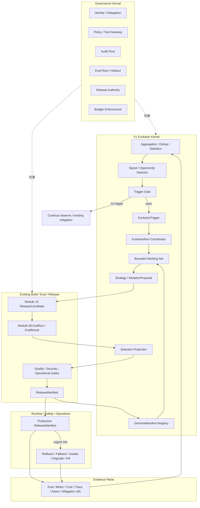

# UEAF 演化闭环与成本控制参考架构

Architecture Generation: `V1`  
Maturity: `Required Reference`  
Implementation: `Current`

本文给出模块 11 V1 Controlled Evolution Kernel 的参考实现。规范语义以核心规范为准。

## 1. V1 目标

- 从生产证据中学习，但不让每个任务追加 LLM 反思；
- 严重问题先由现有安全/运行/发布体系止血，不等待 Evolution；
- 只有通过 Trigger Gate 的问题或机会才创建 `EvolutionTrigger`；
- 只维护一个通用 `GenomeManifest` 生命周期；
- 候选继续复用模块 10 `ReleaseCandidate`；
- 评测和发布继续复用模块 08/07/09；
- 历史可增长，但 Active Working Set 有界；
- EvolutionRun 有预算、停止条件和明确终态；
- 不建设 V2 Species/GenePool/Ecosystem Fitness 服务。

## 2. 两条反馈路径



原则：

```text
Operational Response = 解决现在怎么办
Evolution Response   = 解决以后是否要改变自己
```

## 3. V1 逻辑拓扑



## 4. P0-P3 参考处理

| Priority | 参考场景 | Operational Response | Evolution |
|---|---|---|---|
| P0 | 泄漏、越权、危险副作用 | 立即隔离/回滚/kill | 高优先 Trigger，允许绕过普通 cooldown |
| P1 | 大面积质量崩溃、系统性依赖故障 | fallback/降级/限流/回滚 | 高优先 Trigger |
| P2 | 可复现质量、成本、延迟退化 | 继续运行或局部降级 | 证据聚合后 Trigger |
| P3 | 新模型/Tool/Provider/成本机会 | 无紧急动作 | 计划性 Opportunity Trigger |

P0/P1 只允许绕过普通样本量/cooldown；不得绕过 Authority、Eval、Budget、Release 或 Governance Kernel。

## 5. Trigger Gate Funnel

V1 推荐：

```text
signal / opportunity
  -> evidence_sufficient?
  -> still_relevant?
  -> mutable_surface_match?
  -> existing_mitigation_insufficient?
  -> novelty_sufficient?
  -> expected_value_positive?
  -> cooldown_satisfied?
  -> EvolutionTrigger
```

### 5.1 便宜路径

```text
Production observation
  -> counters / histograms
  -> exact dedup
  -> statistical threshold
  -> existing incident / mitigation lookup
  -> mutable-scope lookup
  -> previous mutation lookup
  -> no trigger
  -> STOP
```

默认不需要强模型。

### 5.2 升级路径

只有以下信息无法确定时才逐级使用模型：

- root cause / mutable-surface classification；
- 多来源证据冲突；
- expected value 难以确定；
- 新机会是否与现有能力真正兼容。

推荐：

```text
rule/statistics
  -> cheap classifier
  -> strong reasoning only if necessary
```

## 6. Reactive 与 Opportunistic

### 6.1 Reactive

```text
failure cluster
quality / latency / cost drift
security / regression pattern
```

目标是减少未来重复发生的问题。

### 6.2 Opportunistic

```text
new model
new tool / adapter
new provider capability
cheaper route
new business capability
scheduled optimization review
```

系统没有故障也可以 Evolution；例如在质量不降的情况下切换更低成本模型。

## 7. 数据分层

| 层级 | V1 语义 | 是否默认进入 LLM Context |
|---|---|---|
| Raw Evidence | 原始域事实引用 | 否 |
| Operational Mitigation refs | 原始安全/运行/发布事实引用 | 否 |
| Pattern / Lesson | 内部分析记录 | 条件 |
| `EvolutionTrigger` | Canonical | 是 |
| `EvolutionRun` | Canonical | 最小状态摘要 |
| `GenomeManifest` | Canonical | 只加载必要 refs |
| `MutationProposal` | Canonical | 是 |
| `ReleaseCandidate` | 模块 10 既有对象 | 评测阶段 |
| Lineage / Fitness | Projection | 否，按需查询 |

## 8. Token 预算漏斗

示例：

```text
1,000,000 observations
  -> 80,000 deduplicated
  -> 4,000 clusters
  -> 120 meaningful signals/opportunities
  -> 20 Trigger Gate candidates
  -> 6 EvolutionTriggers
  -> 3 strong-model analyses
  -> 1..3 ReleaseCandidates
```

比例仅作示例。核心目标是昂贵模型调用与“通过 Gate 的新问题/新机会”相关，而不是与生产请求量线性相关。

## 9. Single-Candidate First

V1 首个实现 SHOULD 优先支持：

```text
1 Trigger
  -> 1 EvolutionRun
  -> 1 MutationProposal
  -> 1 GenomeManifest candidate
  -> 1 ReleaseCandidate
  -> accept / reject
```

证明闭环后，再允许 2~5 个有限 Candidate。Population/Tournament 不属于 V1 首个实现要求。

## 10. Candidate Eval Funnel

```text
ReleaseCandidate
  -> schema / contract check
  -> deterministic tests
  -> statistical evaluation
  -> regression / security hard checks
  -> cheap model judge if needed
  -> strong model judge if needed
  -> human review if needed
  -> existing release gates
```

确定性 hard failure 后，默认停止后续昂贵 Judge。

## 11. Sparse Mutation

例如 RAG 召回退化：

```text
mutable:
  context_policy / retrieval parameters

frozen:
  identity
  permissions
  unrelated workflow
  unrelated tools
  release authority
```

Trigger Gate 必须先确认问题至少部分位于可变范围。第三方暂时宕机、用户数据错误等问题不能因为“发生失败”就默认修改 Prompt/Workflow。

## 12. `EvolutionRun` 参考配置

```yaml
evolution_run:
  trigger_ref: trigger-123
  baseline_genome_ref: genome-42
  strategy_ref: llm-guided-sparse-v1
  mutable_scope:
    - context_policy
  budget_ref: budget-slice-evo-123
  stop_policy:
    plateau_candidates: 2
    max_candidates: 3
    stop_on_safety_failure: true
```

Trigger Policy 示例：

```yaml
trigger_policy:
  normal_cooldown_ms: 86400000
  min_new_observations: 500
  p0_bypass_cooldown: true
  p1_bypass_cooldown: true
  require_novelty_check: true
  require_expected_value_check: true
```

预算细节由既有 Budget Domain 管理，不在 Evolution Plane 建立第二套 Ledger。

## 13. `no_evolution_needed`

EvolutionTrigger 只是“值得分析”，不是“必须改变”。

EvolutionRun MAY 在分析后正常结束：

```text
no_evolution_needed
```

典型原因：

- Provider 暂态已经恢复；
- 根因属于用户/业务数据，不在 mutable surface；
- 已有 fallback/runbook 足够；
- 新机会的收益不足以覆盖迁移/回归成本；
- 没有安全且可验证的 Mutation 方向。

## 14. 经验压缩

经验压缩可以是内部批处理：

```text
new evidence refs
  -> dedup
  -> same-pattern merge
  -> contradiction detection
  -> compact lesson metadata
  -> active-set eviction
  -> archive / retention
```

当经验被 Tool/Policy/Workflow/Skill 工件稳定吸收时，Active Working Set 只保留引用和失效条件。

## 15. Lineage 与失败实验

V1 不建设 Lineage Store 作为第二真相源。

通过：

```text
GenomeManifest.parent_refs
MutationProposal
ReleaseCandidate
Eval refs
ReleaseManifest
Event history
```

生成 Lineage Projection。

失败实验可以在 Projection/内部记录中保存环境、原因和证据引用，用于 novelty 和重复提案检测。

## 16. 三个时间尺度

```text
毫秒~分钟：Operational Response
小时~天：Evolution Response
周~月：Optimization Review / Opportunistic Evolution
```

实际 SLA 由风险 Profile、任务价值和业务 SLO 决定。

## 17. V1 递归深度

V1 只要求：

```text
L0 Business Agent
  <- L1 Controlled Evolution Kernel
```

Meta Evolution 属于 V3 Research。

## 18. 生产反馈

Canary/Production 事实只能形成新 Evidence：

```text
ReleaseCandidate
  -> Canary
  -> Metric / Eval / Incident / Rollback
  -> Evidence
  -> Signal / Opportunity Detector
  -> Trigger Gate
```

线上短期指标不能直接宣告“进化成功”。

## 19. V1 落地顺序

1. `GenomeManifest` + `EvolutionAuthorityPolicy`；
2. Signal/Opportunity Detector + Trigger Gate；
3. `EvolutionTrigger` + `EvolutionRun`；
4. 结构化 Evidence 聚合与有界 Working Set；
5. 一种 `llm_guided_sparse_mutation` Strategy；
6. 复用模块 10 ReleaseCandidate 和模块 08 Eval；
7. 先实现 Single-Candidate Evolution；
8. Prompt/Context 等低风险 target 的 Candidate；
9. 再扩展 Workflow/Skill/Tool mutation。

V2 Species/GenePool/Ecosystem Fitness 与 V3 Meta Evolution 不属于本参考实现。
