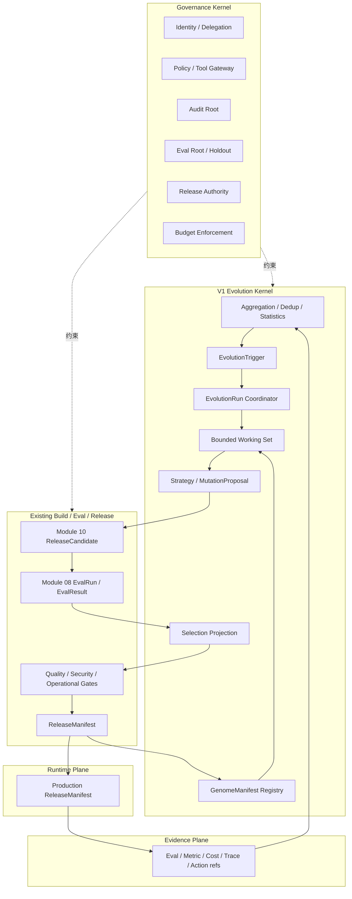

# UEAF 演化闭环与成本控制参考架构

Architecture Generation: `V1`  
Maturity: `Required Reference`  
Implementation: `Current`

本文给出模块 11 V1 Controlled Evolution Kernel 的参考实现。规范语义以核心规范为准。

## 1. V1 目标

- 从生产证据中学习，但不让每个任务追加 LLM 反思；
- 只维护一个通用 `GenomeManifest` 生命周期；
- 候选继续复用模块 10 `ReleaseCandidate`；
- 评测和发布继续复用模块 08/07/09；
- 历史可增长，但 Active Working Set 有界；
- EvolutionRun 有预算、停止条件和明确终态；
- 不建设 V2 Species/GenePool/Ecosystem Fitness 服务。

## 2. 逻辑拓扑



## 3. 便宜路径与昂贵路径

### 3.1 默认便宜路径

```text
Production evidence
  -> counters / histograms
  -> exact dedup
  -> semantic cluster if needed
  -> significance / threshold
  -> no trigger
  -> STOP
```

稳定时期不调用强模型。

### 3.2 有价值异常路径

```text
validated trigger
  -> bounded Working Set
  -> deterministic diagnosis when possible
  -> strong reasoning only if necessary
  -> 1..N sparse MutationProposal
  -> Module 10 sandbox build
  -> Eval funnel
  -> finalist
  -> existing release gates
```

## 4. 数据分层

| 层级 | V1 语义 | 是否默认进入 LLM Context |
|---|---|---|
| Raw Evidence | 原始域事实引用 | 否 |
| Pattern / Lesson | 内部分析记录 | 条件 |
| `EvolutionTrigger` | Canonical | 是 |
| `EvolutionRun` | Canonical | 最小状态摘要 |
| `GenomeManifest` | Canonical | 只加载必要 refs |
| `MutationProposal` | Canonical | 是 |
| `ReleaseCandidate` | 模块 10 既有对象 | 评测阶段 |
| Lineage / Fitness | Projection | 否，按需查询 |

## 5. Token 预算漏斗

示例：

```text
1,000,000 observations
  -> 80,000 deduplicated
  -> 4,000 clusters
  -> 120 significant patterns
  -> 20 trigger candidates
  -> 5 strong-model analyses
  -> 3 ReleaseCandidates
```

比例仅作示例。核心目标是昂贵模型调用与“有价值的新问题”相关，而不是与生产请求量线性相关。

## 6. Candidate Eval Funnel

```text
ReleaseCandidate
  -> schema / contract check
  -> deterministic tests
  -> statistical evaluation
  -> regression / security hard checks
  -> cheap model judge if needed
  -> strong model judge if needed
  -> human review if needed
  -> existing release gates
```

确定性 hard failure 后，默认停止后续昂贵 Judge。

## 7. Sparse Mutation

例如 RAG 召回退化：

```text
mutable:
  context_policy / retrieval parameters

frozen:
  identity
  permissions
  unrelated workflow
  unrelated tools
  release authority
```

V1 推荐候选数量保持很小，例如 2~5 个。Population/Genetic Search 只有在自动评测廉价、搜索空间明确时才作为可选策略；它不是 V1 必需能力。

## 8. `EvolutionRun` 参考配置

```yaml
evolution_run:
  trigger_ref: trigger-123
  baseline_genome_ref: genome-42
  strategy_ref: llm-guided-sparse-v1
  mutable_scope:
    - context_policy
  budget_ref: budget-slice-evo-123
  stop_policy:
    plateau_candidates: 2
    max_candidates: 5
    stop_on_safety_failure: true
```

预算细节由既有 Budget Domain 管理，不在 Evolution Plane 建立第二套 Ledger。

## 9. 经验压缩

经验压缩可以是内部批处理：

```text
new evidence refs
  -> dedup
  -> same-pattern merge
  -> contradiction detection
  -> compact lesson metadata
  -> active-set eviction
  -> archive / retention
```

当经验被 Tool/Policy/Workflow/Skill 工件稳定吸收时，Active Working Set 只保留引用和失效条件。

## 10. Lineage 与失败实验

V1 不建设 Lineage Store 作为第二真相源。

通过：

```text
GenomeManifest.parent_refs
MutationProposal
ReleaseCandidate
Eval refs
ReleaseManifest
Event history
```

生成 Lineage Projection。

失败实验可以在 Projection/内部记录中保存环境、原因和证据引用，用于重复提案检测。

## 11. V1 递归深度

V1 只要求：

```text
L0 Business Agent
  <- L1 Controlled Evolution Kernel
```

Meta Evolution 属于 V3 Research。

## 12. 生产反馈

Canary/Production 事实只能形成新 Evidence：

```text
ReleaseCandidate
  -> Canary
  -> Metric / Eval / Incident
  -> Evidence
  -> Trigger Engine
```

线上短期指标不能直接宣告“进化成功”。

## 13. V1 落地顺序

1. `GenomeManifest` + `EvolutionAuthorityPolicy`；
2. `EvolutionTrigger` + `EvolutionRun`；
3. 结构化 Evidence 聚合与有界 Working Set；
4. 一种 `llm_guided_sparse_mutation` Strategy；
5. 复用模块 10 ReleaseCandidate 和模块 08 Eval；
6. Prompt/Context 等低风险 target 的 Candidate；
7. 再扩展 Workflow/Skill/Tool mutation。

V2 Species/GenePool/Ecosystem Fitness 与 V3 Meta Evolution 不属于本参考实现。
