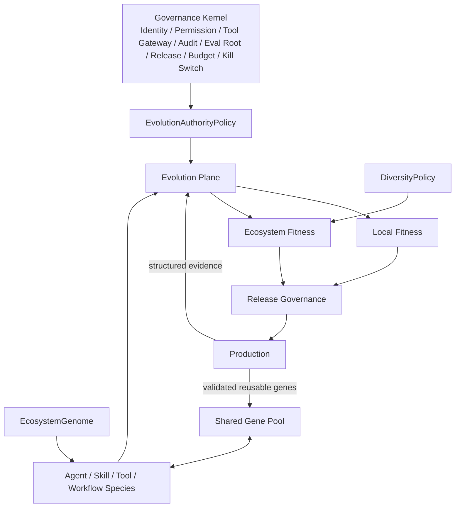

# UEAF 生态共同进化与基因池参考架构

## 1. 目标

本参考架构展示 Agent、Skill、Tool、Workflow、Routing 与 Evolution Strategy 如何在同一 Governance Kernel 下共同进化，并通过共享 Gene Pool 与 Capability Transfer 复用已验证能力。

## 2. 逻辑结构



## 3. 最小演化单元

定位原则：

```text
Failure / opportunity
  -> identify smallest responsible unit
  -> mutate Skill / Tool / Workflow / Routing first
  -> only mutate whole Agent when evidence supports system-level cause
```

这样可以减少候选数量、评测范围和 Token 消耗。

## 4. 共享 Gene Pool

Gene Pool 不是任意代码仓库，而是受治理的可复用能力注册表：

```text
CodingAgent creates DependencyAnalysisSkill v12
  -> passes Eval / Security / Fitness
  -> Gene Pool
  -> SecurityAgent compatibility eval
  -> ArchitectureAgent compatibility eval
```

每次横向转移都必须重新评测目标场景，不能继承源场景分数。

## 5. 演化权限

默认：

```text
Observe    ON
Propose    ON
Experiment ON
Promote    risk-based
```

Promote 推荐：

```text
Prompt / Model Routing / Context / Memory Policy -> automatic after gates
Workflow / Skill / Agent Topology              -> canary
Tool / Ecosystem Topology / Evolution Strategy -> gated
Meta Evolution                                 -> gated
Governance Kernel                              -> never
```

企业可收紧 mutable target，但不能通过普通配置解除 Governance Kernel 硬边界。

## 6. 双层 Fitness

Candidate 先看自身是否提升，再看是否把代价转嫁给生态：

```text
Candidate
  -> Local Fitness
  -> Ecosystem Fitness
  -> Diversity / concentration checks
  -> Release Gates
```

例如 ResearchAgent 成功率 +5%，但总 Token +200%、FactCheckAgent 负载 +300%、共享单点依赖显著增加，应判为 mixed 或 reject，而不是“进化成功”。

## 7. Diversity

生态不强制只保留一个 Winner。可维护：

- 主生产 Elite；
- 不同任务切片的 Specialist；
- 供应商或实现不同的 Alternative Species；
- 灾备/回滚 Variant；
- 实验 Population。

这样避免所有 Agent 继承同一个隐藏缺陷。

## 8. 推荐演化闭环

```text
Production Evidence
  -> Trigger
  -> choose subject Species / Gene
  -> EvolutionAuthorityPolicy check
  -> sparse mutation / transfer proposal
  -> sandbox experiment
  -> deterministic/statistical eval first
  -> Local Fitness
  -> Ecosystem Fitness
  -> DiversityPolicy
  -> Quality/Security/Operational gates
  -> Promote mode: auto/canary/gated
  -> ReleaseManifest
  -> production feedback
```

## 9. 成本原则

- 不为每个任务启动生态分析；
- Gene/Species 搜索基于聚合 Pattern；
- Capability Transfer 优先复用已验证工件而非重新生成；
- 小范围 Mutation 优先于整 Agent 重建；
- 生态 Fitness 应把共享 Agent/Tool 调用成本计回触发方，防止局部优化转嫁成本；
- Stable ecosystem 在无 Trigger 时额外强模型调用应接近零。
