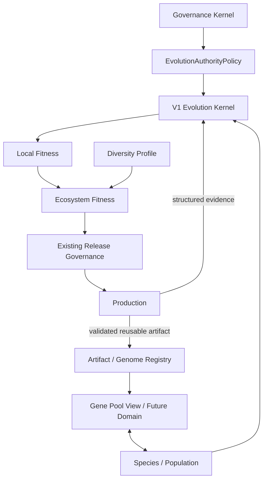

# UEAF 生态共同进化与基因池参考架构

Architecture Generation: `V2`  
Maturity: `Planned Reference`  
Implementation: `Future`

> 本文用于保留 V2 未来架构，不属于 V1 当前实现要求。V1 不应据此预建 Species Service、GenePool DB、Population Scheduler 或 Ecosystem Fitness Service。

## 1. 目标

V2 在 V1 `GenomeManifest + EvolutionRun + MutationProposal` 基础上，增加跨 Agent/Skill/Tool/Workflow 的能力复用、Species、生态 Fitness 与多样性控制。

## 2. 逻辑结构



Gene Pool 在 V2 初期优先实现为 Registry Projection/View，而不是新的权威数据库。

## 3. 最小演化单元

```text
failure / opportunity
  -> locate smallest responsible unit
  -> mutate existing GenomeManifest subject
  -> only expand to larger Agent/Ecosystem scope when evidence requires
```

V2 继续沿用 V1 通用 `GenomeManifest`，避免为 Agent、Skill、Tool、Workflow 默认创建多套基础生命周期。

## 4. Species

V1 中的 species tag / Registry metadata 在规模足够时可以升级为 SpeciesDefinition。

V2 允许：

- 同一 purpose 下多个替代实现；
- 多个 Specialist；
- 多个 Elite Variant；
- 不同成本/延迟/可靠性切片的候选并存。

不要求收敛到一个“最强 Agent”。

## 5. Gene Pool

推荐演进路径：

```text
V1 Artifact / Registry
  -> reusable metadata
  -> Gene Pool Projection
  -> only if necessary: independent Gene Pool Domain
```

共享能力进入目标 Agent 前必须重新做兼容性与目标侧 Eval。

## 6. Capability Transfer

V2 默认使用：

```text
MutationProposal(mutation_type=transfer)
```

只有 Transfer 证明具有独立长生命周期时才引入专门对象。

流程：

```text
validated source artifact
  -> transfer mutation
  -> target compatibility
  -> target local eval
  -> ecosystem externality eval
  -> release gates
```

## 7. 双层 Fitness

```text
Candidate
  -> Local Fitness
  -> shortlist
  -> Ecosystem Fitness
  -> Diversity / concentration checks
  -> Release Gates
```

Local Fitness 评价自身任务；Ecosystem Fitness 评价总 Token、全链路延迟、共享资源竞争、故障相关性、依赖集中度和运营复杂度等外部性。

## 8. Funnel Evaluation

避免组合爆炸：

```text
all candidates
  -> cheap deterministic local eval
  -> regression
  -> small shortlist
  -> ecosystem eval
  -> finalists
  -> full release gates
```

只有少量 Finalist 执行昂贵的全生态评测。

## 9. Diversity

V2 可使用 Policy/Eval Profile 约束：

- min alternative species；
- model/provider diversity；
- max shared gene ratio；
- dependency concentration；
- preserved elite variants。

只有独立生命周期被证明后才升级为独立 `DiversityPolicy` 对象。

## 10. 演化权限

继续复用 V1 `EvolutionAuthorityPolicy`：

```text
Observe     ON
Propose     ON
Experiment  ON
Promote     risk-based
```

V2 可以增加 ecosystem topology、species membership、capability transfer 等 target，但 Governance Kernel 永远 `never`。

## 11. V2 启动条件

建议在以下事实出现后再实施：

- 多个 Agent 重复创建相同 Skill/Tool；
- Registry metadata 已不足以管理复用；
- Local 优化明显产生跨 Agent 成本转移；
- 需要多个 Specialist/Elite 同时在线；
- 生态规模让全局资源归因具有实际收益。

## 12. V3 边界

本文不实现：

- Meta Evolution；
- Dynamic Niche / Species Creation；
- Ecosystem Topology 自主递归演化；
- Pareto Frontier 作为长期优化主循环；
- Evolution Debt / Systemic Risk 独立领域；
- ModelEvolutionPort。

这些属于 V3 Research。
