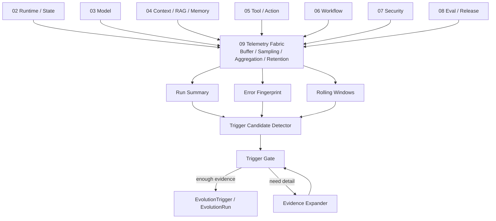

# UEAF V1 Evidence 采集与 Trigger 数据流参考架构

Architecture Generation: `V1`  
Maturity: `Required Reference`  
Implementation: `Current`

## 1. 目标

本参考架构展示 UEAF V1 如何自动采集足够 Evidence，同时控制日志、数据库、Token 和计算成本。

核心思想：

```text
AI 不持续监控 AI。
系统以结构化遥测监控 AI；只有少量值得解释的问题才进入 Evolution AI。
```

## 2. 责任边界



模块 02–08 在事实产生位置输出结构化观测；模块 09 负责采集基础设施；模块 11 只负责 Trigger Candidate、Trigger Gate 和按需 Evidence Expansion。

## 3. 默认数据路径

```text
Run starts
  -> module-local structured events
  -> non-blocking TelemetryPort.emit
  -> local buffer / queue
  -> batch collector
  -> Run Summary + Metrics + sampled Trace
  -> rolling aggregation / fingerprint
  -> no trigger
  -> STOP
```

正常路径不使用 LLM。

## 4. 异常数据路径

```text
aggregate/fingerprint deviates
  -> Trigger Candidate
  -> deterministic Trigger Gate
  -> if unclear:
       Evidence Expansion
       -> failed samples
       -> current successful controls
       -> baseline release controls
  -> cheap model if still unclear
  -> strong model only if necessary
  -> EvolutionTrigger or no_trigger
```

## 5. 三级 Evidence 漏斗

```text
L0 Always-on
  tiny structured facts / Run Summary
            ↓
L1 Conditional
  sampled trace / detailed failure evidence
            ↓
L2 On-demand
  targeted raw context only after Trigger Candidate
```

示例规模：

```text
1,000,000 Runs
  -> 1,000,000 tiny summaries
  -> rolling aggregates
  -> 2,000 fingerprints/patterns
  -> 50 suspicious patterns
  -> 10 trigger candidates
  -> 2~3 Evidence Expansions
  -> 0~2 EvolutionTriggers
```

具体比例不是规范阈值。

## 6. 采样策略

推荐初始 Profile 示例：

```yaml
sampling:
  success_full_trace_rate: 0.005
  ordinary_failure_full_trace_rate: 0.25
  p1_full_trace_rate: 1.0
  p0_full_trace_rate: 1.0
  canary_multiplier: 4.0
```

这些是示例，不构成默认产品常量。受数据分类和合规限制时，P0/P1 的“100%”仍只表示保存政策允许的必要 Evidence，不意味着无条件保存敏感 Payload。

## 7. 聚合窗口

推荐同时维护：

```text
5m   突发故障
1h   短周期稳定异常
24h  日内 drift
7d   baseline / trend
```

窗口可按业务调整，但 Trigger Engine 不应为了普通判断回扫全历史 Trace。

## 8. Error Fingerprint 优先

```text
raw error
  -> error_code / stage / tool/model / operation
  -> normalized signature
  -> deterministic fingerprint
  -> count + affected runs + sample refs
```

只有无法归类的剩余错误才进入 semantic clustering。

## 9. Evidence Expansion 的 A/B/C 对照

每次调查建议至少包含三组：

```text
A current failures
B current successes
C baseline release samples
```

Working Set Builder 应只抽取差异相关字段和必要正文，而不是完整复制全部 Trace。

## 10. 存储拓扑

V1 推荐：

```text
PostgreSQL / equivalent
  - run summary projection
  - rolling aggregate projection
  - fingerprint projection
  - Evolution V1 canonical tables

OTel / existing observability backend
  - metrics
  - traces
  - logs

Object storage
  - large trace payloads / artifacts / cold archive
```

不要求 Evolution 专用 Vector DB、Graph DB 或 TSDB。

## 11. Backpressure

当 Telemetry Pipeline 超载：

```text
keep Audit/Security/ActionReceipt
keep P0/P1 evidence
keep minimal Run Summary
reduce success trace sampling
reduce verbose debug
reduce semantic clustering
```

普通低优先 Evidence 可以降级，但缺口必须计量并暴露。

## 12. Collection Cost SLO

推荐把 Evidence 成本本身作为 SLO/预算维度观察：

- telemetry bytes per run；
- trace sample rate；
- storage growth/day；
- aggregation CPU；
- semantic clustering jobs；
- evidence expansion bytes/tokens；
- Trigger Candidate → Trigger 转化率；
- false-trigger / no-evolution-needed 比例。

若 Evidence 平台成本随请求量近似按“大 Payload 全量保存”线性增长，应视为架构退化信号。

## 13. V1 验收参考

V1 Evidence 实现至少证明：

1. 正常稳定运行的 Collection/Trigger Candidate 路径为 0 LLM Token；
2. Trigger 判断不需要扫描全量 Trace；
3. Full Trace 可按成功/失败/Canary/P0-P1 自适应采样；
4. 高基数 ID 不进入常规 Metric label；
5. Evidence Expansion 有明确样本和大小上限；
6. 模块 11 不复制模块 09/08/05 的原始权威存储；
7. Telemetry 超载时有明确降级优先级；
8. Evidence gap 可观测且不能被当成“无异常”。
