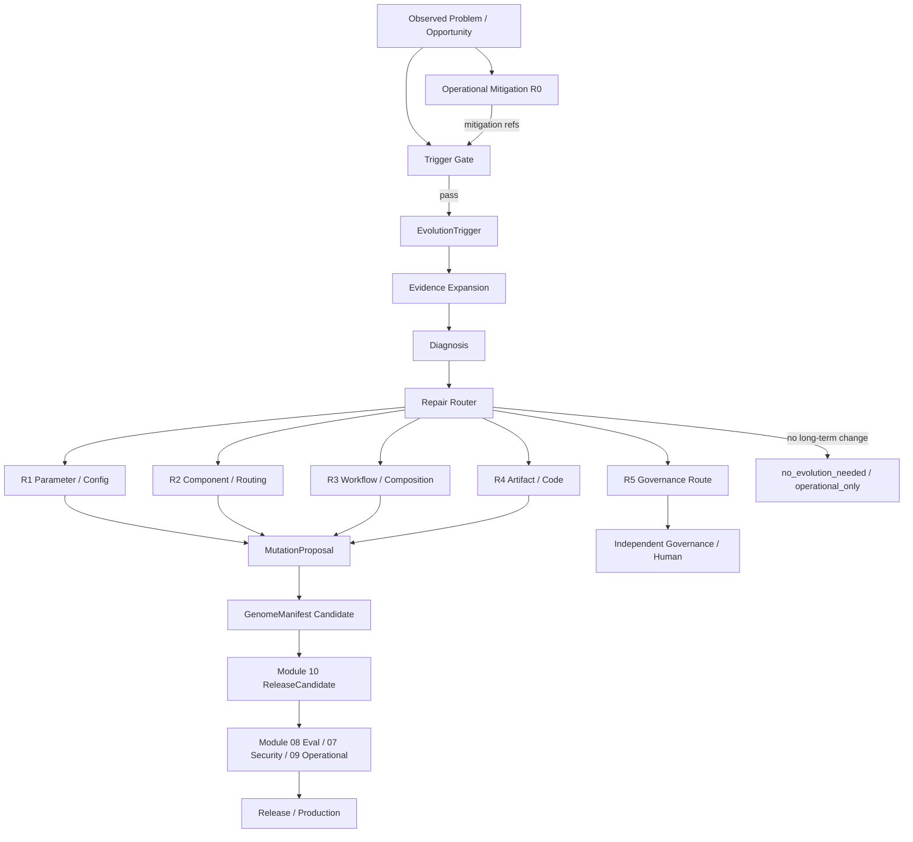

# UEAF V1 问题诊断与修复路由参考架构

Architecture Generation: `V1`  
Maturity: `Required Reference`  
Implementation: `Current`

## 1. 目标

本文展示 UEAF V1 在发现 RAG、Model、Tool、Workflow、Memory、Runtime 等问题后，如何从 Evidence 进入 Diagnosis，再选择最小长期修复，并通过既有 Build/Eval/Release 链闭环。

核心原则：

```text
基层发现 / 止血
  !=
基层长期自改
```

长期自改统一进入 Evolution Kernel。

## 2. 总体数据流



`Diagnosis`、`Repair Router`、`RepairLevel` 是内部策略/Projection，不新增 Canonical Object。

## 3. Repair Ladder

```text
R0  Operational Mitigation
      ↓ if long-term change still needed
R1  Parameter / Config
      ↓ if insufficient and evidence supports
R2  Component / Routing
      ↓
R3  Workflow / Composition
      ↓
R4  Artifact / Code

R5  Governance Boundary
    -> never auto-escalate into permission change
```

修复不是固定必须逐级尝试；如果已有强证据明确指向代码缺陷，可以直接提出 R4 Candidate。但“证据不足”不能成为扩大修改范围的理由。

## 4. Repair Router 最小逻辑

```text
EvolutionTrigger
  -> collect bounded A/B/C evidence
  -> classify observed problem
  -> identify likely root cause
  -> check current operational mitigation
  -> check previous attempts
  -> intersect with EvolutionAuthorityPolicy
  -> choose smallest plausible repair target
  -> choose repair level
  -> output:
       NO_EVOLUTION
       OPERATIONAL_ONLY
       MUTATION(R1..R4)
       ROUTE_GOVERNANCE(R5)
```

推荐优先顺序：规则/映射表 -> 统计归因 -> Cheap Model -> Strong Model。

## 5. RAG 示例

### 5.1 `retrieval_empty` 上升

```text
retrieval_empty 1% -> 9%
  ↓
check source freshness
check provider health
check ACL filtering
check query distribution
check index/retriever
```

可能结果：

```text
Provider outage recovered
  -> OPERATIONAL_ONLY / no_evolution_needed

Query formulation changed
  -> R1 query/retrieval policy

Embedding/retriever weak for new slice
  -> R2 component route

Need query-rewrite + verify stage
  -> R3 workflow

ACL blocks required data correctly
  -> R5 / governance or product design
```

关键点：不得因为 `retrieval_empty` 自动提高 top_k，更不得为了成功率绕过 ACL。

### 5.2 Context Token 膨胀

优先 R1：top_k、selection、compression、dedup、token budget。只有局部参数不能解决时才考虑 R2/R3。

## 6. Tool 示例

### 6.1 Timeout

```text
Tool timeout
  ↓
outcome_certainty = unknown ?
  ├─ yes -> reconciliation first
  └─ no  -> use authoritative outcome
```

长期诊断：

- provider latency；
- timeout 是否过短；
- sync/async 模式；
- polling strategy；
- workflow 是否产生重复调用；
- provider 是否应切换。

可能修复：

```text
R1 timeout/backoff config
R2 provider/tool route
R3 async workflow / polling topology
R4 Tool/Adapter code bug
```

禁止：`timeout ↑ -> retry_count ↑` 的机械自修。

### 6.2 Permission denied

```text
deny
  ↓
Tool selected incorrectly?
  -> R1/R2 Router/Prompt repair

Permission truly required?
  -> R5 governance request
```

AI 不得自行扩大 Tool permission。

## 7. Model 示例

```text
schema_invalid ↑
  -> prompt/schema policy (R1)
  -> model route/capability (R2)

hallucination ↑
  -> evidence quality / prompt (R1)
  -> stronger/specialized model (R2)
  -> verifier workflow (R3)

token ↑
  -> prompt/context cap (R1)
  -> model/router (R2)
  -> planning/workflow loops (R3)
```

## 8. Workflow 示例

```text
fan-out ↑
  -> route/branch threshold (R1)
  -> component attribution (R2)
  -> topology redesign (R3)

retry loop
  -> stop/retry policy (R1)
  -> failing dependency (R2)
  -> topology/resilience design (R3)
```

Workflow 观察到问题不意味着 Workflow 就是 root cause。

## 9. Memory 示例

```text
wrong memory recalled
  -> confidence / ranking / invalidation (R1)
  -> memory component/policy replacement (R2)

active memory grows
  -> cap / eviction / consolidation (R1)
  -> retrieval/composition redesign (R3)

cross-tenant memory
  -> immediate containment + R5 governance/security
```

## 10. 修复范围与 Genome

Repair Router 选择的是 `repair_target_scope`，最终仍通过现有：

```text
MutationProposal
  -> GenomeManifest candidate
```

例如：

```yaml
repair_level: r1
repair_target_scope:
  - context_policy
change_summary:
  retrieval_top_k: 5 -> 8
```

或：

```yaml
repair_level: r3
repair_target_scope:
  - workflow
change_summary:
  add_verification_node: true
```

## 11. Eval Funnel 按 Repair Level 调整

```text
R1
 -> targeted eval
 -> direct regression

R2
 -> targeted eval
 -> compatibility
 -> regression
 -> risk-based canary

R3
 -> trajectory/workflow eval
 -> regression
 -> latency/cost
 -> canary

R4
 -> unit/integration
 -> security/static analysis
 -> compatibility
 -> benchmark
 -> full relevant gates
```

Candidate 不因修复层级低就绕过硬安全门禁。

## 12. 修复升级控制

```text
R1 failed
  -> do not automatically broaden scope
  -> inspect failure evidence
  -> new hypothesis required before R2

R2 failed
  -> new composition evidence required before R3

R3 failed
  -> implementation-defect evidence required before R4
```

这样避免 EvolutionRun 变成“失败就越改越大”的无限搜索。

## 13. 修复历史复用

不建设独立 RepairHistory Service。通过 Trigger、Mutation、Genome parent refs、Eval、Release 和 Production feedback 生成 Repair Projection。

相似问题再次出现时优先查询：

```text
same symptom + same environment
  -> previous successful repair?
  -> previous failed repair?
  -> environment changed enough to re-test?
```

用于降低重复 Token 和实验成本。

## 14. V1 首个落地建议

第一版只支持三个高价值路径即可：

1. RAG `retrieval_empty / recall / context token` -> R1 Context/Retrieval Policy；
2. Model `schema/token/route` -> R1/R2；
3. Tool `timeout/rate-limit/schema` -> R0 + R1/R2，严格保留 reconciliation。

Workflow R3 与 Code R4 可在闭环稳定后逐步启用。
